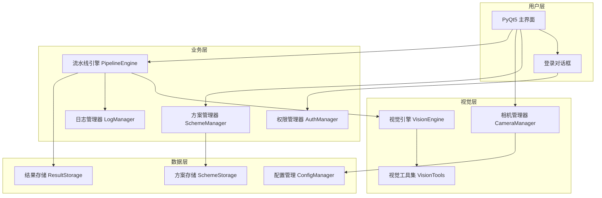
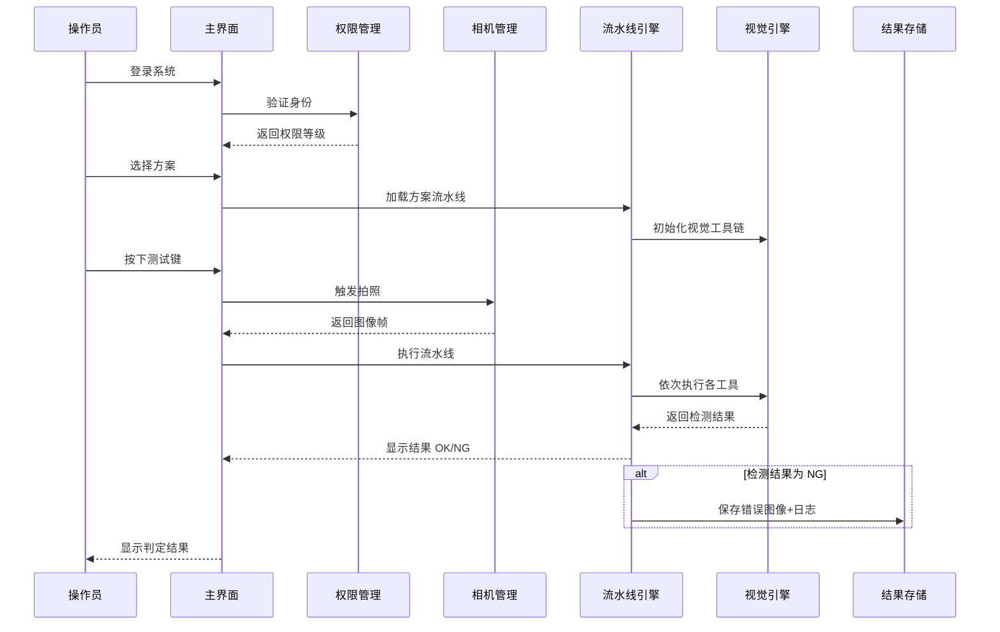
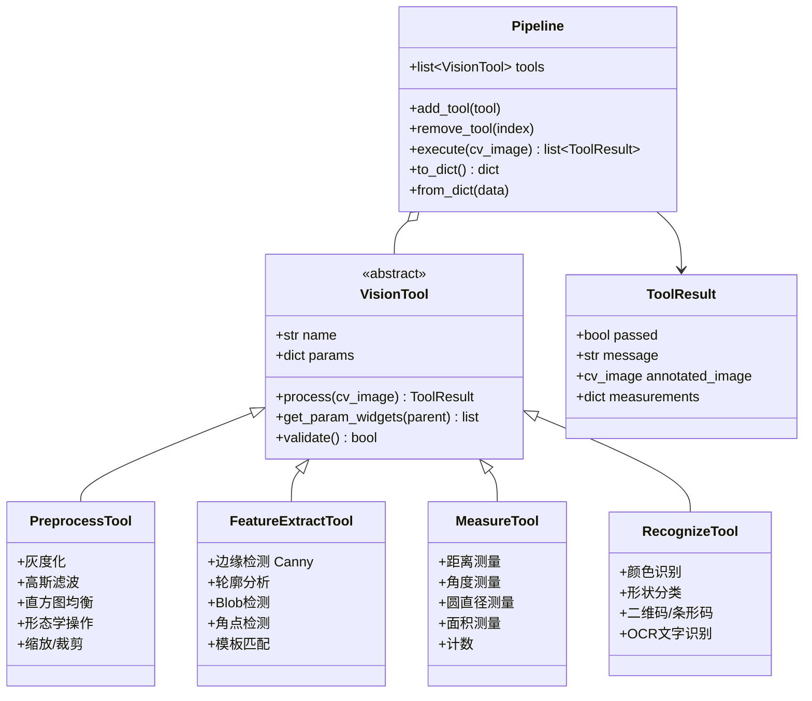
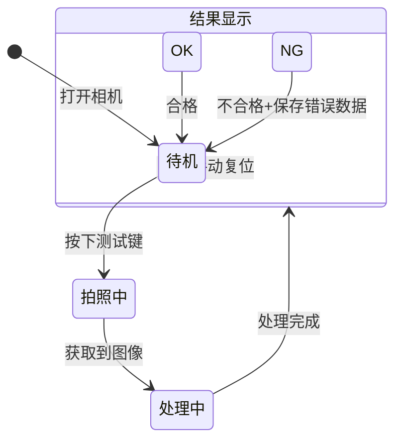

# 视觉识别系统架构优化计划

## 1. 项目概述

### 1.1 现状分析

当前系统是一个基于海康威视 SDK + OpenCV + PyQt5 的视觉识别原型，包含三个核心模块：

| 模块 | 文件 | 功能 |
|------|------|------|
| 相机管理 | [`camera_manager.py`](../camera_manager.py) | 海康SDK枚举、打开、取流、显示 |
| 视觉算法 | [`vision_algorithm.py`](../vision_algorithm.py) | 算法基类 + 阈值轮廓分析实现 |
| 主界面 | [`ui_mainwindow.py`](../ui_mainwindow.py) | PyQt5界面、方案管理、参数调节 |
| 入口 | [`main.py`](../main.py) | 程序启动入口 |

### 1.2 目标

构建一个 **MVP 版本** 的工业视觉识别系统，满足以下核心需求：

1. **多视觉工具组合** — 预处理、特征提取、测量、识别等多种工具可自由组合成方案
2. **方案全生命周期管理** — 新建/保存/导入/导出方案，换产品只需换方案
3. **按键触发模式** — 工人放入工件 → 按键 → 拍照 → 分析 → 出结果
4. **错误数据保存** — 只保存 NG 图像 + 检测日志
5. **用户权限管理** — 操作员/工程师/管理员三级权限
6. **架构健壮性** — 模块解耦、异常处理、日志系统、配置管理

---

## 2. 总体架构设计

### 2.1 模块架构图



### 2.2 工作流程



---

## 3. 详细模块设计

### 3.1 项目文件结构

```
VisionTest/
├── main.py                    # 程序入口（更新）
├── requirements.txt           # 依赖清单（新增）
│
├── camera_manager.py          # 相机管理（重构）
├── vision_algorithm.py        # 视觉算法（保留基类，重构）
│
├── ui/
│   ├── __init__.py
│   ├── login_dialog.py        # 登录对话框（新增）
│   ├── main_window.py         # 主界面（从 ui_mainwindow.py 重构）
│   └── widgets/
│       ├── __init__.py
│       ├── camera_panel.py    # 相机控制面板（新增）
│       ├── scheme_panel.py    # 方案管理面板（新增）
│       ├── pipeline_editor.py # 流水线编辑器（新增）
│       └── result_panel.py    # 结果展示面板（新增）
│
├── core/
│   ├── __init__.py
│   ├── auth_manager.py        # 权限管理（新增）
│   ├── config_manager.py      # 配置管理（新增）
│   ├── log_manager.py         # 日志管理（新增）
│   └── result_storage.py      # 结果存储（新增）
│
├── vision/
│   ├── __init__.py
│   ├── vision_engine.py       # 视觉引擎（新增）
│   ├── pipeline.py            # 流水线定义（新增）
│   └── tools/
│       ├── __init__.py
│       ├── base_tool.py       # 视觉工具基类（新增）
│       ├── preprocess.py      # 预处理工具集（新增）
│       ├── feature_extract.py # 特征提取工具集（新增）
│       ├── measure.py         # 测量工具集（新增）
│       └──识别.py              # 识别工具集（新增）
│
├── data/
│   ├── schemes/               # 方案文件存储目录（新增）
│   ├── logs/                  # 日志文件目录（新增）
│   ├── errors/                # 错误图像存储目录（新增）
│   └── config.json            # 系统配置文件（新增）
│
└── plans/                     # 计划文档目录
    └── architecture_optimization_plan.md
```

### 3.2 视觉工具集设计

视觉工具是系统的核心，采用 **组合模式**，每个工具是一个独立的处理单元，可串联成流水线。



**MVP 阶段实现的工具清单：**

| 类别 | 工具名称 | 功能说明 |
|------|----------|----------|
| 预处理 | 灰度化 | 彩色转灰度 |
| 预处理 | 高斯滤波 | 去噪平滑 |
| 预处理 | 直方图均衡 | 增强对比度 |
| 预处理 | 形态学操作 | 膨胀/腐蚀/开闭运算 |
| 预处理 | ROI选取 | 设置感兴趣区域 |
| 特征提取 | Canny边缘检测 | 提取边缘 |
| 特征提取 | 阈值分割 | 二值化分割 |
| 特征提取 | 轮廓分析 | 查找并筛选轮廓 |
| 特征提取 | Blob检测 | 连通域分析 |
| 测量 | 面积测量 | 测量目标面积 |
| 测量 | 距离测量 | 测量两点/边缘距离 |
| 测量 | 圆检测 | 霍夫圆检测+直径测量 |
| 测量 | 目标计数 | 统计目标数量 |
| 识别 | 颜色识别 | 识别指定颜色区域 |
| 识别 | 模板匹配 | 基于模板的匹配定位 |

### 3.3 方案管理设计

方案 = 流水线配置 + 工具参数 + 判定规则

```json
{
  "scheme_name": "产品A_外观检测",
  "version": "1.0",
  "created_at": "2026-06-02 10:00:00",
  "author": "engineer",
  "pipeline": [
    {
      "tool_type": "灰度化",
      "params": {},
      "enabled": true
    },
    {
      "tool_type": "高斯滤波",
      "params": {"ksize": 5},
      "enabled": true
    },
    {
      "tool_type": "阈值分割",
      "params": {"min": 50, "max": 255},
      "enabled": true
    },
    {
      "tool_type": "轮廓分析",
      "params": {"min_area": 500, "max_area": 10000},
      "enabled": true
    },
    {
      "tool_type": "目标计数",
      "params": {},
      "enabled": true,
      "judge_rule": {
        "type": "range",
        "min": 1,
        "max": 5,
        "on_fail": "NG"
      }
    }
  ],
  "judge_rules": {
    "logic": "AND",
    "on_all_pass": "OK",
    "on_any_fail": "NG"
  }
}
```

### 3.4 用户权限设计

| 角色 | 权限范围 |
|------|----------|
| 操作员 | 选择方案、触发检测、查看结果、查看日志 |
| 工程师 | 操作员权限 + 编辑方案、新建/删除方案、调整参数、导入/导出方案 |
| 管理员 | 工程师权限 + 用户管理、系统配置、查看所有日志 |

**默认账户：**
- 操作员: `operator / 123456`
- 工程师: `engineer / 123456`
- 管理员: `admin / admin123`

### 3.5 触发模式设计

从"实时取流+实时处理"改为 **"待机-触发-拍照-处理-显示"** 模式：



### 3.6 错误数据保存

当检测结果为 NG 时，自动保存以下内容：

```
data/errors/
├── 2026-06-02/
│   ├── product_A_20260602_100000.jpg    # 原始图像
│   ├── product_A_20260602_100000_result.jpg  # 标注图像
│   └── product_A_20260602_100000.json   # 检测数据
│   ├── product_A_20260602_100015.jpg
│   ├── product_A_20260602_100015_result.jpg
│   └── product_A_20260602_100015.json
└── error_log.csv  # 汇总日志
```

### 3.7 日志系统设计

使用 Python 标准库 `logging`，分级记录：

| 级别 | 用途 |
|------|------|
| DEBUG | 调试信息（算法参数、图像尺寸等） |
| INFO | 常规操作（相机打开/关闭、方案切换、检测结果） |
| WARNING | 警告（参数异常、相机连接不稳定） |
| ERROR | 错误（相机断开、算法崩溃、保存失败） |
| CRITICAL | 严重错误（SDK初始化失败、系统无法运行） |

日志文件按天滚动，保留最近 30 天。

---

## 4. 实施步骤

### 步骤 1：项目结构重组

- 创建 `ui/`、`core/`、`vision/`、`vision/tools/`、`data/` 目录结构
- 创建各目录的 `__init__.py`
- 从 [`ui_mainwindow.py`](../ui_mainwindow.py) 拆分 UI 逻辑到独立模块
- 更新 [`main.py`](../main.py) 入口

### 步骤 2：核心基础设施

- 实现 [`core/config_manager.py`](../core/config_manager.py) — 系统配置管理
- 实现 [`core/log_manager.py`](../core/log_manager.py) — 日志系统
- 实现 [`core/auth_manager.py`](../core/auth_manager.py) — 用户权限管理
- 实现 [`core/result_storage.py`](../core/result_storage.py) — 结果存储

### 步骤 3：视觉引擎重构

- 实现 [`vision/tools/base_tool.py`](../vision/tools/base_tool.py) — 视觉工具基类
- 实现 [`vision/tools/preprocess.py`](../vision/tools/preprocess.py) — 预处理工具
- 实现 [`vision/tools/feature_extract.py`](../vision/tools/feature_extract.py) — 特征提取工具
- 实现 [`vision/tools/measure.py`](../vision/tools/measure.py) — 测量工具
- 实现 [`vision/tools/recognize.py`](../vision/tools/recognize.py) — 识别工具
- 实现 [`vision/pipeline.py`](../vision/pipeline.py) — 流水线定义与执行
- 实现 [`vision/vision_engine.py`](../vision/vision_engine.py) — 视觉引擎调度

### 步骤 4：相机管理优化

- 重构 [`camera_manager.py`](../camera_manager.py) — 增加异常处理、重连机制
- 增加单次拍照模式（软触发）
- 优化 600 万像素图像处理性能

### 步骤 5：UI 界面重构

- 实现 [`ui/login_dialog.py`](../ui/login_dialog.py) — 登录对话框
- 实现 [`ui/main_window.py`](../ui/main_window.py) — 主界面（从 [`ui_mainwindow.py`](../ui_mainwindow.py) 重构）
- 实现 [`ui/widgets/camera_panel.py`](../ui/widgets/camera_panel.py) — 相机控制面板
- 实现 [`ui/widgets/scheme_panel.py`](../ui/widgets/scheme_panel.py) — 方案管理面板
- 实现 [`ui/widgets/pipeline_editor.py`](../ui/widgets/pipeline_editor.py) — 流水线编辑器（拖拽式）
- 实现 [`ui/widgets/result_panel.py`](../ui/widgets/result_panel.py) — 结果展示面板

### 步骤 6：方案管理增强

- 方案导入/导出为 `.json` 文件
- 方案版本管理
- 方案参数校验

### 步骤 7：集成测试与调优

- 各模块集成测试
- 600 万像素图像处理性能测试
- 异常场景测试（相机断开、参数错误等）

---

## 5. 关键设计决策

### 5.1 为什么采用流水线模式而非单一算法？

当前系统每个方案只能绑定一个算法类，扩展性差。流水线模式允许用户自由组合多个视觉工具，每个工具负责一个独立步骤，结果可逐步可视化，调试更方便。

### 5.2 为什么拆分 UI 模块？

当前 [`ui_mainwindow.py`](../ui_mainwindow.py) 超过 360 行，所有逻辑耦合在一起。拆分为独立模块后：
- 每个模块职责单一，易于维护
- 多人可并行开发不同面板
- 便于后续添加新功能

### 5.3 为什么增加权限管理？

工业现场需要区分操作员和工程师的职责：
- 操作员只需选择和启动方案，防止误操作修改参数
- 工程师可以调试和优化方案
- 管理员管理系统配置

### 5.4 为什么从实时取流改为按键触发？

根据用户描述，实际产线流程是"人工放入 → 按键 → 拍照 → 分析 → 出结果"，不需要实时处理。按键触发模式更符合实际使用场景，且能降低系统负载。

---

## 6. 依赖清单

```
# requirements.txt
PyQt5>=5.15.0
opencv-python>=4.5.0
numpy>=1.21.0
pyzbar>=0.1.9        # 二维码/条形码识别（可选，后续扩展）
pytesseract>=0.3.10  # OCR识别（可选，后续扩展）
```

当前虚拟环境已安装 PyQt5、opencv-python、numpy，无需额外安装即可完成 MVP。

---

## 7. 风险与缓解措施

| 风险 | 影响 | 缓解措施 |
|------|------|----------|
| 600万像素图像处理慢 | 用户体验差 | 处理放在子线程，UI不阻塞；支持ROI减少处理区域 |
| 海康SDK兼容性问题 | 相机无法连接 | 保留原有SDK调用方式，增加异常处理和重试机制 |
| 方案文件格式变更 | 旧方案无法使用 | 增加版本号，提供向后兼容的导入逻辑 |
| 权限管理增加复杂度 | 开发周期延长 | MVP阶段使用简单密码验证，后续可升级为数据库 |
