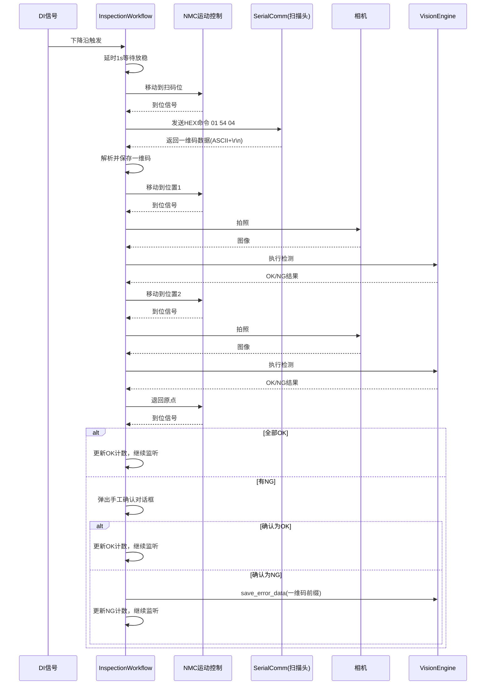

# 一维码扫描头集成与自动化流程改造计划

## 1. 概述

在现有的自动化检测工作流（[`InspectionWorkflow`](core/inspection_workflow.py:82)）中集成一维码扫描功能。工作流改造为：**DI触发 → 移动到扫码位 → 发送扫描命令 → 等待并解析一维码 → 移动到各检测位 → 检测 → 退回原点 → 显示结果**。扫描到的一维码数据作为NG时的错误图片命名依据。

## 2. 改造范围

| 文件 | 改动类型 | 说明 |
|------|----------|------|
| [`core/inspection_workflow.py`](core/inspection_workflow.py) | **主要修改** | 新增扫码状态、扫码流程、一维码存储 |
| [`core/serial_comm.py`](core/serial_comm.py) | 小修改 | 默认波特率改为9600 |
| [`core/result_storage.py`](core/result_storage.py) | 小修改 | 支持自定义前缀命名 |
| [`vision/vision_engine.py`](vision/vision_engine.py) | 小修改 | `save_error_data` 支持自定义文件名前缀 |
| [`ui/inspection_panel.py`](ui/inspection_panel.py) | 小修改 | 状态显示增加"扫码中"状态 |
| [`data/products/测试产品方案.json`](data/products/测试产品方案.json) | 修改 | 新增扫码位置配置 |
| [`core/product_manager.py`](core/product_manager.py) | 小修改 | 默认配置模板增加扫码位字段 |

## 3. 详细设计

### 3.1 产品配置扩展

在产品配置（[`data/products/测试产品方案.json`](data/products/测试产品方案.json)）中新增 `barcode_scan` 字段，用于配置扫码位置和串口命令：

```json
{
  "name": "测试产品方案",
  "barcode_scan": {
    "enabled": true,
    "position": -60000,
    "command": "01 54 04",
    "timeout_ms": 5000
  },
  "positions": [
    { "name": "位置1", "position": -50000, "scheme": "位置1方案" },
    { "name": "位置2", "position": -25000, "scheme": "位置2方案" }
  ]
}
```

字段说明：
- `enabled`: 是否启用扫码功能
- `position`: 扫码位的轴坐标
- `command`: 发送的HEX扫描命令（固定为 `01 54 04`）
- `timeout_ms`: 等待扫码返回的超时时间（毫秒）

### 3.2 工作流状态机扩展

在 [`InspectionWorkflow.State`](core/inspection_workflow.py:85) 中新增两个状态：

```python
class State(Enum):
    IDLE = "空闲"
    MONITORING = "等待DI触发"
    WAITING = "等待工件放稳"
    MOVING = "移动中"
    SCANNING = "扫码中"          # ← 新增：移动到扫码位并扫描
    CAPTURING = "拍照中"
    TESTING = "检测中"
    RETURNING = "退回原点"
    SHOW_RESULT = "显示结果"
    WAITING_FOR_CONFIRM = "等待确认"
    ERROR = "错误"
```

### 3.3 工作流流程（含扫码）

```
DI触发 (下降沿)
    │
    ▼
WAITING (等待1s工件放稳)
    │
    ▼
[如果启用扫码] ──→ MOVING (移动到扫码位)
    │                   │
    │                   ▼
    │               SCANNING (发送01 54 04，等待返回)
    │                   │
    │            ┌──────┼──────┐
    │            │      │      │
    │          成功    超时   失败
    │            │      │      │
    │            ▼      ▼      ▼
    │        保存一维码  直接NG  直接NG
    │            │   退回原点  退回原点
    │            │   不保存图片 不保存图片
    │            │
    │            ▼
    └──→ MOVING (移动到位置1)
            │
            ▼
         CAPTURING → TESTING → (循环所有位置)
            │
            ▼
         RETURNING (退回原点)
            │
            ▼
         SHOW_RESULT
            │
      ┌─────┴─────┐
      │           │
      ▼           ▼
     OK         NG (手工确认)
      │           │
      ▼      ┌────┴────┐
   继续监听  OK确认    NG确认
              │         │
              ▼         ▼
           继续监听  保存错误图片
                     (以{一维码}_{时间戳}命名)
                      │
                      ▼
                   继续监听
```

### 3.4 核心修改：InspectionWorkflow

#### 3.4.1 新增属性和配置

在 [`InspectionWorkflow.__init__`](core/inspection_workflow.py:134) 中新增：

```python
# 串口通信管理器（用于扫描头）
self._serial_comm: Optional[SerialCommManager] = None

# 一维码数据
self._barcode_data: Optional[str] = None

# 扫码超时定时器
self._scan_timer = QTimer(self)
self._scan_timer.setSingleShot(True)
self._scan_timer.timeout.connect(self._on_scan_timeout)
```

#### 3.4.2 新增方法

```python
def set_serial_comm(self, comm: SerialCommManager):
    """设置串口通信管理器（用于扫描头）"""
    self._serial_comm = comm
    if comm:
        comm.data_received.connect(self._on_barcode_data_received)

def _on_barcode_data_received(self, data: bytes):
    """接收到扫描头返回的一维码数据"""
    if self._state != self.State.SCANNING:
        return
    # 停止超时定时器
    self._scan_timer.stop()
    # 解析ASCII文本，去除\r\n
    try:
        barcode = data.decode('ascii', errors='replace').strip()
        if barcode:
            self._barcode_data = barcode
            log_info(f"扫码成功: {barcode}")
            # 继续执行后续检测位置
            self._current_pos_index = 0
            self._execute_current_position()
        else:
            log_warning("扫码返回空数据")
            self._on_barcode_failed()
    except Exception as e:
        log_error(f"解析一维码失败: {e}")
        self._on_barcode_failed()

def _on_barcode_failed(self):
    """扫码失败处理 - 直接NG，退回原点"""
    self._barcode_data = None
    self._trigger_count += 1
    self.trigger_count_changed.emit(self._trigger_count)
    self._ng_count += 1
    self.ng_count_changed.emit(self._ng_count)
    # 不保存错误图片，直接退回原点
    self._return_to_origin()
```

#### 3.4.3 修改 `_on_di_triggered` 方法

在 [`_on_di_triggered`](core/inspection_workflow.py:487) 中，延时结束后判断是否启用扫码：

```python
def _on_start_delay_elapsed(self):
    """延时结束 - 判断是否需要扫码"""
    barcode_cfg = self._product_config.get("barcode_scan", {})
    if barcode_cfg.get("enabled", False):
        # 移动到扫码位
        scan_pos = barcode_cfg.get("position", 0)
        log_info(f"移动到扫码位 (坐标: {scan_pos})")
        self._move_to_scan_position(scan_pos)
    else:
        # 不扫码，直接执行第一个检测位置
        self._execute_current_position()
```

#### 3.4.4 新增扫码移动方法

```python
def _move_to_scan_position(self, target_pos: int):
    """移动到扫码位"""
    self._set_state(self.State.MOVING)
    self._move_target = target_pos
    # ... 与 _move_to 相同的运动逻辑 ...
    # 到位后调用 _on_arrived_at_scan_position

def _on_arrived_at_scan_position(self):
    """到达扫码位 - 发送扫描命令"""
    self._set_state(self.State.SCANNING)
    barcode_cfg = self._product_config.get("barcode_scan", {})
    command = barcode_cfg.get("command", "01 54 04")
    timeout_ms = barcode_cfg.get("timeout_ms", 5000)
    
    if self._serial_comm and self._serial_comm.is_open:
        # 发送HEX扫描命令
        self._serial_comm.send_hex(command)
        log_info(f"已发送扫描命令: {command}")
        # 启动超时定时器
        self._scan_timer.start(timeout_ms)
    else:
        log_error("串口未打开，无法扫码")
        self._on_barcode_failed()
```

#### 3.4.5 修改 `_check_arrival` 方法

在 [`_check_arrival`](core/inspection_workflow.py:586) 中，需要区分是扫码移动还是检测位置移动：

```python
def _check_arrival(self):
    """检查轴是否到位"""
    try:
        state = self._nmc_sdk.get_axis_state(self._config.axis)
        if state == 0:  # 空闲 = 到位
            self._arrive_timer.stop()
            log_info(f"轴已到位 (位置: {self._move_target})")
            if self._state == self.State.RETURNING:
                self._on_returned_to_origin()
            elif self._state == self.State.MOVING and self._is_scan_move():
                # 扫码移动到位
                self._on_arrived_at_scan_position()
            else:
                self._on_arrived()
            return
        # ... 超时检查 ...
```

或者更简洁的方式：在 `_move_to_scan_position` 中设置一个标志位 `_is_scan_move = True`，到位后根据标志位判断。

#### 3.4.6 修改 `_save_ng_error_data` 方法

在 [`_save_ng_error_data`](core/inspection_workflow.py:860) 中，使用一维码作为文件名前缀：

```python
def _save_ng_error_data(self):
    """保存NG错误数据 - 使用一维码命名"""
    product_name = self._product_config.get("name", "未知产品")
    barcode = self._barcode_data or "NO_BARCODE"
    
    for result in self._results:
        if not result.passed and result.raw_image is not None:
            try:
                self._vision_engine.save_error_data(
                    scheme_name=product_name,
                    product_id=barcode,  # 使用一维码作为product_id
                    raw_image=result.raw_image,
                    annotated_image=result.annotated,
                    results=result.tool_results,
                    custom_prefix=barcode,  # 新增参数：自定义前缀
                )
            except Exception as e:
                log_error(f"保存NG位置 [{result.name}] 错误数据失败: {e}")
```

### 3.5 修改 VisionEngine.save_error_data

在 [`VisionEngine.save_error_data`](vision/vision_engine.py:193) 中新增 `custom_prefix` 参数：

```python
def save_error_data(self, scheme_name, product_id, raw_image,
                    annotated_image, results, custom_prefix=None):
    """保存错误数据"""
    timestamp = time.strftime("%Y%m%d_%H%M%S")
    date_str = time.strftime("%Y-%m-%d")
    date_dir = os.path.join(ERRORS_DIR, date_str)
    os.makedirs(date_dir, exist_ok=True)

    if custom_prefix:
        prefix = f"{custom_prefix}_{timestamp}"
    else:
        safe_name = scheme_name.replace("/", "_").replace("\\", "_") or "未命名"
        prefix = f"{safe_name}_{timestamp}"
    # ... 后续不变 ...
```

### 3.6 修改 SerialCommManager 默认波特率

在 [`core/serial_comm.py`](core/serial_comm.py:56) 中：

```python
DEFAULT_BAUDRATE = 9600  # 从 115200 改为 9600
```

### 3.7 修改 InspectionPanel 状态显示

在 [`ui/inspection_panel.py`](ui/inspection_panel.py:616) 的状态名称字典中新增：

```python
state_names = {
    InspectionWorkflow.State.IDLE: "空闲",
    InspectionWorkflow.State.MONITORING: "等待DI触发",
    InspectionWorkflow.State.MOVING: "移动中",
    InspectionWorkflow.State.SCANNING: "扫码中",  # ← 新增
    InspectionWorkflow.State.CAPTURING: "拍照中",
    InspectionWorkflow.State.TESTING: "检测中",
    InspectionWorkflow.State.RETURNING: "退回原点",
    InspectionWorkflow.State.SHOW_RESULT: "显示结果",
    InspectionWorkflow.State.ERROR: "错误",
}
```

### 3.8 修改 MainWindow 初始化

在 [`ui/main_window.py`](ui/main_window.py:601) 的 `_init_inspection_workflow` 中传入串口管理器：

```python
def _init_inspection_workflow(self):
    """初始化自动化检测工作流"""
    self._inspection_workflow = InspectionWorkflow(
        nmc_sdk=self._nmc_sdk,
        camera_mgr=self.camera_mgr,
        vision_engine=self.vision_engine,
        parent=self
    )
    # 传入串口通信管理器（用于扫描头）
    if self._serial_comm is not None:
        self._inspection_workflow.set_serial_comm(self._serial_comm)
```

### 3.9 默认产品配置模板更新

在 [`core/product_manager.py`](core/product_manager.py:121) 的 `create_default_config` 中：

```python
def create_default_config(name: str) -> Dict[str, Any]:
    return {
        "name": name,
        "description": "",
        "barcode_scan": {                    # ← 新增
            "enabled": False,
            "position": 0,
            "command": "01 54 04",
            "timeout_ms": 5000
        },
        "camera": { ... },
        "motion": { ... },
        "positions": [ ... ],
        ...
    }
```

## 4. 实施步骤

### 步骤 1：修改 SerialCommManager 默认波特率
- 文件：[`core/serial_comm.py`](core/serial_comm.py:56)
- 将 `DEFAULT_BAUDRATE` 从 `115200` 改为 `9600`

### 步骤 2：扩展 InspectionWorkflow 状态机
- 文件：[`core/inspection_workflow.py`](core/inspection_workflow.py)
- 在 `State` 枚举中新增 `SCANNING` 状态
- 新增属性：`_serial_comm`、`_barcode_data`、`_scan_timer`、`_is_scan_move`
- 新增方法：`set_serial_comm()`、`_on_barcode_data_received()`、`_on_barcode_failed()`、`_move_to_scan_position()`、`_on_arrived_at_scan_position()`、`_on_scan_timeout()`
- 修改方法：`_on_start_delay_elapsed()`、`_check_arrival()`、`_save_ng_error_data()`
- 在 `load_product()` 中加载 `barcode_scan` 配置
- 在 `cleanup()` 中清理扫码相关资源

### 步骤 3：修改 VisionEngine.save_error_data
- 文件：[`vision/vision_engine.py`](vision/vision_engine.py:193)
- 新增 `custom_prefix` 可选参数
- 当提供 `custom_prefix` 时，使用 `{custom_prefix}_{timestamp}` 作为文件名前缀

### 步骤 4：更新 InspectionPanel 状态显示
- 文件：[`ui/inspection_panel.py`](ui/inspection_panel.py:616)
- 在状态名称字典和颜色映射中新增 `SCANNING` 状态

### 步骤 5：更新 MainWindow 初始化
- 文件：[`ui/main_window.py`](ui/main_window.py:601)
- 在 `_init_inspection_workflow()` 中调用 `set_serial_comm()` 传入串口管理器

### 步骤 6：更新产品配置模板
- 文件：[`core/product_manager.py`](core/product_manager.py:121)
- 在 `create_default_config()` 中新增 `barcode_scan` 默认配置

### 步骤 7：更新测试产品配置
- 文件：[`data/products/测试产品方案.json`](data/products/测试产品方案.json)
- 新增 `barcode_scan` 配置段

## 5. 数据流图



## 6. 异常处理

| 异常场景 | 处理方式 |
|----------|----------|
| 扫码超时（无返回） | 直接NG，退回原点，不保存图片，等待下次触发 |
| 扫码返回空数据 | 同上 |
| 串口未打开 | 记录错误日志，按扫码失败处理 |
| 一维码解析失败 | 记录错误日志，按扫码失败处理 |

## 7. 注意事项

1. **串口复用**：扫描头与现有串口通信模块共用同一个 [`SerialCommManager`](core/serial_comm.py:141) 实例。当工作流处于 `SCANNING` 状态时，收到的串口数据才被解析为一维码；其他状态下收到的数据仍按原有逻辑处理（或忽略）。

2. **波特率修改**：默认波特率改为9600后，现有的串口对话框（[`SerialDialog`](ui/widgets/serial_dialog.py:40)）会自动使用新默认值，不影响用户手动选择其他波特率。

3. **向后兼容**：如果产品配置中没有 `barcode_scan` 字段或 `enabled: false`，工作流行为与修改前完全一致，不影响现有功能。

4. **扫码位配置**：扫码位坐标在产品配置中设置，不同产品可以有不同的扫码位位置，满足"每个产品的码的位置都不相同"的需求。
