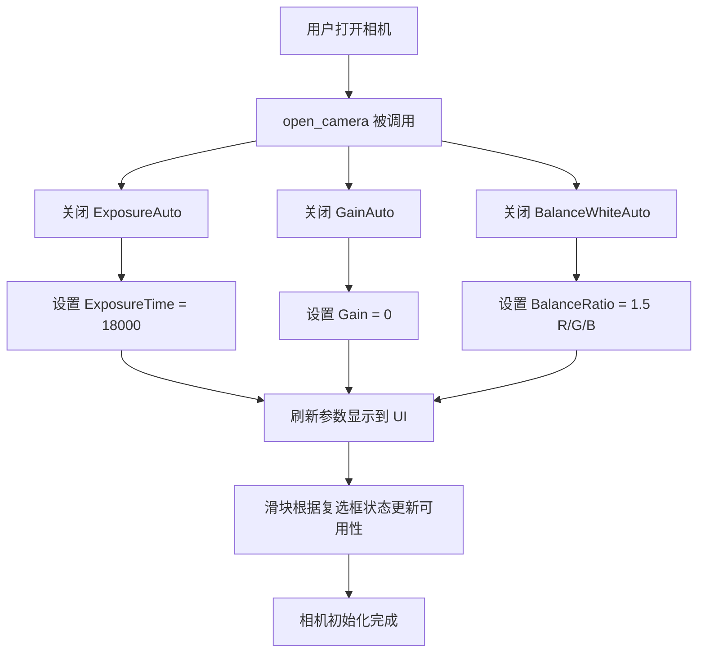

# 相机初始化参数修改计划

## 需求概述

相机初始化时不要自动曝光和自动增益，改为使用固定参数：
- 曝光时间：18000 µs（微秒）
- 增益：0 dB
- 白平衡系数：1.5（BalanceRatio）

## 涉及文件

1. [`ui/widgets/camera_panel.py`](ui/widgets/camera_panel.py) — 主要修改文件
2. [`camera_manager.py`](camera_manager.py) — 可能需要添加白平衡设置快捷方法

## 修改详情

### 1. [`camera_panel.py`](ui/widgets/camera_panel.py) — UI 初始化部分

**位置：** `_setup_ui()` 方法，第 245-247 行和第 290-292 行

**当前代码：**
```python
self.exp_auto_check = QCheckBox("自动曝光")
self.exp_auto_check.setChecked(True)  # 默认开启自动曝光

self.gain_auto_check = QCheckBox("自动增益")
self.gain_auto_check.setChecked(True)  # 默认开启自动增益
```

**修改为：**
```python
self.exp_auto_check = QCheckBox("自动曝光")
self.exp_auto_check.setChecked(False)  # 默认关闭自动曝光

self.gain_auto_check = QCheckBox("自动增益")
self.gain_auto_check.setChecked(False)  # 默认关闭自动增益
```

### 2. [`camera_panel.py`](ui/widgets/camera_panel.py) — `open_camera()` 方法

**位置：** 第 510-515 行

**当前代码：**
```python
# 默认开启自动曝光和自动增益
self.cam_mgr.set_enum_param("ExposureAuto", 1)
self.cam_mgr.set_enum_param("GainAuto", 1)

# 读取当前参数并更新 UI
self._refresh_params()
```

**修改为：**
```python
# 关闭自动曝光和自动增益
self.cam_mgr.set_enum_param("ExposureAuto", 0)  # GxAutoEntry.OFF
self.cam_mgr.set_enum_param("GainAuto", 0)       # GxAutoEntry.OFF

# 设置固定参数
self.cam_mgr.set_exposure_time(18000.0)           # 曝光时间 18000 µs
self.cam_mgr.set_gain(0.0)                        # 增益 0 dB

# 设置白平衡（BalanceRatio = 1.5）
# 需要分别设置 R、G、B 三个通道的白平衡系数
# 用户要求白平衡系数为 1.5，通常三个通道都设为 1.5 或只设 R/B 通道
self._set_white_balance(1.5)

# 读取当前参数并更新 UI
self._refresh_params()
```

### 3. [`camera_panel.py`](ui/widgets/camera_panel.py) — 新增白平衡设置方法

在 `CameraPanel` 类中新增 `_set_white_balance()` 方法：

```python
def _set_white_balance(self, ratio: float):
    """
    设置白平衡系数。
    
    Daheng SDK 通过 BalanceRatioSelector 选择通道（Red=0, Green=1, Blue=2），
    然后通过 BalanceRatio 设置对应通道的系数。
    
    Args:
        ratio: 白平衡系数值（用户要求 1.5）
    """
    if not self.cam_mgr.is_open:
        return
    
    try:
        # 先关闭自动白平衡
        self.cam_mgr.set_enum_param("BalanceWhiteAuto", 0)  # GxAutoEntry.OFF
        
        # 分别设置 R、G、B 三个通道
        from gxipy.gxidef import GxBalanceRatioSelectorEntry
        
        # Red 通道
        self.cam_mgr.set_enum_param("BalanceRatioSelector", GxBalanceRatioSelectorEntry.RED)
        self.cam_mgr.set_float_param("BalanceRatio", ratio)
        
        # Green 通道
        self.cam_mgr.set_enum_param("BalanceRatioSelector", GxBalanceRatioSelectorEntry.GREEN)
        self.cam_mgr.set_float_param("BalanceRatio", ratio)
        
        # Blue 通道
        self.cam_mgr.set_enum_param("BalanceRatioSelector", GxBalanceRatioSelectorEntry.BLUE)
        self.cam_mgr.set_float_param("BalanceRatio", ratio)
        
        log_info(f"白平衡系数已设置为: {ratio}")
    except Exception as e:
        log_error(f"设置白平衡失败: {e}")
```

### 4. [`camera_panel.py`](ui/widgets/camera_panel.py) — 打开相机后滑块状态

**位置：** `open_camera()` 方法末尾，第 517-523 行

当前代码已经根据复选框状态控制滑块可用性，由于复选框默认改为 False（未勾选），滑块会自动变为可用状态，因此**无需额外修改**。

### 5. 可选：[`camera_manager.py`](camera_manager.py) — 添加白平衡快捷方法

为了保持代码一致性，可以在 `CameraManager` 类中添加白平衡设置的快捷方法：

```python
def set_white_balance(self, ratio: float) -> bool:
    """
    设置白平衡系数（三个通道统一设置）。
    
    Args:
        ratio: 白平衡系数值
    """
    try:
        from gxipy.gxidef import GxBalanceRatioSelectorEntry
        
        # 关闭自动白平衡
        self.set_enum_param("BalanceWhiteAuto", 0)
        
        # Red
        self.set_enum_param("BalanceRatioSelector", GxBalanceRatioSelectorEntry.RED)
        self.set_float_param("BalanceRatio", ratio)
        
        # Green
        self.set_enum_param("BalanceRatioSelector", GxBalanceRatioSelectorEntry.GREEN)
        self.set_float_param("BalanceRatio", ratio)
        
        # Blue
        self.set_enum_param("BalanceRatioSelector", GxBalanceRatioSelectorEntry.BLUE)
        self.set_float_param("BalanceRatio", ratio)
        
        return True
    except Exception as e:
        log_debug(f"设置白平衡失败: {e}")
        return False
```

## 修改流程图



## 注意事项

1. **白平衡系数 1.5**：用户要求白平衡系数为 1.5。Daheng SDK 中 `BalanceRatio` 是一个 Float 类型参数，通过 `BalanceRatioSelector` 选择通道（Red=0, Green=1, Blue=2）。通常三个通道都设为相同值（1.5）即可。

2. **自动白平衡**：需要先关闭 `BalanceWhiteAuto`（设为 0 = OFF），否则手动设置 `BalanceRatio` 可能被自动模式覆盖。

3. **兼容性**：如果相机不支持白平衡设置（某些黑白相机没有此功能），`_set_white_balance` 方法会捕获异常并记录日志，不会影响其他参数的设置。

4. **UI 交互**：用户仍然可以在相机打开后，通过 UI 界面手动调节曝光、增益和勾选自动模式。此修改仅影响初始化时的默认行为。
