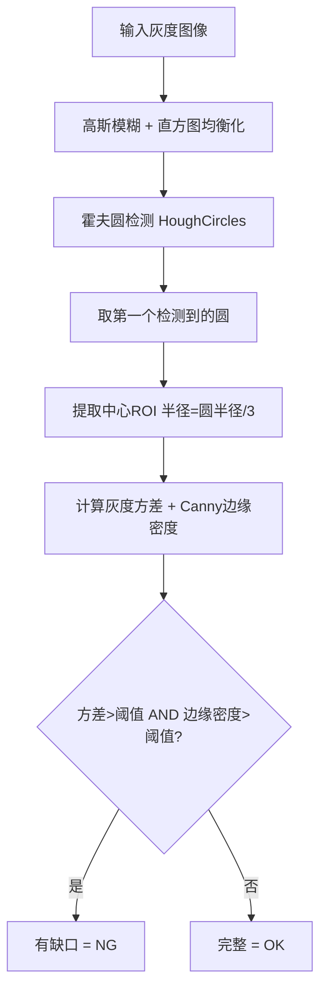
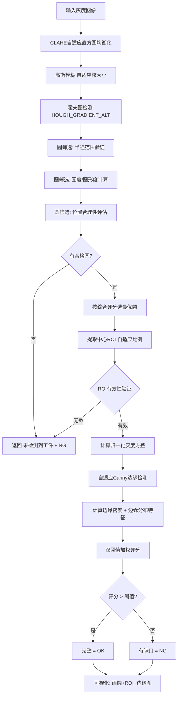
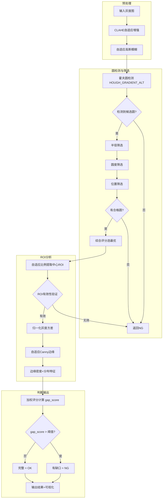

# 脚垫检测算子 (`FootPadDetect`) 优化计划

## 一、当前实现分析

当前 [`FootPadDetect`](vision/tools/recognize.py:1108) 的检测流程：



### 当前实现的主要问题

| 问题 | 位置 | 影响 |
|------|------|------|
| 预处理仅用直方图均衡化，光照适应性差 | 第1136-1137行 | 光照变化时圆检测不稳定 |
| 霍夫圆检测后直接取第一个结果，无筛选 | 第1167-1168行 | 可能选中伪圆/非目标圆 |
| 无圆度/位置合理性验证 | 缺失 | 检测到非圆形区域时误检 |
| ROI半径固定比例，无有效性验证 | 第1171-1177行 | ROI可能偏移或越界 |
| 灰度方差未归一化，对光照敏感 | 第1180行 | 不同光照下方差变化大 |
| Canny边缘阈值固定(30,90) | 第1181行 | 不同对比度下边缘提取不稳定 |
| 双阈值AND条件过于严格 | 第1188行 | 单一条件波动即导致误判 |
| 无置信度评分输出 | 缺失 | 无法评估检测结果的可靠程度 |

## 二、优化后的检测流程



## 三、详细优化方案

### 3.1 预处理增强

**目标**：提高对不同光照条件的适应性

| 优化项 | 说明 | 参数 |
|--------|------|------|
| CLAHE 替代直方图均衡化 | 使用 `cv2.createCLAHE(clipLimit=2.0, tileGridSize=(8,8))` 替代 `cv2.equalizeHist`，避免过度增强噪声 | `clahe_clip_limit=2.0`, `clahe_grid_size=8` |
| 自适应高斯模糊核大小 | 根据图像尺寸动态计算核大小：`ksize = max(3, int(min(w,h)/100)*2+1)` | 保留 `blur_kernel_size` 参数，默认自适应 |
| 可选双边滤波保边去噪 | 添加参数开关，在强噪声场景下启用双边滤波替代高斯模糊 | `use_bilateral=False` |

### 3.2 霍夫圆检测 + 多级筛选

**目标**：提高圆检测的准确性和鲁棒性

#### 3.2.1 使用改进的霍夫圆检测方法

```python
# 使用 HOUGH_GRADIENT_ALT（OpenCV 4.8+）替代 HOUGH_GRADIENT
# 前者对 param2 更不敏感，更容易找到正确的圆
circles = cv2.HoughCircles(
    enhanced,
    cv2.HOUGH_GRADIENT_ALT,  # 更稳定的方法
    dp=dp,
    minDist=minDist,
    param1=param1,  # Canny 高阈值
    param2=param2,  # 累加器阈值（ALT模式下意义不同）
    minRadius=minRadius,
    maxRadius=maxRadius
)
```

**兼容性处理**：如果 OpenCV 版本不支持 `HOUGH_GRADIENT_ALT`，自动回退到 `HOUGH_GRADIENT`。

#### 3.2.2 圆筛选策略

对检测到的所有候选圆进行多维度评分：

| 筛选维度 | 计算方法 | 权重 |
|----------|----------|------|
| **半径匹配度** | 与期望半径的偏差：`score_r = 1 - |r - r_expected| / r_expected` | 0.3 |
| **圆度** | 轮廓分析：`circularity = 4π * area / perimeter²`，越接近1越好 | 0.3 |
| **位置合理性** | 与ROI中心距离：`score_pos = 1 - dist / max_dist` | 0.2 |
| **边缘强度** | 圆周边界上的梯度强度均值 | 0.2 |

综合评分 = 加权求和，选最高分圆。

#### 3.2.3 新增参数

| 参数名 | 默认值 | 说明 |
|--------|--------|------|
| `use_gradient_alt` | `True` | 是否使用 HOUGH_GRADIENT_ALT |
| `expected_radius` | `0` | 期望半径（0=不启用半径匹配筛选） |
| `circularity_threshold` | `0.7` | 最小圆度阈值 |
| `center_offset_ratio` | `0.2` | 圆心允许偏移比例（相对于ROI尺寸） |
| `score_threshold` | `0.5` | 综合评分最低阈值 |

### 3.3 中心ROI提取与验证

**目标**：确保ROI区域有效且包含有意义的图像内容

```python
# 自适应ROI比例：根据圆的大小动态调整
roi_ratio = self.params.get("roi_ratio", 3)
# 如果圆很大，适当增大roi_ratio以缩小ROI
adaptive_ratio = roi_ratio * (1 + 0.1 * (r / maxRadius - 0.5))
roi_radius = max(5, int(r / adaptive_ratio))

# ROI有效性验证
if center_roi.size == 0 or center_roi.shape[0] < 3 or center_roi.shape[1] < 3:
    return ToolResult(success=True, passed=False, message="ROI区域无效")
    
# 检查ROI是否包含足够的图像内容（非全黑/全白）
roi_range = np.max(center_roi) - np.min(center_roi)
if roi_range < 5:  # ROI几乎无变化
    return ToolResult(success=True, passed=False, message="ROI区域无有效内容")
```

### 3.4 特征计算优化

#### 3.4.1 归一化灰度方差

```python
# 使用归一化方差，减少光照影响
normalized_roi = center_roi.astype(np.float32) / 255.0
gray_variance = float(np.var(normalized_roi))

# 可选：计算局部方差（分块计算后取均值），对纹理更敏感
use_local_variance = self.params.get("use_local_variance", False)
if use_local_variance:
    block_size = 8
    h, w = center_roi.shape
    blocks_h, blocks_w = h // block_size, w // block_size
    local_vars = []
    for i in range(blocks_h):
        for j in range(blocks_w):
            block = center_roi[i*block_size:(i+1)*block_size, 
                               j*block_size:(j+1)*block_size]
            local_vars.append(np.var(block))
    gray_variance = float(np.mean(local_vars)) / (255**2)  # 归一化
```

#### 3.4.2 自适应Canny边缘检测

```python
# 使用Otsu方法自动确定Canny阈值
def _adaptive_canny(self, roi):
    """根据ROI的灰度统计自适应计算Canny阈值"""
    median = np.median(roi)
    # Otsu阈值作为参考
    _, otsu_thresh = cv2.threshold(roi, 0, 255, cv2.THRESH_BINARY + cv2.THRESH_OTSU)
    
    low = int(max(0, 0.4 * otsu_thresh))
    high = int(min(255, 1.2 * otsu_thresh))
    
    # 确保 low < high
    if low >= high:
        low = max(0, high - 10)
    
    edges = cv2.Canny(roi, low, high)
    return edges, low, high
```

#### 3.4.3 边缘分布特征

除了边缘密度外，增加边缘分布特征：

```python
# 边缘密度
edge_density = float(np.sum(edges == 255) / edges.size) if edges.size > 0 else 0.0

# 边缘分布均匀度：将ROI分成4个象限，计算各象限边缘密度的标准差
h, w = edges.shape
quadrants = [
    edges[:h//2, :w//2],
    edges[:h//2, w//2:],
    edges[h//2:, :w//2],
    edges[h//2:, w//2:]
]
quad_densities = [np.sum(q == 255) / q.size if q.size > 0 else 0 for q in quadrants]
edge_uniformity = float(np.std(quad_densities))  # 越小越均匀

# 边缘集中度：边缘像素到ROI中心的平均距离
y_idxs, x_idxs = np.where(edges == 255)
if len(y_idxs) > 0:
    cy, cx = h / 2, w / 2
    distances = np.sqrt((y_idxs - cy)**2 + (x_idxs - cx)**2)
    edge_concentration = float(np.mean(distances) / max(h, w) * 2)
else:
    edge_concentration = 0.0
```

### 3.5 双阈值判断优化

#### 3.5.1 加权评分系统

```python
# 多特征加权评分
features = {
    "gray_variance": gray_variance,        # 归一化方差 [0, ~0.1]
    "edge_density": edge_density,           # 边缘密度 [0, 1]
    "edge_uniformity": edge_uniformity,     # 边缘均匀度 [0, ~0.5]
    "edge_concentration": edge_concentration, # 边缘集中度 [0, 1]
}

# 特征到缺口的映射（各特征的权重和期望方向）
# 方差大 -> 可能有缺口 (+)
# 边缘密度大 -> 可能有缺口 (+)
# 边缘均匀度大 -> 边缘分布不均匀，可能有缺口 (+)
# 边缘集中度大 -> 边缘集中在中心附近，可能有缺口 (-)

# 计算综合缺口分数 [0, 1]
gap_score = (
    w1 * min(1.0, gray_variance / variance_threshold) +
    w2 * min(1.0, edge_density / edge_density_threshold) +
    w3 * min(1.0, edge_uniformity / 0.2) +
    w4 * max(0, 1.0 - edge_concentration / 0.5)
) / (w1 + w2 + w3 + w4)

# 双阈值判断
# gap_score > high_threshold -> 有缺口 (NG)
# gap_score < low_threshold -> 完整 (OK)
# 中间区域 -> 根据置信度输出
```

#### 3.5.2 新增判断参数

| 参数名 | 默认值 | 说明 |
|--------|--------|------|
| `variance_threshold` | `0.02` | 归一化方差阈值（原为15，现归一化到[0,1]） |
| `edge_density_threshold` | `0.05` | 边缘密度阈值（保持不变） |
| `gap_score_threshold` | `0.5` | 综合缺口分数阈值 |
| `use_weighted_score` | `True` | 是否使用加权评分替代简单AND判断 |
| `var_weight` | `0.3` | 方差特征权重 |
| `edge_density_weight` | `0.4` | 边缘密度特征权重 |
| `edge_uniformity_weight` | `0.15` | 边缘均匀度特征权重 |
| `edge_concentration_weight` | `0.15` | 边缘集中度特征权重 |

### 3.6 可视化增强

| 可视化项 | 说明 |
|----------|------|
| 绘制所有候选圆（半透明） | 显示所有检测到的候选圆，最优圆高亮 |
| 绘制中心ROI圆 | 红色圆圈标注ROI区域 |
| 绘制ROI边缘图 | 在角落小图中显示Canny边缘检测结果 |
| 显示综合评分 | 在图像上显示 gap_score 和各特征值 |
| OK/NG状态颜色 | OK=绿色，NG=红色 |
| 置信度进度条 | 在图像侧边显示评分进度条 |

### 3.7 参数兼容性

**重要**：优化后部分参数含义发生变化（如 `variance_threshold` 从绝对值变为归一化值），需要：

1. 保留旧参数名作为兼容选项
2. 在 `__init__` 中检测旧参数格式并自动迁移
3. 在 `get_param_widgets` 中显示新参数UI

```python
# 参数迁移逻辑
if self.params.get("variance_threshold", 15) > 1.0:
    # 旧参数格式（绝对值），自动迁移到归一化格式
    old_val = self.params["variance_threshold"]
    self.params["variance_threshold"] = old_val / (255**2)  # 归一化
```

## 四、优化后的完整流程



## 五、实施步骤

### 步骤 1: 修改 `FootPadDetect.__init__`
- 添加新参数默认值
- 添加旧参数兼容迁移逻辑
- 添加 `HOUGH_GRADIENT_ALT` 兼容性检测

### 步骤 2: 实现预处理增强
- CLAHE 替代直方图均衡化
- 自适应高斯模糊核大小
- 可选双边滤波

### 步骤 3: 实现圆检测与多级筛选
- 多维度评分函数
- 候选圆排序与筛选
- 综合评分选最优

### 步骤 4: 实现ROI提取与验证
- 自适应ROI比例
- ROI有效性检查

### 步骤 5: 实现特征计算优化
- 归一化方差计算
- 自适应Canny阈值
- 边缘分布特征

### 步骤 6: 实现加权评分判断
- 多特征加权评分
- 双阈值判断逻辑
- 置信度输出

### 步骤 7: 更新可视化
- 候选圆绘制
- 特征值显示
- 评分进度条

### 步骤 8: 更新 `get_param_widgets`
- 新参数UI控件
- 参数分组优化
- 工具提示说明

### 步骤 9: 更新方案配置文件
- 确保 `默认方案.json` 中的参数与新实现兼容

## 六、兼容性与风险

| 风险 | 缓解措施 |
|------|----------|
| `HOUGH_GRADIENT_ALT` 在旧版OpenCV不可用 | 自动检测版本，回退到 `HOUGH_GRADIENT` |
| 参数迁移导致旧方案加载失败 | 添加参数兼容层，自动检测并转换旧参数格式 |
| 新算法在特定场景下性能下降 | 保留旧算法作为可选模式 `use_legacy_mode=False` |
| 计算量增加影响实时性 | 关键路径保持高效，复杂特征计算可选启用 |
