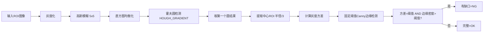
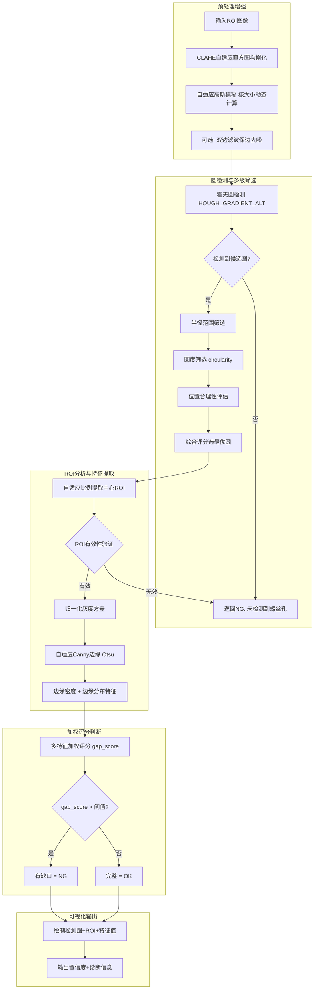

# FootPadDetect（脚垫检测）鲁棒性优化计划

## 一、问题分析

### 1.1 当前检测流程



### 1.2 当前代码关键问题

| # | 问题 | 位置 | 影响 |
|---|------|------|------|
| 1 | **直方图均衡化过度增强噪声** | [`recognize.py:1137`](vision/tools/recognize.py:1137) | 光照变化时圆检测不稳定，噪声被放大 |
| 2 | **霍夫圆检测只取第一个结果** | [`recognize.py:1167-1168`](vision/tools/recognize.py:1168) | 可能选中伪圆/噪声圆，无任何筛选 |
| 3 | **无圆度/形状验证** | 缺失 | 检测到非圆形区域时直接使用 |
| 4 | **ROI半径固定比例(半径/3)** | [`recognize.py:1171-1177`](vision/tools/recognize.py:1172) | ROI可能偏移或越界，无有效性检查 |
| 5 | **灰度方差未归一化** | [`recognize.py:1180`](vision/tools/recognize.py:1180) | 不同光照下方差绝对值变化大，阈值15不可靠 |
| 6 | **Canny边缘阈值固定(30,90)** | [`recognize.py:1181`](vision/tools/recognize.py:1181) | 不同对比度下边缘提取不稳定 |
| 7 | **双阈值AND条件过于严格** | [`recognize.py:1188`](vision/tools/recognize.py:1188) | 单一条件波动即导致误判 |
| 8 | **无置信度评分** | 缺失 | 无法评估检测结果的可靠程度 |

### 1.3 根因分析

20%错误率的主要来源（推测）：

1. **圆检测失败（约10-15%）**：`HOUGH_GRADIENT` 对 `param2` 敏感，直方图均衡化在光照变化时产生过多噪声，导致检测到错误的圆或漏检。
2. **缺口判断错误（约5-10%）**：固定Canny阈值在光照变化时提取的边缘不一致，灰度方差绝对值受光照影响大，AND条件过于脆弱。

---

## 二、优化方案

### 2.1 整体优化流程



### 2.2 详细优化点

#### 2.2.1 预处理增强

**目标**：提高对不同光照条件的适应性，减少噪声对圆检测的干扰。

| 优化项 | 实现方式 | 参数 |
|--------|----------|------|
| **CLAHE 替代直方图均衡化** | `cv2.createCLAHE(clipLimit=2.0, tileGridSize=(8,8))` 替代 `cv2.equalizeHist`，避免过度增强噪声 | `clahe_clip_limit=2.0`, `clahe_grid_size=8` |
| **自适应高斯模糊核大小** | 根据ROI尺寸动态计算：`ksize = max(3, int(min(w,h)/100)*2+1)`，确保核为奇数 | `auto_blur=True`（默认启用） |
| **可选双边滤波** | 在强噪声场景下启用双边滤波替代高斯模糊，保边去噪 | `use_bilateral=False` |

**参考实现**：项目已有 [`GaussianBlur`](vision/tools/preprocess.py:35) 和 [`HistEqualize`](vision/tools/preprocess.py:89) 工具，但当前 `FootPadDetect` 内部硬编码了预处理逻辑，需要重构。

#### 2.2.2 霍夫圆检测 + 多级筛选

**目标**：提高圆检测的准确性和鲁棒性，从"取第一个"改为"选最优"。

##### 2.2.2.1 使用改进的霍夫圆检测方法

```python
# 优先使用 HOUGH_GRADIENT_ALT（OpenCV 4.8+），更稳定
# 自动检测 OpenCV 版本，不支持时回退到 HOUGH_GRADIENT
try:
    method = cv2.HOUGH_GRADIENT_ALT
except AttributeError:
    method = cv2.HOUGH_GRADIENT
```

**参考实现**：项目已有 [`CircleDetection`](vision/tools/geometry.py:10) 实现了基础圆检测，但 `FootPadDetect` 需要更专门的参数。

##### 2.2.2.2 多维度圆筛选评分

对检测到的所有候选圆进行评分，选最优：

| 维度 | 计算方法 | 权重 | 说明 |
|------|----------|------|------|
| **半径匹配度** | `score_r = 1 - abs(r - r_expected) / r_expected` | 0.25 | 与期望半径偏差越小越好 |
| **圆度** | `circularity = 4π * area / perimeter²` | 0.35 | 越接近1越圆，权重最高 |
| **位置合理性** | `score_pos = 1 - dist_to_center / max_dist` | 0.20 | 圆心越靠近ROI中心越好 |
| **边缘强度** | 圆周边界梯度均值归一化 | 0.20 | 边界越清晰越好 |

```python
def _score_circle(self, circle, roi_center, roi_size, expected_radius):
    """对单个候选圆进行多维度评分"""
    x, y, r = circle
    cx, cy = roi_center
    
    # 1. 半径匹配度
    if expected_radius > 0:
        score_r = max(0, 1 - abs(r - expected_radius) / expected_radius)
    else:
        score_r = 0.5  # 无期望半径时给中等分
    
    # 2. 圆度（需要轮廓）
    # 在二值图上找对应轮廓
    score_circ = self._calc_circularity(x, y, r, binary_img)
    
    # 3. 位置合理性
    dist = np.sqrt((x - cx)**2 + (y - cy)**2)
    max_dist = np.sqrt(roi_size[0]**2 + roi_size[1]**2) / 2
    score_pos = max(0, 1 - dist / max_dist)
    
    # 4. 边缘强度
    score_edge = self._calc_edge_strength(x, y, r, gray_img)
    
    # 综合评分
    weights = [0.25, 0.35, 0.20, 0.20]
    total = (score_r * weights[0] + score_circ * weights[1] + 
             score_pos * weights[2] + score_edge * weights[3])
    return total
```

##### 2.2.2.3 新增参数

| 参数名 | 默认值 | 说明 |
|--------|--------|------|
| `use_gradient_alt` | `True` | 是否优先使用 HOUGH_GRADIENT_ALT |
| `expected_radius` | `0` | 期望半径（0=不启用半径匹配） |
| `circularity_threshold` | `0.5` | 最小圆度阈值，低于此值直接淘汰 |
| `circle_score_threshold` | `0.3` | 综合评分最低阈值 |

#### 2.2.3 中心ROI提取与验证

**目标**：确保ROI区域有效且包含有意义的图像内容。

```python
# 自适应ROI比例
roi_ratio = self.params.get("roi_ratio", 3)
# 根据圆的大小动态调整比例
adaptive_ratio = roi_ratio * (1 + 0.1 * (r / max_radius - 0.5))
roi_radius = max(5, int(r / adaptive_ratio))

# ROI有效性验证
if center_roi.size == 0 or center_roi.shape[0] < 3 or center_roi.shape[1] < 3:
    return ToolResult(success=True, passed=False, message="ROI区域无效")

# 检查ROI是否包含足够的图像内容（非全黑/全白）
roi_range = np.max(center_roi) - np.min(center_roi)
if roi_range < 5:
    return ToolResult(success=True, passed=False, message="ROI区域无有效内容")
```

#### 2.2.4 特征计算优化

##### 2.2.4.1 归一化灰度方差

```python
# 归一化到[0,1]范围，减少光照影响
normalized_roi = center_roi.astype(np.float32) / 255.0
gray_variance = float(np.var(normalized_roi))

# 可选：局部方差（分块计算后取均值），对纹理更敏感
use_local_variance = self.params.get("use_local_variance", False)
if use_local_variance:
    block_size = 8
    h, w = center_roi.shape
    blocks_h, blocks_w = h // block_size, w // block_size
    local_vars = []
    for i in range(blocks_h):
        for j in range(blocks_w):
            block = center_roi[i*block_size:(i+1)*block_size,
                               j*block_size:(j+1)*block_size]
            local_vars.append(np.var(block.astype(np.float32) / 255.0))
    gray_variance = float(np.mean(local_vars))
```

##### 2.2.4.2 自适应Canny边缘检测（复用已有实现）

项目已有 [`CannyEdge._compute_auto_thresholds`](vision/tools/feature_extract.py:24) 实现了Otsu自适应阈值，可以直接复用：

```python
@staticmethod
def _adaptive_canny(roi):
    """使用Otsu算法自动计算Canny双阈值"""
    blurred = cv2.medianBlur(roi, 5)
    otsu_thresh, _ = cv2.threshold(blurred, 0, 255, 
                                     cv2.THRESH_BINARY | cv2.THRESH_OTSU)
    low = int(np.clip(otsu_thresh * 0.5, 0, 255))
    high = int(np.clip(otsu_thresh * 1.5, 0, 255))
    if high - low < 10:
        high = min(low + 10, 255)
    edges = cv2.Canny(roi, low, high)
    return edges, low, high
```

##### 2.2.4.3 边缘分布特征

除了边缘密度外，增加边缘分布均匀度特征：

```python
# 边缘密度
edge_density = float(np.sum(edges == 255) / edges.size) if edges.size > 0 else 0.0

# 边缘分布均匀度：将ROI分成4个象限，计算各象限边缘密度的标准差
h, w = edges.shape
quadrants = [
    edges[:h//2, :w//2],
    edges[:h//2, w//2:],
    edges[h//2:, :w//2],
    edges[h//2:, w//2:]
]
quad_densities = [np.sum(q == 255) / q.size if q.size > 0 else 0 for q in quadrants]
edge_uniformity = float(np.std(quad_densities))  # 越小越均匀

# 边缘集中度：边缘像素到ROI中心的平均距离
y_idxs, x_idxs = np.where(edges == 255)
if len(y_idxs) > 0:
    cy, cx = h / 2, w / 2
    distances = np.sqrt((y_idxs - cy)**2 + (x_idxs - cx)**2)
    edge_concentration = float(np.mean(distances) / max(h, w) * 2)
else:
    edge_concentration = 0.0
```

#### 2.2.5 加权评分判断（替代简单AND）

**核心改进**：用连续评分替代二元AND判断，大幅提高鲁棒性。

```python
# 多特征加权评分
# 特征说明：
#   gray_variance: 归一化方差 [0, ~0.1]，越大越可能有缺口
#   edge_density: 边缘密度 [0, 1]，越大越可能有缺口
#   edge_uniformity: 边缘均匀度 [0, ~0.5]，越大越不均匀，可能有缺口
#   edge_concentration: 边缘集中度 [0, 1]，越大越集中在中心，可能是完整脚垫

# 计算各特征的"缺口贡献分"
var_score = min(1.0, gray_variance / variance_threshold)
edge_score = min(1.0, edge_density / edge_density_threshold)
uniformity_score = min(1.0, edge_uniformity / 0.2)
concentration_score = max(0, 1.0 - edge_concentration / 0.5)

# 加权综合
w_var = self.params.get("var_weight", 0.30)
w_edge = self.params.get("edge_density_weight", 0.35)
w_uniform = self.params.get("edge_uniformity_weight", 0.20)
w_conc = self.params.get("edge_concentration_weight", 0.15)
total_weight = w_var + w_edge + w_uniform + w_conc

gap_score = (var_score * w_var + edge_score * w_edge + 
             uniformity_score * w_uniform + concentration_score * w_conc) / total_weight

# 双阈值判断（可选，默认使用单阈值）
gap_threshold = self.params.get("gap_score_threshold", 0.5)
has_gap = gap_score > gap_threshold
```

#### 2.2.6 新增参数总表

| 参数名 | 默认值 | 类型 | 说明 |
|--------|--------|------|------|
| **预处理参数** | | | |
| `clahe_clip_limit` | `2.0` | float | CLAHE对比度限制 |
| `clahe_grid_size` | `8` | int | CLAHE网格大小 |
| `auto_blur` | `True` | bool | 是否自动计算模糊核大小 |
| `blur_kernel_size` | `5` | int | 手动模糊核大小（auto_blur=False时使用） |
| `use_bilateral` | `False` | bool | 是否使用双边滤波 |
| **圆检测参数** | | | |
| `use_gradient_alt` | `True` | bool | 是否优先使用HOUGH_GRADIENT_ALT |
| `expected_radius` | `0` | int | 期望半径（0=不启用） |
| `circularity_threshold` | `0.5` | float | 最小圆度阈值 |
| `circle_score_threshold` | `0.3` | float | 圆综合评分最低阈值 |
| **特征计算参数** | | | |
| `use_local_variance` | `False` | bool | 是否使用局部方差 |
| `use_adaptive_canny` | `True` | bool | 是否使用自适应Canny阈值 |
| **加权评分参数** | | | |
| `use_weighted_score` | `True` | bool | 是否使用加权评分替代简单AND |
| `variance_threshold` | `0.02` | float | 归一化方差阈值（原15，现归一化到[0,1]） |
| `edge_density_threshold` | `0.05` | float | 边缘密度阈值 |
| `gap_score_threshold` | `0.5` | float | 综合缺口分数阈值 |
| `var_weight` | `0.30` | float | 方差特征权重 |
| `edge_density_weight` | `0.35` | float | 边缘密度特征权重 |
| `edge_uniformity_weight` | `0.20` | float | 边缘均匀度特征权重 |
| `edge_concentration_weight` | `0.15` | float | 边缘集中度特征权重 |

### 2.3 参数兼容性

**重要**：优化后 `variance_threshold` 从绝对值15变为归一化值0.02，需要兼容旧方案。

```python
# 在 __init__ 中检测旧参数格式并自动迁移
if self.params.get("variance_threshold", 15) > 1.0:
    # 旧参数格式（绝对值），自动迁移到归一化格式
    old_val = self.params["variance_threshold"]
    self.params["variance_threshold"] = old_val / (255**2)
```

### 2.4 可视化增强

| 可视化项 | 说明 |
|----------|------|
| 绘制所有候选圆（半透明） | 显示所有检测到的候选圆，最优圆高亮（绿色实线） |
| 绘制中心ROI圆 | 红色圆圈标注ROI区域 |
| 显示综合评分 | 在图像上显示 gap_score 和各特征值 |
| OK/NG状态颜色 | OK=绿色，NG=红色 |
| 显示Canny阈值 | 显示自适应计算出的 low/high 值 |

---

## 三、实施步骤

### 步骤 1: 修改 `__init__` 方法
- 添加所有新参数的默认值
- 添加旧参数兼容迁移逻辑
- 添加 `HOUGH_GRADIENT_ALT` 兼容性检测

### 步骤 2: 实现预处理增强
- CLAHE 替代直方图均衡化
- 自适应高斯模糊核大小
- 可选双边滤波

### 步骤 3: 实现圆检测与多级筛选
- 实现 `_score_circle` 多维度评分函数
- 实现 `_calc_circularity` 圆度计算
- 实现 `_calc_edge_strength` 边缘强度计算
- 候选圆排序与筛选逻辑

### 步骤 4: 实现ROI提取与验证
- 自适应ROI比例
- ROI有效性检查（尺寸、内容范围）

### 步骤 5: 实现特征计算优化
- 归一化方差计算
- 自适应Canny阈值（复用 `CannyEdge._compute_auto_thresholds` 逻辑）
- 边缘分布特征（均匀度、集中度）

### 步骤 6: 实现加权评分判断
- 多特征加权评分
- 双阈值判断逻辑
- 置信度输出

### 步骤 7: 更新可视化
- 候选圆绘制
- 特征值显示
- 评分显示

### 步骤 8: 更新 `get_param_widgets`
- 新参数UI控件
- 参数分组优化（预处理/圆检测/特征/评分）
- 工具提示说明

### 步骤 9: 更新方案配置文件
- 确保 `默认方案.json` 中的参数与新实现兼容

---

## 四、兼容性与风险

| 风险 | 缓解措施 |
|------|----------|
| `HOUGH_GRADIENT_ALT` 在旧版OpenCV不可用 | 自动检测版本，回退到 `HOUGH_GRADIENT` |
| 参数迁移导致旧方案加载失败 | 添加参数兼容层，自动检测并转换旧参数格式 |
| 新算法在特定场景下性能下降 | 保留旧算法作为可选模式 `use_legacy_mode=False` |
| 计算量增加影响实时性 | 关键路径保持高效，复杂特征计算可选启用 |

---

## 五、预期效果

| 指标 | 当前 | 优化后目标 |
|------|------|-----------|
| 识别准确率 | ~80%（10次错2次） | >99%（产线要求） |
| 光照变化适应性 | 差（直方图均衡化） | 好（CLAHE + 自适应参数） |
| 圆检测稳定性 | 差（取第一个） | 好（多级筛选+评分） |
| 缺口判断鲁棒性 | 差（固定阈值AND） | 好（自适应阈值+加权评分） |
| 参数可调性 | 低 | 高（分组参数+自动模式） |
