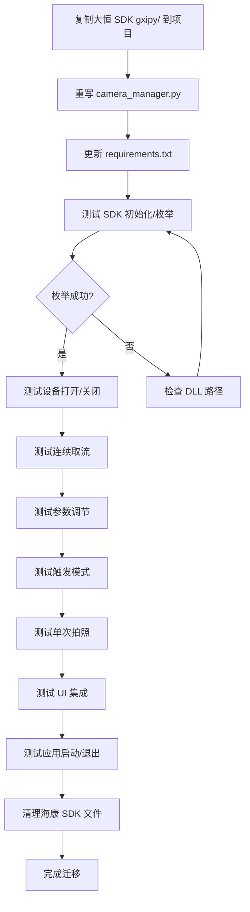

# 海康 SDK 到大恒 SDK 迁移方案

> **设备类型**：GigE 相机
> **大恒 SDK DLL**：`GxIAPI.dll`（核心API）、`DxImageProc.dll`（图像处理）、`GxIAPICPP.dll`（C++封装）
> **DLL 路径**：`C:\Program Files\Daheng Imaging\GalaxySDK\APIDll\Win64\`
> **Python SDK 路径**：`C:\Program Files\Daheng Imaging\GalaxySDK\Samples\Python SDK\gxipy\`

## 1. 概述

本文档详细描述了将项目中的海康威视（Hikvision）MVS SDK 替换为大恒图像（Daheng）GalaxySDK 的完整迁移方案。

### 1.1 迁移目标

- 将 [`camera_manager.py`](../camera_manager.py) 中的海康 SDK 调用全部替换为大恒 SDK
- 保持对外接口不变，确保 [`ui/main_window.py`](../ui/main_window.py) 和 [`ui/widgets/camera_panel.py`](../ui/widgets/camera_panel.py) 无需修改
- 保留所有现有功能：设备枚举、连接/断开、实时取流、参数调节、触发模式、单次拍照、图像格式转换

### 1.2 核心差异对比

| 特性 | 海康 SDK | 大恒 SDK |
|------|---------|---------|
| 架构风格 | ctypes 底层封装，手动句柄管理 | 面向对象，自动生命周期管理 |
| SDK 初始化 | `MV_CC_Initialize()` / `MV_CC_Finalize()` | `DeviceManager` 构造/析构自动处理 |
| 设备枚举 | `MV_CC_EnumDevices()` + ctypes 结构体 | `device_manager.update_device_list()` 返回列表 |
| 设备打开 | `CreateHandle` → `OpenDevice` | `open_device_by_index()` / `open_device_by_sn()` |
| 参数读写 | `MV_CC_Get/SetXxxValue(name, struct)` | `cam.ParamName.get()` / `cam.ParamName.set(value)` |
| 图像采集 | `MV_CC_StartGrabbing()` + `GetImageBuffer` | `cam.stream_on()` + `data_stream[0].get_image()` |
| 图像格式转换 | 手动 cv2 Bayer/YUV 转换 | `raw_image.convert("RGB")` 内置转换 |
| 触发控制 | `SetEnumValue("TriggerMode", 1/0)` | `cam.TriggerMode.set(GxSwitchEntry.ON/OFF)` |
| 软触发 | `SetCommandValue("TriggerSoftware")` | `cam.TriggerSoftware.send_command()` |
| 资源释放 | 手动 `FreeImageBuffer` + `CloseDevice` + `DestroyHandle` | `cam.close_device()` 自动释放 |

---

## 2. 接口映射关系

### 2.1 SDK 生命周期

| 海康 API | 大恒 API | 说明 |
|---------|---------|------|
| `MvCamera.MV_CC_Initialize()` | `DeviceManager()` 构造时自动调用 | 大恒在 `__new__` 中自动初始化 |
| `MvCamera.MV_CC_Finalize()` | `DeviceManager.__del__()` 自动调用 | 最后一个 DeviceManager 析构时自动反初始化 |
| `MvCamera.MV_CC_EnumDevices()` | `device_manager.update_device_list()` | 返回 `(dev_num, dev_info_list)` |
| `MvCamera()` 构造 | `device_manager.open_device_by_*()` | 大恒直接返回 Device 对象 |

### 2.2 设备枚举

| 海康 | 大恒 |
|-----|------|
| `MV_CC_DEVICE_INFO_LIST` | `dev_num, dev_info_list = device_manager.update_device_list()` |
| `MV_CC_DEVICE_INFO.nTLayerType` | `dev_info_list[i].get('device_class')` → `GxDeviceClassList` |
| `decode_char(gige.chUserDefinedName)` | `dev_info_list[i].get('user_name')` |
| `decode_char(gige.chModelName)` | `dev_info_list[i].get('model_name')` |
| `decode_char(gige.chSerialNumber)` | `dev_info_list[i].get('serial_number')` |
| `gige.nCurrentIp` | `dev_info_list[i].get('ip')` / `dev_info_list[i].get('current_ip')` |

### 2.3 设备连接

| 海康 | 大恒 |
|-----|------|
| `MvCamera.MV_CC_CreateHandle(dev_info)` | `device_manager.open_device_by_index(1)` |
| `MvCamera.MV_CC_OpenDevice()` | 同上，一步完成 |
| `MvCamera.MV_CC_CloseDevice()` | `device.close_device()` |
| `MvCamera.MV_CC_DestroyHandle()` | 同上，自动处理 |
| `MV_CC_GetOptimalPacketSize()` | `device.GevSCPSPacketSize.get()` (仅 GEVDevice) |

### 2.4 参数读写

| 海康 | 大恒 | 参数类型 |
|-----|------|---------|
| `MV_CC_GetFloatValue("ExposureTime", st)` | `cam.ExposureTime.get()` | FloatFeature |
| `MV_CC_SetFloatValue("ExposureTime", val)` | `cam.ExposureTime.set(val)` | FloatFeature |
| `MV_CC_GetIntValue("Width", st)` | `cam.Width.get()` | IntFeature |
| `MV_CC_SetIntValue("GevSCPSPacketSize", val)` | `cam.GevSCPSPacketSize.set(val)` | IntFeature (GEVDevice) |
| `MV_CC_GetEnumValue("TriggerMode", st)` | `cam.TriggerMode.get()` | EnumFeature |
| `MV_CC_SetEnumValue("TriggerMode", val)` | `cam.TriggerMode.set(val)` | EnumFeature |
| `MV_CC_SetCommandValue("TriggerSoftware")` | `cam.TriggerSoftware.send_command()` | CommandFeature |
| `MV_CC_GetBoolValue("AcquisitionFrameRateEnable", st)` | `cam.AcquisitionFrameRateEnable.get()` | BoolFeature |
| `MV_CC_SetBoolValue("AcquisitionFrameRateEnable", val)` | `cam.AcquisitionFrameRateEnable.set(val)` | BoolFeature |

### 2.5 图像采集

| 海康 | 大恒 |
|-----|------|
| `MV_CC_StartGrabbing()` | `cam.stream_on()` |
| `MV_CC_StopGrabbing()` | `cam.stream_off()` |
| `MV_CC_GetImageBuffer(stFrame, timeout)` | `cam.data_stream[0].get_image(timeout)` |
| `MV_CC_FreeImageBuffer(stFrame)` | 无需手动释放 |
| `stFrame.stFrameInfo.nWidth` | `raw_image.get_width()` |
| `stFrame.stFrameInfo.nHeight` | `raw_image.get_height()` |
| `stFrame.stFrameInfo.enPixelType` | `raw_image.get_pixel_format()` |
| `stFrame.stFrameInfo.nFrameLen` | `raw_image.get_image_size()` |
| `stFrame.pBufAddr` → bytes | `raw_image.get_numpy_array()` → numpy array |

### 2.6 触发模式

| 海康 | 大恒 |
|-----|------|
| `SetEnumValue("TriggerMode", 1)` | `cam.TriggerMode.set(GxSwitchEntry.ON)` |
| `SetEnumValue("TriggerMode", 0)` | `cam.TriggerMode.set(GxSwitchEntry.OFF)` |
| `SetEnumValue("TriggerSource", 7)` | `cam.TriggerSource.set(GxTriggerSourceEntry.SOFTWARE)` |
| `SetCommandValue("TriggerSoftware")` | `cam.TriggerSoftware.send_command()` |

### 2.7 像素格式映射

| 海康 PixelType | 大恒 GxPixelFormatEntry |
|----------------|------------------------|
| `PixelType_Gvsp_Mono8` | `GxPixelFormatEntry.MONO8` |
| `PixelType_Gvsp_Mono10` | `GxPixelFormatEntry.MONO10` |
| `PixelType_Gvsp_Mono12` | `GxPixelFormatEntry.MONO12` |
| `PixelType_Gvsp_Mono16` | `GxPixelFormatEntry.MONO16` |
| `PixelType_Gvsp_BayerGR8` | `GxPixelFormatEntry.BAYER_GR8` |
| `PixelType_Gvsp_BayerRG8` | `GxPixelFormatEntry.BAYER_RG8` |
| `PixelType_Gvsp_BayerGB8` | `GxPixelFormatEntry.BAYER_GB8` |
| `PixelType_Gvsp_BayerBG8` | `GxPixelFormatEntry.BAYER_BG8` |
| `PixelType_Gvsp_BayerGR10` | `GxPixelFormatEntry.BAYER_GR10` |
| `PixelType_Gvsp_BayerGR12` | `GxPixelFormatEntry.BAYER_GR12` |
| `PixelType_Gvsp_BayerGR16` | `GxPixelFormatEntry.BAYER_GR16` |
| `PixelType_Gvsp_RGB8_Packed` | `GxPixelFormatEntry.RGB8_PLANAR` |

---

## 3. 文件结构变更

### 3.1 新增文件

```
gxipy/                          # 大恒 SDK Python 包（从 SDK 安装目录复制）
  __init__.py
  gxiapi.py                     # 核心 API
  gxidef.py                     # 枚举定义
  gxdll.dll / GalaxyCamera.dll  # 底层 DLL（需确认文件名）
```

### 3.2 修改文件

| 文件 | 变更类型 | 说明 |
|------|---------|------|
| [`camera_manager.py`](../camera_manager.py) | **重写** | 核心迁移文件，替换所有海康 SDK 调用 |
| [`requirements.txt`](../requirements.txt) | 修改 | 添加大恒 SDK 依赖说明 |
| [`main.spec`](../main.spec) | 可能修改 | 如果打包，需添加 gxipy 数据文件 |

### 3.3 删除文件

| 文件 | 说明 |
|------|------|
| `MvImport/` 目录 | 海康 SDK Python 封装，不再需要 |
| `MCDLL_NET.dll` | 海康 SDK 依赖的 DLL |

---

## 4. 详细迁移步骤

### 步骤 1：复制大恒 SDK 到项目

将大恒 SDK 的 Python 包复制到项目根目录：

```
# 源路径
C:\Program Files\Daheng Imaging\GalaxySDK\Samples\Python SDK\gxipy\

# 目标路径
d:\Python project\VisionTest2.0\gxipy\
```

同时需要将大恒的底层 DLL（如 `gxdll.dll` 或 `GalaxyCamera.dll`）复制到项目目录或确保其在系统 PATH 中。

### 步骤 2：重写 camera_manager.py

这是核心迁移工作。需要创建一个新的 `camera_manager.py`，保持相同的类名和方法签名，但内部实现全部替换为大恒 SDK。

#### 2.1 SDK 导入部分（替换文件顶部）

**原代码（海康）**：
```python
# 搜索 MvImport 目录
# 导入 MvCamera, CameraParams_header, PixelType_header 等
```

**新代码（大恒）**：
```python
import os
import sys
import time
import threading
from typing import Optional, Callable, List, Dict, Any, Tuple

import cv2
import numpy as np
from PyQt5.QtCore import QThread, pyqtSignal
from PyQt5.QtGui import QImage, QPixmap

from core.log_manager import log_error, log_info, log_warning

# 大恒 SDK 导入
try:
    # 将 gxipy 目录加入路径
    _gxipy_dir = os.path.join(os.path.dirname(os.path.abspath(__file__)), 'gxipy')
    if os.path.isdir(_gxipy_dir) and _gxipy_dir not in sys.path:
        sys.path.insert(0, os.path.dirname(_gxipy_dir))
    
    import gxipy as gx
    from gxipy.gxidef import (
        GxDeviceClassList, GxAccessMode, GxSwitchEntry,
        GxTriggerSourceEntry, GxPixelFormatEntry, GxAcquisitionModeEntry,
        GxAutoEntry, DxBayerConvertType, DxValidBit, DxRGBChannelOrder,
        GxFrameStatusList,
    )
    SDK_AVAILABLE = True
except ImportError as e:
    gx = None
    SDK_AVAILABLE = False
    log_info(f"大恒 SDK 未加载，相机功能不可用: {e}")
```

#### 2.2 像素格式工具函数（简化）

大恒 SDK 内置了 `raw_image.convert("RGB")` 方法，可以直接将 Bayer RAW 转换为 RGB，无需手动 cv2 转换。但为了保持与现有代码的兼容性（现有代码返回 BGR numpy array），我们需要一个适配层。

**新实现**：
```python
def is_mono_data(pixel_format: int) -> bool:
    """判断是否为 Mono 图像（大恒像素格式）"""
    mono_formats = [
        GxPixelFormatEntry.MONO8, GxPixelFormatEntry.MONO8_SIGNED,
        GxPixelFormatEntry.MONO10, GxPixelFormatEntry.MONO12,
        GxPixelFormatEntry.MONO14, GxPixelFormatEntry.MONO16,
    ]
    return pixel_format in mono_formats


def is_color_data(pixel_format: int) -> bool:
    """判断是否为彩色/Bayer 图像（大恒像素格式）"""
    color_formats = [
        GxPixelFormatEntry.BAYER_GR8, GxPixelFormatEntry.BAYER_RG8,
        GxPixelFormatEntry.BAYER_GB8, GxPixelFormatEntry.BAYER_BG8,
        GxPixelFormatEntry.BAYER_GR10, GxPixelFormatEntry.BAYER_RG10,
        GxPixelFormatEntry.BAYER_GB10, GxPixelFormatEntry.BAYER_BG10,
        GxPixelFormatEntry.BAYER_GR12, GxPixelFormatEntry.BAYER_RG12,
        GxPixelFormatEntry.BAYER_GB12, GxPixelFormatEntry.BAYER_BG12,
        GxPixelFormatEntry.BAYER_GR16, GxPixelFormatEntry.BAYER_RG16,
        GxPixelFormatEntry.BAYER_GB16, GxPixelFormatEntry.BAYER_BG16,
    ]
    return pixel_format in color_formats


def raw_to_opencv(frame_data: bytes, width: int, height: int,
                  pixel_format: int) -> Optional[np.ndarray]:
    """
    将大恒 SDK 原始帧数据转换为 OpenCV BGR 图像。
    注意：此函数接收的是大恒像素格式枚举值，而非海康的。
    """
    try:
        img_data = np.frombuffer(frame_data, dtype=np.uint8)
        
        # Mono8 直接返回
        if pixel_format == GxPixelFormatEntry.MONO8:
            return img_data.reshape((height, width)).copy()
        
        # 彩色/Bayer 格式 - 使用大恒 SDK 内置转换
        elif is_color_data(pixel_format):
            # 注意：这里需要构造一个临时的 RawImage 对象来使用 convert 方法
            # 但由于 RawImage 需要 frame_data 结构体，更简单的方式是：
            # 直接使用 cv2 进行 Bayer 转换（与大恒 SDK 内部算法等效）
            bayer_img = img_data.reshape((height, width)).copy()
            # 根据像素格式选择对应的 cv2 转换标志
            cv_color = _pixel_format_to_cv_color(pixel_format)
            if cv_color is not None:
                return cv2.cvtColor(bayer_img, cv_color)
            return bayer_img
        
        # 其他格式
        else:
            try:
                return img_data.reshape((height, width, 3)).copy()
            except Exception:
                return img_data.reshape((height, width)).copy()
                
    except Exception as e:
        log_error(f"图像格式转换失败: {e}")
        return None
```

#### 2.3 CameraGrabbingThread（适配大恒）

**新实现**：
```python
class CameraGrabbingThread(QThread):
    """相机取流线程 - 大恒 SDK 版本"""
    
    frame_received = pyqtSignal(int, int, int, bytes)  # width, height, pixel_format, data
    
    def __init__(self, device, data_stream):
        super().__init__()
        self._device = device
        self._data_stream = data_stream
        self._running = False
    
    def run(self):
        self._running = True
        _logged_pixel_format = False
        
        while self._running:
            try:
                raw_image = self._data_stream.get_image(200)
                if raw_image is not None and raw_image.get_status() == GxFrameStatusList.SUCCESS:
                    width = raw_image.get_width()
                    height = raw_image.get_height()
                    pixel_format = raw_image.get_pixel_format()
                    
                    if not _logged_pixel_format:
                        _logged_pixel_format = True
                        log_info(f"相机输出: {width}x{height}, 像素格式=0x{pixel_format:08X}")
                    
                    # 获取 numpy array
                    numpy_image = raw_image.get_numpy_array()
                    if numpy_image is not None:
                        img_bytes = numpy_image.tobytes()
                        self.frame_received.emit(width, height, pixel_format, img_bytes)
                else:
                    self.msleep(5)
                    
            except Exception as e:
                log_error(f"取流线程异常: {e}")
                self.msleep(50)
    
    def stop(self):
        self._running = False
        self.wait(2000)
```

#### 2.4 CameraManager 类（核心迁移）

**类结构对比**：

| 成员 | 海康版本 | 大恒版本 |
|------|---------|---------|
| `_camera` | `MvCamera` 实例 | `Device` 对象（GEVDevice/U3VDevice/U2Device） |
| `_grabbing_thread` | `CameraGrabbingThread` | `CameraGrabbingThread`（内部使用 data_stream） |
| `_device_info` | 解析后的设备信息 dict | 解析后的设备信息 dict（格式兼容） |
| `_sdk_initialized` | 类变量，手动管理 | 由 DeviceManager 自动管理 |
| `_data_stream` | 无 | `device.data_stream[0]` |

**关键方法迁移**：

```python
class CameraManager:
    """
    大恒工业相机管理器。
    封装了相机的枚举、连接、取流、参数调节、触发控制等完整操作。
    """
    
    _device_manager = None  # 单例 DeviceManager
    
    def __init__(self):
        self._device = None
        self._data_stream = None
        self._grabbing_thread = None
        self._is_grabbing = False
        self._lock = threading.Lock()
        self._device_info = None
        self._is_trigger_mode = False
        self._frame_callback = None
    
    # ---------- SDK 初始化 ----------
    
    @staticmethod
    def initialize_sdk():
        """初始化相机 SDK（应用启动时调用一次）"""
        if not SDK_AVAILABLE:
            log_info("相机 SDK 不可用，跳过初始化")
            return
        try:
            # DeviceManager 构造时自动初始化 SDK
            if CameraManager._device_manager is None:
                CameraManager._device_manager = gx.DeviceManager()
                log_info("大恒 SDK 初始化成功")
        except Exception as e:
            log_error(f"大恒 SDK 初始化异常: {e}")
    
    @staticmethod
    def finalize_sdk():
        """反初始化相机 SDK（应用退出时调用一次）"""
        try:
            if CameraManager._device_manager is not None:
                # 关闭所有已打开的设备
                # DeviceManager 析构时自动反初始化 SDK
                CameraManager._device_manager = None
                log_info("大恒 SDK 反初始化完成")
        except Exception:
            pass
    
    # ---------- 设备枚举 ----------
    
    def enumerate_devices(self, timeout_ms: int = 200) -> List[Dict[str, Any]]:
        """
        枚举所有可用的相机设备。
        返回格式与海康版本兼容。
        """
        devices = []
        if not SDK_AVAILABLE:
            return devices
        
        try:
            self._ensure_sdk_initialized()
            dev_mgr = CameraManager._device_manager
            
            dev_num, dev_info_list = dev_mgr.update_device_list(timeout=timeout_ms)
            
            for i in range(dev_num):
                info = dev_info_list[i]
                device_class = info.get('device_class', GxDeviceClassList.UNKNOWN)
                
                result = {
                    "index": i,
                    "tlayer_type": device_class,
                    "dev_info": info,  # 直接存储设备信息 dict
                }
                
                if device_class == GxDeviceClassList.GEV:
                    result["type"] = "GigE"
                elif device_class == GxDeviceClassList.U3V:
                    result["type"] = "USB3"
                elif device_class == GxDeviceClassList.U2:
                    result["type"] = "USB2"
                else:
                    result["type"] = "Unknown"
                
                result["name"] = info.get('user_name', 'Unknown')
                result["model"] = info.get('model_name', 'Unknown')
                result["serial"] = info.get('serial_number', 'Unknown')
                result["ip"] = info.get('ip', 'N/A') or info.get('current_ip', 'N/A')
                
                devices.append(result)
            
            log_info(f"枚举到 {len(devices)} 个相机设备")
            
        except Exception as e:
            log_error(f"枚举相机失败: {e}")
        
        return devices
    
    # ---------- 连接与打开 ----------
    
    def open_camera(self, dev_info) -> bool:
        """
        打开相机设备。
        dev_info: 来自 enumerate_devices 返回的 dev_info（设备信息 dict）
        """
        if not SDK_AVAILABLE:
            return False
        
        if self._device is not None:
            log_info("相机已打开，请先关闭")
            return False
        
        try:
            self._ensure_sdk_initialized()
            dev_mgr = CameraManager._device_manager
            
            # 根据设备索引打开
            index = dev_info.get("index", 0)
            self._device = dev_mgr.open_device_by_index(index + 1)  # 大恒索引从1开始
            
            if self._device is None:
                log_error("打开设备失败")
                return False
            
            # 获取数据流
            self._data_stream = self._device.data_stream[0]
            
            # 记录设备信息
            self._device_info = {
                "model": self._device.DeviceModelName.get(),
                "serial": self._device.DeviceSerialNumber.get(),
                "name": self._device.DeviceVendorName.get(),
            }
            
            log_info(f"相机打开成功: {self._device_info['model']}")
            
            # GigE 优化
            if isinstance(self._device, gx.GEVDevice):
                self._optimize_gige()
            
            # 默认连续采集模式
            self.set_trigger_mode(False)
            
            return True
            
        except Exception as e:
            log_error(f"打开相机异常: {e}")
            self._device = None
            self._data_stream = None
            return False
    
    def _optimize_gige(self):
        """优化 GigE 网络参数"""
        try:
            if isinstance(self._device, gx.GEVDevice):
                # 获取并设置最优包大小
                # 大恒 SDK 的 GEVDevice 有 GevSCPSPacketSize 属性
                packet_size = self._device.GevSCPSPacketSize.get()
                log_info(f"GigE 当前包大小: {packet_size}")
                # 注意：大恒 SDK 可能需要通过其他方式获取最优包大小
        except Exception as e:
            log_error(f"GigE 优化异常: {e}")
    
    # ---------- 关闭 ----------
    
    def close_camera(self):
        try:
            self.stop_grabbing()
            
            if self._device is not None:
                self._device.close_device()
                self._device = None
                self._data_stream = None
                self._device_info = None
                self._is_trigger_mode = False
                log_info("相机关闭成功")
        except Exception as e:
            log_error(f"关闭相机异常: {e}")
    
    # ---------- 触发模式 ----------
    
    def set_trigger_mode(self, enable: bool) -> bool:
        if self._device is None:
            return False
        
        try:
            if enable:
                self._device.TriggerMode.set(gx.GxSwitchEntry.ON)
                self._device.TriggerSource.set(gx.GxTriggerSourceEntry.SOFTWARE)
                self._is_trigger_mode = True
                log_info("已切换为触发模式（软触发）")
            else:
                self._device.TriggerMode.set(gx.GxSwitchEntry.OFF)
                self._is_trigger_mode = False
                log_info("已切换为连续采集模式")
            return True
        except Exception as e:
            log_error(f"设置触发模式异常: {e}")
            return False
    
    def trigger_once(self) -> bool:
        if self._device is None or not self._is_trigger_mode:
            return False
        try:
            self._device.TriggerSoftware.send_command()
            return True
        except Exception as e:
            log_error(f"软触发异常: {e}")
            return False
    
    # ---------- 参数读写 ----------
    
    def get_float_param(self, name: str) -> Optional[float]:
        if self._device is None:
            return None
        try:
            feature = getattr(self._device, name, None)
            if feature is not None and hasattr(feature, 'get'):
                return float(feature.get())
            return None
        except Exception as e:
            log_error(f"获取参数 {name} 异常: {e}")
            return None
    
    def set_float_param(self, name: str, value: float) -> bool:
        if self._device is None:
            return False
        try:
            feature = getattr(self._device, name, None)
            if feature is not None and hasattr(feature, 'set'):
                feature.set(float(value))
                return True
            return False
        except Exception as e:
            log_error(f"设置参数 {name} 异常: {e}")
            return False
    
    def get_int_param(self, name: str) -> Optional[int]:
        if self._device is None:
            return None
        try:
            feature = getattr(self._device, name, None)
            if feature is not None and hasattr(feature, 'get'):
                return int(feature.get())
            return None
        except Exception as e:
            log_error(f"获取参数 {name} 异常: {e}")
            return None
    
    def set_int_param(self, name: str, value: int) -> bool:
        if self._device is None:
            return False
        try:
            feature = getattr(self._device, name, None)
            if feature is not None and hasattr(feature, 'set'):
                feature.set(int(value))
                return True
            return False
        except Exception as e:
            log_error(f"设置参数 {name} 异常: {e}")
            return False
    
    def get_enum_param(self, name: str) -> Optional[int]:
        if self._device is None:
            return None
        try:
            feature = getattr(self._device, name, None)
            if feature is not None and hasattr(feature, 'get'):
                return int(feature.get())
            return None
        except Exception as e:
            log_error(f"获取枚举参数 {name} 异常: {e}")
            return None
    
    def set_enum_param(self, name: str, value: int) -> bool:
        if self._device is None:
            return False
        try:
            feature = getattr(self._device, name, None)
            if feature is not None and hasattr(feature, 'set'):
                feature.set(value)
                return True
            return False
        except Exception as e:
            log_error(f"设置枚举参数 {name} 异常: {e}")
            return False
    
    # ---------- 常用参数快捷方法 ----------
    
    def get_exposure_time(self) -> Optional[float]:
        if self._device is None:
            return None
        try:
            return float(self._device.ExposureTime.get())
        except Exception:
            return None
    
    def set_exposure_time(self, value_us: float) -> bool:
        if self._device is None:
            return False
        try:
            # 关闭自动曝光
            self._device.ExposureAuto.set(gx.GxAutoEntry.OFF)
            time.sleep(0.05)
            self._device.ExposureTime.set(float(value_us))
            return True
        except Exception as e:
            log_error(f"设置曝光时间异常: {e}")
            return False
    
    def get_gain(self) -> Optional[float]:
        if self._device is None:
            return None
        try:
            return float(self._device.Gain.get())
        except Exception:
            return None
    
    def set_gain(self, value_db: float) -> bool:
        if self._device is None:
            return False
        try:
            self._device.GainAuto.set(gx.GxAutoEntry.OFF)
            time.sleep(0.05)
            self._device.Gain.set(float(value_db))
            return True
        except Exception as e:
            log_error(f"设置增益异常: {e}")
            return False
    
    def get_frame_rate(self) -> Optional[float]:
        if self._device is None:
            return None
        try:
            return float(self._device.AcquisitionFrameRate.get())
        except Exception:
            return None
    
    def set_frame_rate(self, value_fps: float) -> bool:
        if self._device is None:
            return False
        try:
            self._device.AcquisitionFrameRate.set(float(value_fps))
            return True
        except Exception as e:
            log_error(f"设置帧率异常: {e}")
            return False
    
    # ---------- 取流控制 ----------
    
    def start_grabbing(self, frame_callback: Callable = None) -> bool:
        if self._device is None:
            log_error("相机未打开，无法开始采集")
            return False
        
        if self._is_grabbing:
            log_info("已在采集中")
            return True
        
        try:
            self._device.stream_on()
            
            self._frame_callback = frame_callback
            self._grabbing_thread = CameraGrabbingThread(self._device, self._data_stream)
            if frame_callback is not None:
                self._grabbing_thread.frame_received.connect(frame_callback)
            self._grabbing_thread.start()
            self._is_grabbing = True
            
            log_info("开始采集图像")
            return True
        except Exception as e:
            log_error(f"开始采集异常: {e}")
            return False
    
    def stop_grabbing(self):
        try:
            if self._grabbing_thread is not None:
                self._grabbing_thread.stop()
                self._grabbing_thread = None
            
            if self._device is not None and self._is_grabbing:
                self._device.stream_off()
                self._is_grabbing = False
                log_info("停止采集图像")
        except Exception as e:
            log_error(f"停止采集异常: {e}")
    
    # ---------- 单次拍照 ----------
    
    def capture_once(self, timeout_ms: int = 3000) -> Optional[Tuple[int, int, int, bytes]]:
        if self._device is None:
            return None
        
        try:
            was_grabbing = self._is_grabbing
            if was_grabbing:
                self.stop_grabbing()
            
            # 确保流已开启
            self._device.stream_on()
            time.sleep(0.05)
            
            raw_image = self._data_stream.get_image(timeout_ms)
            
            if raw_image is not None and raw_image.get_status() == GxFrameStatusList.SUCCESS:
                width = raw_image.get_width()
                height = raw_image.get_height()
                pixel_format = raw_image.get_pixel_format()
                numpy_image = raw_image.get_numpy_array()
                
                if numpy_image is not None:
                    img_bytes = numpy_image.tobytes()
                else:
                    img_bytes = b""
                
                # 恢复连续取流
                if was_grabbing:
                    self._grabbing_thread = CameraGrabbingThread(self._device, self._data_stream)
                    if self._frame_callback is not None:
                        self._grabbing_thread.frame_received.connect(self._frame_callback)
                    self._grabbing_thread.start()
                    self._is_grabbing = True
                
                return (width, height, pixel_format, img_bytes)
            else:
                log_error("获取图像超时或失败")
                if was_grabbing:
                    self._grabbing_thread = CameraGrabbingThread(self._device, self._data_stream)
                    if self._frame_callback is not None:
                        self._grabbing_thread.frame_received.connect(self._frame_callback)
                    self._grabbing_thread.start()
                    self._is_grabbing = True
                return None
                
        except Exception as e:
            log_error(f"单次拍照异常: {e}")
            try:
                if was_grabbing and not self._is_grabbing:
                    self._grabbing_thread = CameraGrabbingThread(self._device, self._data_stream)
                    if self._frame_callback is not None:
                        self._grabbing_thread.frame_received.connect(self._frame_callback)
                    self._grabbing_thread.start()
                    self._is_grabbing = True
            except Exception:
                pass
            return None
    
    # ---------- 图像显示辅助 ----------
    
    @staticmethod
    def convert_to_qimage(width: int, height: int, pixel_format: int,
                          img_bytes: bytes) -> Optional[QImage]:
        try:
            if pixel_format == GxPixelFormatEntry.MONO8:
                return QImage(img_bytes, width, height, width, QImage.Format_Grayscale8)
            else:
                cv_img = raw_to_opencv(img_bytes, width, height, pixel_format)
                if cv_img is None:
                    return None
                if len(cv_img.shape) == 2:
                    h, w = cv_img.shape
                    return QImage(cv_img.data, w, h, w, QImage.Format_Grayscale8)
                else:
                    h, w, ch = cv_img.shape
                    rgb_img = cv2.cvtColor(cv_img, cv2.COLOR_BGR2RGB)
                    return QImage(rgb_img.data, w, h, ch * w, QImage.Format_RGB888)
        except Exception as e:
            log_error(f"转换为 QImage 失败: {e}")
            return None
    
    @staticmethod
    def display_on_label(label, width: int, height: int, pixel_format: int,
                         img_bytes: bytes):
        try:
            qimg = CameraManager.convert_to_qimage(width, height, pixel_format, img_bytes)
            if qimg is None:
                return
            pixmap = QPixmap.fromImage(qimg)
            scaled = pixmap.scaled(label.size(), aspectRatioMode=True,
                                   transformMode=True)
            label.setPixmap(scaled)
        except Exception as e:
            log_error(f"显示图像失败: {e}")
    
    # ---------- 属性 ----------
    
    @property
    def is_open(self) -> bool:
        return self._device is not None
    
    @property
    def is_grabbing(self) -> bool:
        return self._is_grabbing
    
    @property
    def device_info(self) -> Optional[Dict[str, Any]]:
        return self._device_info
    
    @property
    def camera_handle(self):
        return self._device
```

### 步骤 3：更新 main_window.py

[`ui/main_window.py`](../ui/main_window.py) 中有一处直接使用了 `raw_to_opencv` 函数（第1457行）。需要确认该函数签名不变。

**需要修改的地方**：
- 第19行：`from camera_manager import CameraManager, raw_to_opencv` — 无需修改，函数名和签名保持不变
- 第1131行：`CameraManager.initialize_sdk()` — 无需修改，静态方法名保持不变
- 第2050行：`CameraManager.finalize_sdk()` — 无需修改，静态方法名保持不变

> **注意**：`raw_to_opencv` 函数的第三个参数从"海康像素格式枚举值"变为"大恒像素格式枚举值"。但由于该函数只在 `camera_manager.py` 内部和 `main_window.py` 的 `_convert_to_cv` 方法中使用，而 `_convert_to_cv` 接收的 `pixel_type` 来自帧信号回调，该信号传递的是大恒的像素格式值，因此调用方无需修改。

### 步骤 4：更新 requirements.txt

在 [`requirements.txt`](../requirements.txt) 中添加大恒 SDK 的说明：

```
# 大恒 GalaxySDK
# gxipy 包已内置于项目 gxipy/ 目录，无需 pip install
# 但需要确保 GalaxyCamera.dll/gxdll.dll 在系统 PATH 或项目目录中
```

### 步骤 5：清理海康 SDK 文件

迁移完成后，可以删除以下不再需要的文件：

| 文件/目录 | 说明 |
|-----------|------|
| `MvImport/` | 整个目录，包含海康 SDK Python 封装 |
| `MCDLL_NET.dll` | 海康 SDK 依赖的 DLL |
| `camera_manager.py` 中的海康导入代码 | 替换后清理 |

---

## 5. 兼容性问题及解决方案

### 5.1 像素格式枚举值差异

**问题**：海康和大恒使用完全不同的像素格式枚举值。现有代码中 `raw_to_opencv` 和 `convert_to_qimage` 的第三个参数 `pixel_type` 在迁移后传递的是大恒的枚举值。

**解决方案**：
- `raw_to_opencv` 函数内部需要根据大恒的 `GxPixelFormatEntry` 进行判断
- `is_mono_data` 和 `is_color_data` 函数需要更新为大恒的枚举值列表
- `convert_to_qimage` 中的 `PixelType_Gvsp_Mono8` 比较需要改为 `GxPixelFormatEntry.MONO8`

### 5.2 设备信息结构差异

**问题**：海康使用 ctypes 结构体 `MV_CC_DEVICE_INFO` 传递设备信息，大恒使用 Python dict。

**解决方案**：
- `enumerate_devices()` 返回的 dict 中，`dev_info` 字段从 ctypes 结构体变为 Python dict
- `open_camera(dev_info)` 的参数类型发生变化，需要内部适配
- 方案：在 `open_camera` 内部根据 `dev_info` 中的 `index` 重新打开设备

### 5.3 参数读写接口差异

**问题**：海康使用 `MV_CC_GetFloatValue("ExposureTime", struct)` 方式，大恒使用 `cam.ExposureTime.get()` 属性方式。

**解决方案**：
- 使用 Python 的 `getattr`/`setattr` 动态访问设备属性
- `get_float_param("ExposureTime")` → `getattr(self._device, "ExposureTime").get()`
- 需要处理属性不存在的情况（某些相机可能不支持特定参数）

### 5.4 自动曝光/自动增益枚举值差异

**问题**：海康的 `ExposureAuto` 枚举值（0=关闭, 1=连续, 2=一次）与大恒的 `GxAutoEntry`（OFF=0, CONTINUOUS=1, ONCE=2）虽然数值相同，但建议使用大恒的枚举常量以确保兼容性。

**解决方案**：
- 在 `camera_panel.py` 中，`self.cam_mgr.set_enum_param("ExposureAuto", 1)` 的调用无需修改
- 但在 `camera_manager.py` 内部，建议使用 `gx.GxAutoEntry.CONTINUOUS` 替代硬编码的 `1`

### 5.5 GigE 包大小优化

**问题**：海康有 `MV_CC_GetOptimalPacketSize()` 方法自动获取最优包大小，大恒 SDK 没有直接对应的方法。

**解决方案**：
- 大恒的 `GEVDevice` 有 `GevSCPSPacketSize` 属性可读写
- 可以尝试设置一个较大的包大小（如 8000）或保持默认值
- 如果网络环境稳定，默认值通常工作良好

### 5.6 线程安全

**问题**：大恒 SDK 的 `data_stream.get_image()` 是否线程安全？

**解决方案**：
- 大恒 SDK 示例中，`get_image()` 在单线程中调用
- 建议保持现有架构：`CameraGrabbingThread` 独占调用 `get_image()`
- `capture_once` 方法中需要先停止取流线程，避免竞争

### 5.7 大恒 SDK DLL 依赖

**问题**：大恒 SDK 依赖底层 DLL（如 `gxdll.dll` 或 `GalaxyCamera.dll`），需要确保 DLL 可被加载。

**解决方案**：
- 将大恒 SDK 安装目录下的 DLL 复制到项目目录，或
- 在 `camera_manager.py` 中使用 `os.add_dll_directory()` 添加 DLL 搜索路径（类似海康的做法）
- 或确保大恒 SDK 已安装，DLL 在系统 PATH 中

### 5.8 USB2 设备特殊处理

**问题**：大恒 SDK 中，USB2 设备（`U2Device`）可能不支持某些 GigE 特有的功能（如 `TriggerSource`）。

**解决方案**：
- 在 `set_trigger_mode` 中检查设备类型
- 对于 USB2 设备，跳过 `TriggerSource` 设置
- 参考大恒示例 `GxAcquireSoftTrigger.py` 中的处理方式

---

## 6. 测试策略

### 6.1 单元测试

| 测试项 | 方法 | 预期结果 |
|-------|------|---------|
| SDK 初始化 | 调用 `CameraManager.initialize_sdk()` | 日志显示初始化成功 |
| SDK 反初始化 | 调用 `CameraManager.finalize_sdk()` | 日志显示反初始化完成 |
| 设备枚举 | 调用 `enumerate_devices()` | 返回设备列表，包含型号/序列号/IP |
| 设备打开 | 调用 `open_camera(dev_info)` | 返回 True，设备状态为已打开 |
| 设备关闭 | 调用 `close_camera()` | 设备状态为已关闭 |

### 6.2 功能测试

| 测试项 | 方法 | 预期结果 |
|-------|------|---------|
| 连续取流 | 调用 `start_grabbing(callback)` | callback 持续收到帧数据 |
| 停止取流 | 调用 `stop_grabbing()` | callback 停止接收数据 |
| 单次拍照 | 调用 `capture_once()` | 返回有效的 (w, h, fmt, bytes) |
| 触发模式 | 设置 `set_trigger_mode(True)` | 切换到触发模式 |
| 软触发 | 调用 `trigger_once()` | 触发信号发送成功 |
| 曝光调节 | 调用 `set_exposure_time(10000)` | 读取值接近 10000us |
| 增益调节 | 调用 `set_gain(10.0)` | 读取值接近 10.0dB |
| 帧率调节 | 调用 `set_frame_rate(20.0)` | 读取值接近 20.0fps |

### 6.3 集成测试

| 测试项 | 方法 | 预期结果 |
|-------|------|---------|
| UI 打开相机 | 点击"打开"按钮 | 实时画面显示 |
| UI 参数调节 | 拖动曝光/增益滑块 | 参数实时变化，画面亮度变化 |
| UI 拍照 | 点击"拍照"按钮 | 画面定格，显示拍照结果 |
| UI 触发模式 | 切换触发模式，点击软触发 | 每次点击获取一帧 |
| 自动连接 | 启动应用 | 自动搜索并连接相机 |
| 应用退出 | 关闭窗口 | SDK 正常反初始化，无异常 |

### 6.4 回归测试

- 确认所有现有视觉检测功能（在 `vision/` 目录下）正常工作
- 确认图像格式转换后的颜色正确性（Bayer 排列）
- 确认在高帧率下长时间运行的稳定性

---

## 7. 迁移工作流



---

## 8. 回滚方案

如果迁移后出现问题，可以快速回滚：

1. 保留原 `camera_manager.py` 的备份（如 `camera_manager_hikvision.py`）
2. 保留 `MvImport/` 目录不动（迁移完成后确认稳定再删除）
3. 回滚时只需恢复 `camera_manager.py` 文件，删除 `gxipy/` 目录

---

## 9. 附录

### 9.1 大恒 SDK 关键类参考

| 类 | 说明 |
|---|------|
| `gx.DeviceManager()` | SDK 管理器，自动初始化和反初始化 |
| `gx.Device` | 相机设备基类，包含所有 GenICam 特征属性 |
| `gx.GEVDevice(Device)` | GigE 相机设备，增加 GevSCPSPacketSize 等网络参数 |
| `gx.U3VDevice(Device)` | USB3 相机设备 |
| `gx.U2Device(Device)` | USB2 相机设备 |
| `gx.DataStream` | 数据流对象，提供 `get_image()` 和回调注册 |
| `gx.RawImage` | 原始图像对象，提供 `convert()` 和 `get_numpy_array()` |
| `gx.RGBImage` | RGB 图像对象，提供 `image_improvement()` 等图像增强 |
| `gx.IntFeature` | 整数类型特征 |
| `gx.FloatFeature` | 浮点类型特征 |
| `gx.EnumFeature` | 枚举类型特征 |
| `gx.BoolFeature` | 布尔类型特征 |
| `gx.CommandFeature` | 命令类型特征（如 TriggerSoftware） |

### 9.2 大恒 SDK 常用枚举值

| 枚举类 | 常用值 |
|--------|--------|
| `GxDeviceClassList` | `UNKNOWN=0, USB2=1, GEV=2, U3V=3` |
| `GxAccessMode` | `READONLY=2, CONTROL=3, EXCLUSIVE=4` |
| `GxSwitchEntry` | `OFF=0, ON=1` |
| `GxTriggerSourceEntry` | `SOFTWARE=0, LINE0=1, LINE1=2, LINE2=3, LINE3=4` |
| `GxAcquisitionModeEntry` | `SINGLE_FRAME=0, MULTI_FRAME=1, CONTINUOUS=2` |
| `GxAutoEntry` | `OFF=0, CONTINUOUS=1, ONCE=2` |
| `GxPixelFormatEntry` | `MONO8, BAYER_GR8, BAYER_RG8, BAYER_GB8, BAYER_BG8, RGB8_PLANAR` |
| `GxFrameStatusList` | `SUCCESS=0, INCOMPLETE=1, INVALID=2` |
| `DxBayerConvertType` | `NEIGHBOUR=0, ADAPTIVE=1, BILINEAR=2, HQ_LINEAR=3, EDGE_SENSING=4, AHD=5` |
| `DxValidBit` | `BIT0_7=0, BIT1_8=1, BIT2_9=2, BIT3_10=3, BIT4_11=4` |
| `DxRGBChannelOrder` | `ORDER_RGB=0, ORDER_BGR=1` |