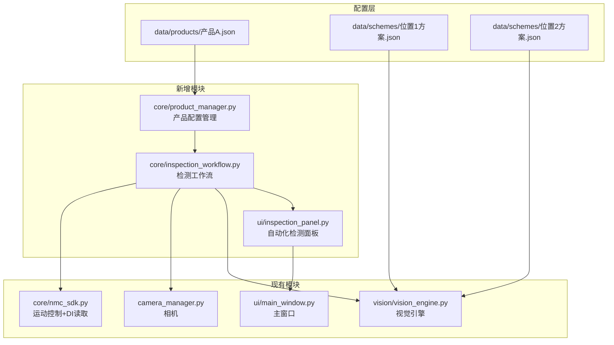
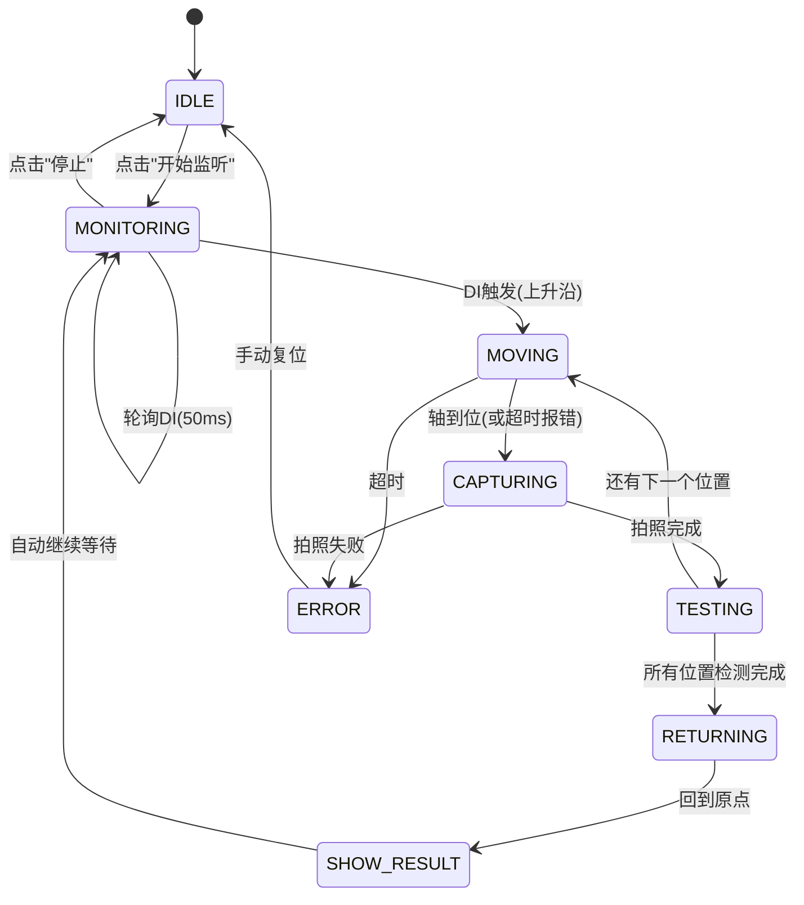

# 两段式视觉检测自动化方案

## 一、设计原则：高自由度配置

针对"同一台仪器会测试不同机器，位置、相机参数、方案都可能改变"的需求，采用 **"产品型号配置"** 模式：

```
data/
├── schemes/              # 视觉方案文件（已有）
│   ├── 默认方案.json
│   ├── 产品A_位置1.json      # 新建
│   └── 产品A_位置2.json      # 新建
├── products/             # 新增 - 产品型号配置目录
│   ├── 产品A.json            # 一个产品一个配置文件
│   └── 产品B.json
└── config.json           # 全局配置（已有）
```

### 产品配置示例 (`data/products/产品A.json`)

```json
{
    "name": "产品A",
    "description": "XX型号测试",
    
    "camera": {
        "exposure_time": 18000,
        "gain": 0,
        "white_balance": {"red": 1.0, "green": 1.0, "blue": 1.0}
    },
    
    "motion": {
        "axis": 1,
        "v_max": 50000,
        "a_max": 100000,
        "origin_position": 0,
        "move_timeout_s": 10
    },
    
    "positions": [
        {"name": "位置1", "position": 10000, "scheme": "产品A_位置1"},
        {"name": "位置2", "position": 20000, "scheme": "产品A_位置2"}
    ],
    
    "di_bit": 3,
    "poll_interval_ms": 50
}
```

**优势：**
- 换产品时只需选择不同的产品配置
- 位置数量可扩展（不仅限于2个位置）
- 每个位置的方案、坐标、相机参数独立配置

---

## 二、三种模式设计

系统包含三种操作模式，通过顶部按钮切换：

```
┌──────────────────────────────────────────────────────────────┐
│ [🔧 生产模式]  [🤖 自动化模式]  [⚙ 设计模式]               │
└──────────────────────────────────────────────────────────────┘
```

| 模式 | 触发方式 | 运动控制 | 结果显示 | 适用角色 |
|------|---------|---------|---------|---------|
| **生产模式** | 手动拍照 | 无 | 单张结果图 | 操作员 |
| **自动化模式** | DI3自动触发 | 自动移动Y轴 | 多位置并排显示 | 操作员 |
| **设计模式** | 手动拍照 | 手动控制 | 单张调试图 | 工程师 |

### 生产模式（已有，保持不变）
- 操作员手动放料 → 点击拍照 → 自动检测 → 显示单张结果
- 适合没有运动控制卡的场景，或手动快速测试

### 自动化模式（新增）
- DI3光电传感器检测到产品放入 → 自动移动Y轴到各位置 → 拍照 → 检测 → 回原点
- 适合批量自动化测试

### 设计模式（已有，保持不变）
- 工程师编辑视觉方案、调试参数
- 需要登录工程师账号

---

## 三、系统架构



---

## 四、自动化模式工作流状态机



### 状态说明

| 状态 | 说明 |
|------|------|
| `IDLE` | 空闲状态，未开始监听 |
| `MONITORING` | 定时轮询DI3，检测上升沿 |
| `MOVING` | 发送运动指令，等待轴到位 |
| `CAPTURING` | 触发相机拍照 |
| `TESTING` | 视觉检测执行中（异步线程） |
| `RETURNING` | 所有位置检测完成，退回原点 |
| `SHOW_RESULT` | 显示最终结果，统计更新 |
| `ERROR` | 发生错误，需手动复位 |

---

## 五、动态网格UI布局

根据产品配置中的位置数量，**动态生成**对应数量的图像显示框：

```
产品A（2个位置）→ 1×2 网格
┌──────────┐ ┌──────────┐
│  位置1    │ │  位置2    │
└──────────┘ └──────────┘

产品B（3个位置）→ 2×2 网格（第三格占满）
┌──────────┐ ┌──────────┐
│  位置1    │ │  位置2    │
├──────────┤ ├──────────┤
│  位置3    │ │          │
└──────────┘ └──────────┘

产品C（4个位置）→ 2×2 网格
┌──────────┐ ┌──────────┐
│  位置1    │ │  位置2    │
├──────────┤ ├──────────┤
│  位置3    │ │  位置4    │
└──────────┘ └──────────┘
```

**核心逻辑：**
```python
def load_product(self, product_config):
    """根据产品配置动态生成显示区域"""
    # 1. 清除旧的显示区域
    self._clear_position_widgets()
    
    # 2. 根据位置数量计算网格列数
    pos_count = len(product_config["positions"])
    cols = 2 if pos_count <= 4 else 3
    
    # 3. 动态创建每个位置的显示控件
    for i, pos in enumerate(product_config["positions"]):
        widget = PositionResultWidget(pos_name=pos["name"])
        self._grid_layout.addWidget(widget, i // cols, i % cols)
        self._position_widgets.append(widget)
```

每个 `PositionResultWidget` 包含：
```
┌──────────────────────┐
│  ── 位置1 ──         │
│  ┌──────────────┐    │
│  │  图像显示区    │    │
│  │  (带标注)      │    │
│  └──────────────┘    │
│  结果: ✓ OK          │
│  耗时: 120ms         │
└──────────────────────┘
```

---

## 六、自动化检测面板UI布局

```
┌──────────────────────────────────────────────────────────────┐
│ [产品: ▼ 产品A]  [开始监听] [停止] [复位]  状态: 等待DI触发  │
├───────────────────────────┬──────────────────────────────────┤
│  ── 位置1 ──              │  ── 位置2 ──                     │
│  ┌───────────────────┐    │  ┌───────────────────┐            │
│  │   图像显示区1       │    │  │   图像显示区2      │            │
│  │   (带标注结果)      │    │  │   (带标注结果)      │            │
│  └───────────────────┘    │  └───────────────────┘            │
│  结果: ✓ OK  耗时: 120ms  │  结果: ✓ OK  耗时: 150ms          │
├───────────────────────────┴──────────────────────────────────┤
│  最终结果: ✓ OK  |  总耗时: 270ms                             │
│  统计: 触发 100次 | OK 95 | NG 5                              │
├──────────────────────────────────────────────────────────────┤
│  执行日志                                                     │
│  [14:00:01] DI触发 → 开始检测                                 │
│  [14:00:02] 位置1: ✓ OK (120ms)                              │
│  [14:00:03] 位置2: ✓ OK (150ms)                              │
│  [14:00:04] 最终结果: ✓ OK                                    │
└──────────────────────────────────────────────────────────────┘
```

---

## 七、需要新增/修改的文件清单

### 7.1 新增文件

| 文件 | 说明 |
|------|------|
| [`core/product_manager.py`](core/product_manager.py) | 产品配置管理器 - 加载/保存/切换产品配置 |
| [`core/inspection_workflow.py`](core/inspection_workflow.py) | 自动化检测工作流 - 状态机核心（~587行） |
| [`ui/inspection_panel.py`](ui/inspection_panel.py) | 自动化检测面板 - 动态网格显示多位置结果（~430行） |
| [`data/products/`](data/products/) | 产品配置存放目录 |
| [`data/products/默认产品.json`](data/products/默认产品.json) | 默认产品配置模板 |
| [`data/schemes/位置1方案.json`](data/schemes/位置1方案.json) | 位置1的视觉方案占位 |
| [`data/schemes/位置2方案.json`](data/schemes/位置2方案.json) | 位置2的视觉方案占位 |

### 7.2 修改文件

| 文件 | 修改内容 |
|------|----------|
| [`vision/vision_engine.py`](vision/vision_engine.py) | 增加 `set_pipeline_by_name(name)` 方法，支持按方案名加载 |
| [`ui/main_window.py`](ui/main_window.py) | 1. 模式切换改为三档（生产/自动化/设计）<br/>2. 集成自动化检测面板<br/>3. NMC初始化在`__init__`中完成<br/>4. 设计模式新增产品配置标签页和轴控制标签页<br/>5. 新增`ProductConfigDialog`产品配置编辑对话框 |

---

## 八、关键设计决策

### 8.1 DI触发 vs 串口触发

当前方案使用 **NMC控制卡直接读取DI3**（`get_input_bit(3)`），原因：
- 与运动控制在同一硬件上，时序更可靠
- 无需额外串口通信
- 现有SDK已完整支持

如果后续需要支持串口触发，只需替换 `InspectionWorkflow` 中的触发检测逻辑即可。

### 8.2 运动到位检测

使用 **轮询 `get_axis_state()`** 判断轴是否到位：
- 轴状态为 `0`（空闲）表示运动完成
- 设置超时保护（默认10秒），超时则报错停止
- 到位后自动执行下一步（拍照→检测）

### 8.3 结果聚合逻辑

- 所有位置都通过（passed=True）→ 最终结果 OK
- 任一位置不通过 → 最终结果 NG
- 每个位置的检测结果和标注图独立保存和显示

### 8.4 生产模式未被取代的原因

1. **无控制卡场景**：有些工位没有NMC控制卡，无法使用自动化模式
2. **手动测试需求**：小批量测试、抽检时，手动操作更灵活
3. **简单场景**：固定单位置检测，不需要运动控制

---

## 九、设计模式新增功能

### 9.1 产品配置编辑器（`ProductConfigDialog`）

设计模式右侧新增 **"产品配置"标签页**，工程师可通过图形界面管理产品配置：

**功能列表：**
- 新建/编辑/删除产品型号
- 配置基本信息（产品名称、描述）
- 配置相机参数（曝光时间、增益）
- 配置运动参数（速度、原点位置、超时时间）
- 配置DI触发位号
- 动态添加/删除检测位置，每个位置可设置名称、坐标、关联的视觉方案

**操作流程：**
1. 工程师登录设计模式
2. 切换到"产品配置"标签页
3. 点击"新建产品"打开编辑对话框
4. 填写产品参数，添加检测位置
5. 保存后，自动化模式即可选择该产品

### 9.2 轴控制面板

设计模式右侧新增 **"轴控制"标签页**，方便工程师调试时移动轴：

**功能列表：**
- 选择轴（Axis_1 ~ Axis_4）
- 显示当前位置
- 设置运动速度
- 绝对移动：输入目标位置，点击移动
- JOG 正/反向点动
- 紧急停止
- 读取当前位置

**设计目的：**
- 工程师调试视觉方案时，需要移动相机到不同位置拍照
- 无需每次都打开独立的运动控制窗口
- 与视觉调试在同一界面，提高效率

### 9.3 NMC初始化时机

NMC SDK 初始化从"打开运动控制窗口时"改为 **"主窗口初始化时"**：

```python
def _init_nmc(self):
    """在 MainWindow.__init__() 中调用"""
    self._nmc_sdk = NMCSDK()
    if self._nmc_sdk.load_dll():
        ret = self._nmc_sdk.connect(auto_open=True)
```

**优势：**
- 所有模块共享同一个 NMC SDK 实例
- 自动化模式可直接使用，无需等待用户打开控制窗口
- 关闭系统时统一清理
