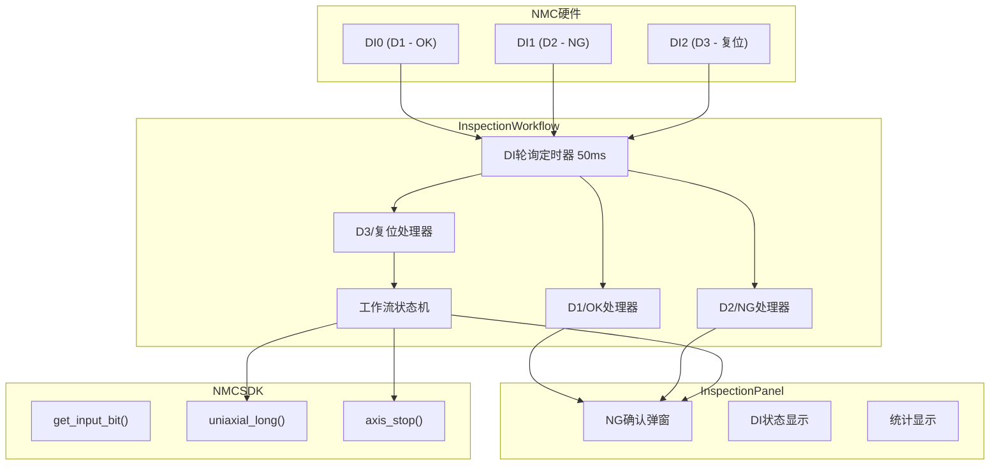
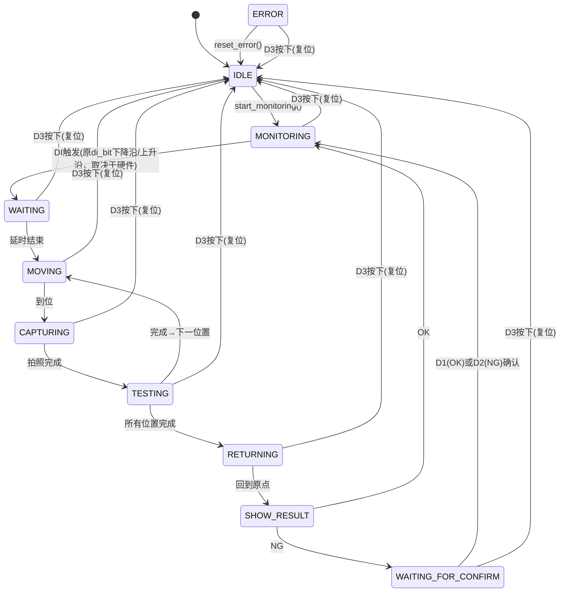

# NMC 数字输入口（DI）监测实施计划

## 一、需求概述

在现有自动化检测系统基础上，增加对 NMC 控制卡三个数字输入口（DI）的监测功能：

| 输入 | NMC位号 | 功能 | 说明 |
|------|---------|------|------|
| D1 | DI0 (bit 0) | OK确认 | 在NG弹窗中按下 = 确认为OK |
| D2 | DI1 (bit 1) | NG确认 | 在NG弹窗中按下 = 确认为NG |
| D3 | DI2 (bit 2) | 复位回零 | 任意状态下按下，停止当前流程，AXI1回到0坐标 |

## 二、当前系统分析

### 现有 DI 监测机制
- [`core/inspection_workflow.py`](core/inspection_workflow.py) 中的 `InspectionWorkflow` 类已有 DI 轮询机制
- 通过 `_poll_timer` 定时器（默认50ms间隔）轮询单个 DI 位号（`self._config.di_bit`）
- 检测下降沿（1→0）触发自动化检测流程（NMC DI默认高电平，按下变低）
- 当前只监测一个 DI 位号（由产品配置中的 `di_bit` 字段指定）

### NG 弹窗机制
- [`ui/inspection_panel.py`](ui/inspection_panel.py) 中的 `_on_ng_confirm_requested` 方法弹出确认对话框
- 对话框有两个按钮："✓ 确认为 OK" 和 "✗ 确认为 NG"
- 点击后调用 `workflow.confirm_ng_result(True/False)`

### 运动控制
- [`core/nmc_sdk.py`](core/nmc_sdk.py) 的 `NMCSDK` 类提供 `get_input_bit(bit_number)` 读取单个DI
- 提供 `uniaxial_long()` 进行相对定位运动
- 提供 `axis_stop()` 停止轴运动

## 三、架构设计



### 工作流状态图（含DI输入）



## 四、详细实施步骤

### 步骤1：扩展 InspectionWorkflow 的 DI 监测功能

**文件：** [`core/inspection_workflow.py`](core/inspection_workflow.py)

#### 1.1 新增 DI 配置

在 `WorkflowConfig` 数据类中新增字段：

```python
@dataclass
class WorkflowConfig:
    # ... 现有字段 ...
    di_bit_ok: int = 0       # D1 - OK确认输入位号
    di_bit_ng: int = 1       # D2 - NG确认输入位号
    di_bit_reset: int = 2    # D3 - 复位回零输入位号
    reset_speed: float = 20000.0    # 复位回零速度
    reset_acc: float = 10000.0      # 复位回零加速度
```

#### 1.2 新增 DI 状态跟踪变量

在 `__init__` 中新增：

```python
self._last_di_states = {0: 0, 1: 0, 2: 0}  # 记录三个DI的上次状态
```

#### 1.3 扩展 `_poll_di()` 方法

当前 `_poll_di()` 只监测一个 DI 位号。需要改为：

- **始终监测 D3（复位）**：在任何状态下都检测 D3 的**上升沿**（0→1，默认0按下1）
- **监测原触发 DI**：仅在 MONITORING 状态下检测原 `di_bit` 的触发信号
- **监测 D1/D2**：仅在 WAITING_FOR_CONFIRM 状态下检测 D1/D2 的**上升沿**（0→1，默认0按下1）

新增方法：

```python
def _poll_all_di(self):
    """轮询所有 DI 状态"""
    # 1. 始终检测 D3 复位信号
    self._check_d3_reset()
    
    # 2. 根据当前状态检测其他 DI
    if self._state == self.State.MONITORING:
        self._check_di_trigger()
    elif self._state == self.State.WAITING_FOR_CONFIRM:
        self._check_di_confirm()
```

#### 1.4 新增 D3 复位处理方法

```python
def _check_d3_reset(self):
    """检测 D3 复位信号（上升沿：默认0，按下为1）"""
    try:
        current = self._nmc_sdk.get_input_bit(self._config.di_bit_reset)
        if current == 1 and self._last_di_states[2] == 0:
            log_info("D3 复位按键按下，执行复位回零")
            self._execute_reset()
        self._last_di_states[2] = current
    except Exception as e:
        log_error(f"读取 D3 复位 DI 失败: {e}")
```

#### 1.5 新增复位执行方法

```python
def _execute_reset(self):
    """执行复位回零 - 停止当前流程，AXI1回到0坐标"""
    # 1. 停止所有定时器
    self._poll_timer.stop()
    self._arrive_timer.stop()
    self._start_delay_timer.stop()
    
    # 2. 停止轴运动
    if self._nmc_sdk and self._nmc_sdk.is_open():
        try:
            self._nmc_sdk.axis_stop(self._config.axis, Axis_Stop_DEC)
        except Exception:
            pass
    
    # 3. 如果正在等待NG确认，发射信号让UI关闭弹窗
    if self._state == self.State.WAITING_FOR_CONFIRM:
        self.reset_during_confirm.emit()  # 新增信号
    
    # 4. 移动到0坐标
    self._move_to_zero()
    
    # 5. 重置状态
    self._running = False
    self._set_state(self.State.IDLE)
    log_info("D3 复位完成，已回到0坐标")
```

#### 1.6 新增移动到0坐标方法

```python
def _move_to_zero(self):
    """移动到0坐标（速度20000，加速度10000）"""
    if not (self._nmc_sdk and self._nmc_sdk.is_open()):
        return
    try:
        axis = self._config.axis
        current_pos = self._nmc_sdk.get_position(axis)
        diff = 0 - current_pos  # 目标0 - 当前位置
        
        # 设置速度参数（使用复位专用速度）
        self._nmc_sdk.set_axis_profile(axis, 0, 20000, 10000, 0, 0, Profile_S)
        # 相对运动到0
        self._nmc_sdk.uniaxial_long(axis, diff, Position_Opposite)
    except Exception as e:
        log_error(f"复位回零运动失败: {e}")
```

#### 1.7 新增 D1/D2 确认检测方法

```python
def _check_di_confirm(self):
    """检测 D1/D2 确认信号（上升沿：默认0，按下为1）"""
    try:
        # 检测 D1 (OK)
        d1 = self._nmc_sdk.get_input_bit(self._config.di_bit_ok)
        if d1 == 1 and self._last_di_states[0] == 0:
            log_info("D1 OK 按键按下")
            self.confirm_ng_result(True)
        self._last_di_states[0] = d1
        
        # 检测 D2 (NG)
        d2 = self._nmc_sdk.get_input_bit(self._config.di_bit_ng)
        if d2 == 1 and self._last_di_states[1] == 0:
            log_info("D2 NG 按键按下")
            self.confirm_ng_result(False)
        self._last_di_states[1] = d2
    except Exception as e:
        log_error(f"读取 D1/D2 确认 DI 失败: {e}")
```

#### 1.8 新增信号

```python
reset_during_confirm = pyqtSignal()
"""D3复位时发射，通知UI关闭NG确认弹窗"""
```

#### 1.9 修改 `_poll_di` 调用

将 `_poll_timer` 连接的槽函数从 `_poll_di` 改为 `_poll_all_di`

#### 1.10 新增状态 `WAITING_FOR_CONFIRM`

在 `State` 枚举中新增：

```python
WAITING_FOR_CONFIRM = "等待确认"  # NG弹窗等待D1/D2确认
```

将原来 `_show_final_result` 中 NG 时设置的 `WAITING` 状态改为 `WAITING_FOR_CONFIRM`

### 步骤2：修改 NG 确认弹窗支持硬件按键

**文件：** [`ui/inspection_panel.py`](ui/inspection_panel.py)

#### 2.1 连接 D3 复位信号

在 `_connect_signals` 中新增：

```python
self._workflow.reset_during_confirm.connect(self._on_reset_during_confirm)
```

#### 2.2 新增复位时关闭弹窗方法

```python
def _on_reset_during_confirm(self):
    """D3复位时关闭NG确认弹窗"""
    if hasattr(self, '_confirm_dialog') and self._confirm_dialog is not None:
        self._confirm_dialog.reject()  # 关闭弹窗
        self._confirm_dialog = None
```

#### 2.3 修改 NG 弹窗，保存 dialog 引用

在 `_on_ng_confirm_requested` 中，将 dialog 保存为实例变量：

```python
self._confirm_dialog = dialog
# ... 现有代码 ...
# 在 dialog.exec_() 之后：
self._confirm_dialog = None
```

#### 2.4 在弹窗中添加提示信息

在弹窗标题或说明中添加："支持 D1(OK) / D2(NG) 硬件按键确认"

### 步骤3：在 InspectionPanel 中添加 DI 状态显示

**文件：** [`ui/inspection_panel.py`](ui/inspection_panel.py)

#### 3.1 在统计栏添加 DI 状态指示

在 `_setup_ui` 的 stats_bar 中添加三个小指示灯：

```python
# DI 状态指示灯
self._di_status_label = QLabel("DI: ● ● ●")
# D1=绿色, D2=红色, D3=黄色
```

#### 3.2 新增 DI 状态更新方法

```python
def _update_di_status(self, d1, d2, d3):
    """更新DI状态显示"""
    colors = []
    colors.append("#66BB6A" if d1 else "#444")  # D1 绿色
    colors.append("#EF5350" if d2 else "#444")  # D2 红色
    colors.append("#FFA000" if d3 else "#444")  # D3 黄色
    self._di_status_label.setText(
        f'D1: <span style="color:{colors[0]}">●</span> '
        f'D2: <span style="color:{colors[1]}">●</span> '
        f'D3: <span style="color:{colors[2]}">●</span>'
    )
```

#### 3.3 连接 DI 状态信号

在工作流中新增 DI 状态信号，或在轮询时通过现有信号传递 DI 状态。

### 步骤4：更新产品配置

**文件：** [`data/products/测试产品方案.json`](data/products/测试产品方案.json)、[`data/products/默认产品.json`](data/products/默认产品.json)

在产品配置中新增字段：

```json
{
  "di_bit_ok": 0,
  "di_bit_ng": 1,
  "di_bit_reset": 2,
  "reset_speed": 20000,
  "reset_acc": 10000
}
```

### 步骤5：更新产品配置加载逻辑

**文件：** [`core/inspection_workflow.py`](core/inspection_workflow.py) 的 `load_product` 方法

在加载产品配置时，读取新增的 DI 配置字段：

```python
self._config.di_bit_ok = product_config.get("di_bit_ok", 0)
self._config.di_bit_ng = product_config.get("di_bit_ng", 1)
self._config.di_bit_reset = product_config.get("di_bit_reset", 2)
self._config.reset_speed = product_config.get("reset_speed", 20000)
self._config.reset_acc = product_config.get("reset_acc", 10000)
```

## 五、涉及文件清单

| 文件 | 修改内容 |
|------|----------|
| [`core/inspection_workflow.py`](core/inspection_workflow.py) | 核心修改：多DI监测、D3复位、D1/D2确认、新状态、新信号 |
| [`ui/inspection_panel.py`](ui/inspection_panel.py) | NG弹窗支持硬件按键、DI状态显示、D3复位信号连接 |
| [`data/products/测试产品方案.json`](data/products/测试产品方案.json) | 新增DI配置字段 |
| [`data/products/默认产品.json`](data/products/默认产品.json) | 新增DI配置字段 |

## 六、注意事项

1. **DI 轮询频率**：当前50ms轮询间隔足够检测按键按下（人类按键时间>100ms），无需调整
2. **上升沿检测**：D1/D2/D3均采用上升沿检测（0→1），因为NMC DI默认低电平（0），按下为高电平（1）
3. **D3复位优先级最高**：在任何状态下D3都能触发复位，复位时会停止所有正在进行的操作
4. **线程安全**：所有DI操作都在主线程的定时器中完成，无需额外线程同步
5. **兼容性**：原有 `di_bit` 配置仍然保留，用于自动化流程的触发DI监测
6. **NG弹窗与硬件按键共存**：鼠标点击和D1/D2硬件按键都可以确认NG结果
