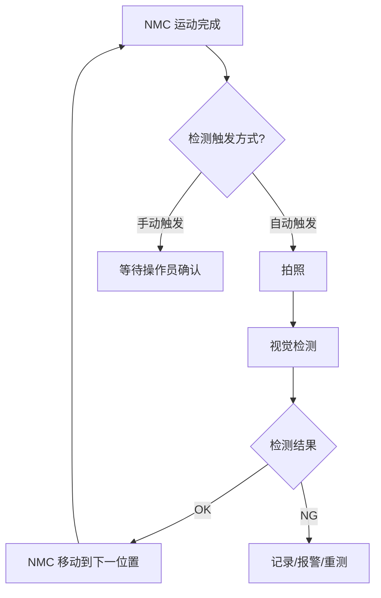

# NMC3401 运动控制卡集成计划

## 1. 概述

将 NMC_SDK_TEST 项目中的 NMC3401 运动控制卡功能集成到 VisionTest2.0 视觉检测系统中。

### 集成方式
- 菜单栏「通信」下添加「运动控制」菜单项
- 点击后打开独立对话框（类似现有的串口通信对话框）
- 与视觉检测流水线联动（后续实现）

### 文件组织
| 源文件 | 目标位置 | 说明 |
|--------|----------|------|
| `nmc_sdk.py` | `core/nmc_sdk.py` | NMC3401 DLL 封装，核心模块 |
| `nmc_gui.py` | `ui/widgets/nmc_control_dialog.py` | 运动控制对话框 UI（重构为 QDialog） |
| `main.py` (NMC) | 不需要 | 入口逻辑合并到 main_window.py |

---

## 2. 详细实施步骤

### 步骤 1：复制 nmc_sdk.py 到 core/ 目录

**文件**: `core/nmc_sdk.py`

- 将 `NMC_SDK_TEST/nmc_sdk.py` 完整复制到 `core/nmc_sdk.py`
- 无需修改，DLL 路径使用默认值即可（VisionTest2.0 根目录已有 MCDLL_NET.dll）

### 步骤 2：创建 nmc_control_dialog.py

**文件**: `ui/widgets/nmc_control_dialog.py`

基于 `nmc_gui.py` 重构为 `QDialog`，参考 `serial_dialog.py` 的模式：

#### 2.1 类结构
```python
class NMCControlDialog(QDialog):
    """NMC3401 运动控制卡对话框"""
    
    # 信号
    nmc_connected = pyqtSignal(bool)  # 连接状态变化
    motion_completed = pyqtSignal(int, bool)  # (axis, success) 运动完成信号
    
    def __init__(self, parent=None):
        ...
```

#### 2.2 UI 布局（保留 nmc_gui.py 的 5 个标签页）
1. **初始化** - 连接/断开控制卡、系统信息显示
2. **IO 监测** - 数字输入/输出状态实时显示
3. **轴参数** - 脉冲模式、命令位置、编码器位置、软限位设置
4. **回零** - 三阶段回零控制（搜索→减速→精定位）
5. **点位运动** - JOG 点动、单轴运动、曲线参数设置

#### 2.3 与 nmc_gui.py 的主要差异
| 项目 | nmc_gui.py (原始) | nmc_control_dialog.py (新) |
|------|-------------------|---------------------------|
| 基类 | QMainWindow | QDialog |
| 窗口管理 | 独立窗口 | 模态对话框 |
| 生命周期 | 独立管理 | 由 MainWindow 管理 |
| 样式 | 独立样式 | 继承 VisionTest2.0 暗色主题 |
| 日志 | 独立 LogHandler | 复用 core/log_manager.py |
| 配置持久化 | 无 | 复用 core/config_manager.py |
| 联动接口 | 无 | 添加 motion_completed 信号 |

### 步骤 3：修改 main_window.py

**文件**: `ui/main_window.py`

#### 3.1 在 `__init__` 中添加 NMC 相关成员
```python
# NMC 运动控制
self._nmc_sdk: Optional[NMCSDK] = None
self._nmc_dialog: Optional[NMCControlDialog] = None
```

#### 3.2 在 `_setup_menu_bar` 中添加菜单项
在「通信」菜单中添加「运动控制」菜单项：
```python
# 在 comm_menu 中添加
self.act_nmc_control = QAction("运动控制", self)
self.act_nmc_control.triggered.connect(self._open_nmc_dialog)
comm_menu.addAction(self.act_nmc_control)
```

#### 3.3 添加 `_open_nmc_dialog` 方法
```python
def _open_nmc_dialog(self):
    """打开运动控制卡对话框。"""
    from .widgets.nmc_control_dialog import NMCControlDialog
    if self._nmc_sdk is None:
        self._nmc_sdk = NMCSDK()
    dialog = NMCControlDialog(self, nmc_sdk=self._nmc_sdk)
    dialog.exec_()
```

#### 3.4 在 `closeEvent` 中添加 NMC 清理
```python
# 关闭 NMC
if self._nmc_sdk is not None:
    try:
        self._nmc_sdk.close_net()
    except Exception:
        pass
    self._nmc_sdk = None
```

### 步骤 4：与视觉检测联动（后续实现）

> ⚠️ **注意**：您提到后续会提供测试流程，这里先预留接口，具体联动逻辑待您提供流程后再设计。

#### 4.1 预留联动架构

联动方式建议采用 **「NMC 工作流 + 视觉检测工作流」组合模式**，类似现有的 `SerialTestWorkflow`：



#### 4.2 预留信号接口

在 `NMCControlDialog` 中已预留 `motion_completed` 信号，后续可通过此信号触发检测流程：

```python
# 在 MainWindow 中连接
self._nmc_dialog.motion_completed.connect(self._on_nmc_motion_completed)

def _on_nmc_motion_completed(self, axis: int, success: bool):
    """NMC 运动完成回调 - 触发视觉检测"""
    if success and self._nmc_auto_test_enabled:
        # 1. 拍照
        self._capture()
        # 2. 检测（在 _on_capture_completed 中触发）
        self._pending_detect = True
        # 3. 根据检测结果控制 NMC 下一步动作
```

---

## 3. 文件修改清单

| 文件 | 操作 | 说明 |
|------|------|------|
| `core/nmc_sdk.py` | **新建** | 从 NMC_SDK_TEST 复制，无需修改 |
| `ui/widgets/nmc_control_dialog.py` | **新建** | 基于 nmc_gui.py 重构为 QDialog |
| `ui/main_window.py` | **修改** | 添加菜单项、打开方法、清理逻辑 |
| `requirements.txt` | **无需修改** | NMC 仅依赖 PyQt5，已存在 |

---

## 4. 关键设计决策

### 4.1 DLL 加载
- `MCDLL_NET.dll` 已在 VisionTest2.0 根目录
- `NMCSDK.__init__` 默认在当前目录查找 DLL，无需额外配置
- 与相机 SDK 共用同一 DLL 文件（已确认）

### 4.2 样式适配
- `nmc_gui.py` 有独立的暗色样式
- 重构为 `QDialog` 后，样式需与 VisionTest2.0 的暗色主题保持一致
- 参考 `serial_dialog.py` 的样式写法

### 4.3 配置持久化
- 使用 `ConfigManager` 保存 NMC 对话框的配置（如上次连接的 IP/端口）
- 配置前缀：`nmc_control`

### 4.4 生命周期管理
- `NMCSDK` 实例由 `MainWindow` 持有（单例），对话框关闭时不销毁
- 对话框关闭时不断开控制卡连接，保持连接状态
- 系统关闭时自动断开

---

## 5. 后续联动方案待讨论

您提到后续会提供测试流程，以下是几个需要一起讨论的设计问题：

1. **触发方式**：NMC 运动到位后，是自动触发拍照检测，还是等待外部信号/操作员确认？
2. **检测结果反馈**：检测 NG 时，NMC 应如何处理？（停止/报警/重测/跳过）
3. **多位置序列**：是否需要在方案中配置多个检测位置，NMC 按顺序移动？
4. **与现有串口工作流的关系**：NMC 联动是否会替代现有的串口触发工作流，还是两者共存？

这些可以在您提供测试流程后再细化设计。
