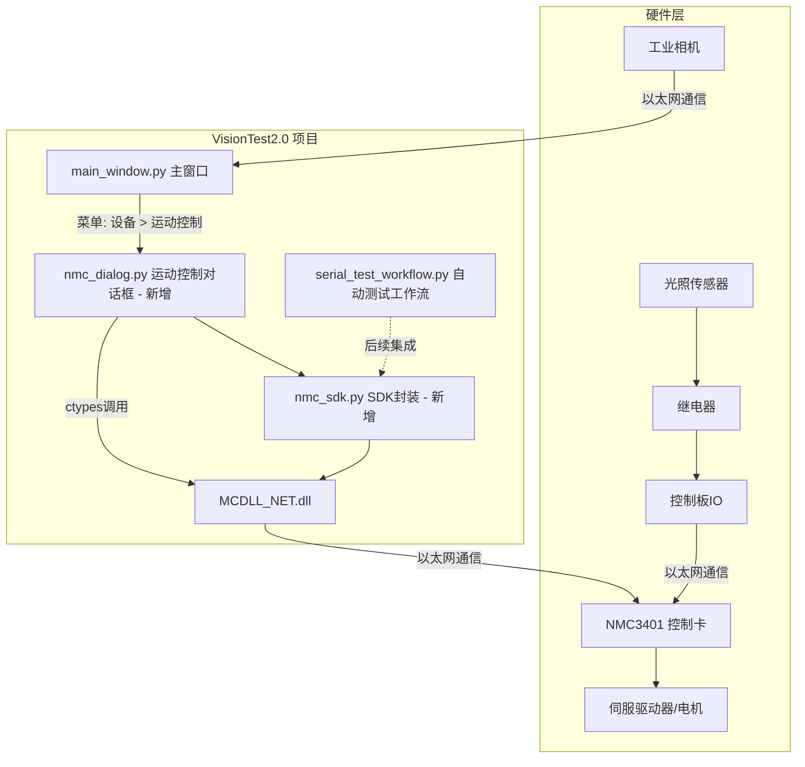
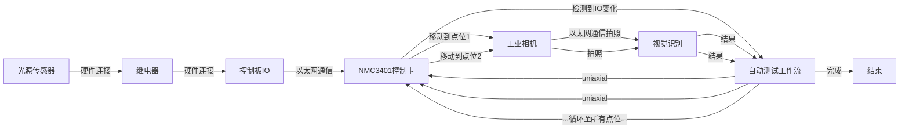

# NMC3401 运动控制卡集成计划

## 1. 概述

将 NMC_SDK_TEST 项目中的 NMC3401 运动控制卡 SDK 集成到 VisionTest2.0 视觉检测系统中，提供独立的运动控制调试面板，并为后续自动测试工作流中的定点移动功能奠定基础。

---

## 2. 你需要提前准备的事项

### 2.1 硬件准备
- **NMC3401 运动控制卡**（已安装到工控机 PCIe 插槽）
- **MCDLL_NET.dll** 驱动文件（已存在于 NMC_SDK_TEST 项目目录中）
- **伺服驱动器与电机**（连接至控制卡对应轴接口）
- **光照传感器 + 继电器 + 控制板 IO**（用于后续自动测试触发）

### 2.2 软件准备
- **拷贝 DLL 文件**：将 `D:\Python project\NMC_SDK_TEST\MCDLL_NET.dll` 复制到 `D:\Python project\VisionTest2.0\` 项目根目录
- **确认 DLL 依赖**：运行 `check_dll.py` 验证 DLL 能否正常加载（该脚本会检查所有导出函数）
- **确认控制卡 IP/网络配置**：NMC3401 通过以太网通信，需确认控制卡的 IP 地址和端口号（默认通常为 192.168.0.11:502）

### 2.3 无需准备
- **无需安装额外 Python 包**：NMC SDK 使用 `ctypes`（Python 内置模块）与 DLL 交互，VisionTest2.0 现有依赖已满足需求
- **无需修改现有代码逻辑**：集成采用"新增文件 + 菜单入口"模式，不影响现有功能

---

## 3. 集成架构



---

## 4. 需要新增/修改的文件

### 4.1 新增文件

#### 文件 1: `core/nmc_sdk.py` — NMC3401 SDK 封装层

**来源**：从 `NMC_SDK_TEST/nmc_sdk.py` 移植，保持核心功能不变

**内容**：
- `NMCSDK` 类：封装 MCDLL_NET.dll 的所有函数
  - 初始化/连接：`load_dll()`, `open_net()`, `close_net()`
  - 轴控制：`set_servo_enable()`, `get_position()`, `set_position()`
  - 运动控制：`jog()`, `uniaxial()`, `axis_stop()`, `emergency_stop_all()`
  - 参数配置：`set_axis_profile()`, `set_pulse_mode()`, `set_soft_limit()`
  - 回零操作：`search_home_set()`, `search_home_start()`, `search_home_get_state()`
  - 状态查询：`get_axis_state()`, `get_servo_enable()`, `get_all_positions()`
- 异常类：`NMCError`, `NMCConnectionError`, `NMCRuntimeError`
- 常量定义：轴编号、脉冲模式、伺服状态、停止模式等

**与原始文件的差异**：
- 移除 GUI 相关依赖
- 适配 VisionTest2.0 的日志系统（使用 `core/log_manager.py` 的 `log_error`/`log_info`）
- 路径处理：DLL 路径相对于项目根目录

#### 文件 2: `ui/widgets/nmc_dialog.py` — NMC 运动控制对话框

**参考模式**：`ui/widgets/serial_dialog.py`（独立 QDialog，从菜单打开）

**功能布局**（参考 `nmc_gui.py` 的 Tab 设计）：

```
┌─────────────────────────────────────────────────┐
│  NMC3401 运动控制面板                     [X]   │
├─────────────────────────────────────────────────┤
│  状态栏: ● 已连接 | 轴1: 0.00 | 轴2: 0.00 ...  │
├───────┬─────────┬──────────┬────────────────────┤
│ 初始化 │ 轴参数  │  回零    │     运动控制       │
├───────┴─────────┴──────────┴────────────────────┤
│                                                   │
│  Tab 1 - 初始化:                                  │
│  ┌─────────────────────────────────────────────┐  │
│  │ IP地址: [192.168.0.11]  端口: [502]         │  │
│  │ [连接]  [断开]  [紧急停止]                   │  │
│  │ 系统信息: 版本号 序列号 运行时间             │  │
│  └─────────────────────────────────────────────┘  │
│                                                   │
│  Tab 2 - 轴参数:                                  │
│  ┌─────────────────────────────────────────────┐  │
│  │ 轴选择: [▼ 轴1]                             │  │
│  │ 脉冲模式: [▼ 脉冲+方向]   [设置]            │  │
│  │ 命令位置: [0]   [设置]                       │  │
│  │ 编码器位置: [0]   [设置]                     │  │
│  │ 软件限位+: [100000]  软件限位-: [-100000]   │  │
│  │ [设置限位]  [使能限位]                       │  │
│  └─────────────────────────────────────────────┘  │
│                                                   │
│  Tab 3 - 回零:                                    │
│  ┌─────────────────────────────────────────────┐  │
│  │ 轴选择: [▼ 轴1]                             │  │
│  │ 回零模式: [▼ 模式1]  速度: [10000]          │  │
│  │ [开始回零]  [停止回零]                       │  │
│  │ 状态: 回零中...                              │  │
│  └─────────────────────────────────────────────┘  │
│                                                   │
│  Tab 4 - 运动控制:                                │
│  ┌─────────────────────────────────────────────┐  │
│  │ 轴选择: [▼ 轴1]                             │  │
│  │ ┌─────────────────────────────────────────┐ │  │
│  │ │  JOG控制:  [正转] [停止] [反转]         │ │  │
│  │ │  速度: [10000]  加速度: [1000]           │ │  │
│  │ └─────────────────────────────────────────┘ │  │
│  │ ┌─────────────────────────────────────────┐ │  │
│  │ │  定点运动:                               │ │  │
│  │ │  目标位置: [0]  速度: [10000]           │ │  │
│  │ │  加速度: [1000]  减速度: [1000]          │ │  │
│  │ │  [启动]  [停止]                          │ │  │
│  │ └─────────────────────────────────────────┘ │  │
│  └─────────────────────────────────────────────┘  │
│                                                   │
│  日志输出区域:                                    │
│  ┌─────────────────────────────────────────────┐  │
│  │ [12:00:01] 连接成功                         │  │
│  │ [12:00:02] 轴1 伺服使能                     │  │
│  │ ...                                         │  │
│  └─────────────────────────────────────────────┘  │
└─────────────────────────────────────────────────┘
```

**核心功能**：
- 连接管理：IP/端口配置，连接/断开/紧急停止
- 轴参数配置：脉冲模式、命令位置、编码器位置、软件限位
- 回零操作：多种回零模式，实时监测回零状态
- JOG 点动：正转/反转/停止，带软件限位自动恢复
- 定点运动：设置目标位置、速度/加速度参数，启动/停止
- 实时状态刷新：定时器周期性读取各轴位置和状态
- 日志输出：带时间戳的操作日志

### 4.2 修改文件

#### 文件 3: `ui/main_window.py` — 主窗口

**修改内容**：
1. 在 `_setup_menu_bar()` 方法的"设备"菜单中添加"运动控制"菜单项
2. 添加 `_open_nmc_dialog()` 方法（参考 `_open_serial_dialog()` 模式）
3. 在 `__init__()` 中添加 `self._nmc_sdk = None` 属性（可选，用于共享 SDK 实例）

**代码变更示例**：

```python
# 在 _setup_menu_bar() 的 device_menu 中添加
self.act_nmc_control = QAction("运动控制", self)
self.act_nmc_control.triggered.connect(self._open_nmc_dialog)
device_menu.addAction(self.act_nmc_control)

# 新增方法
def _open_nmc_dialog(self):
    """打开 NMC 运动控制面板。"""
    from .widgets.nmc_dialog import NMCDialog
    dialog = NMCDialog(self)
    dialog.exec_()
```

#### 文件 4: `core/__init__.py` — 核心模块初始化

**修改内容**：无需修改（Python 自动发现子模块）

#### 文件 5: `ui/widgets/__init__.py` — UI 组件初始化

**修改内容**：无需修改（Python 自动发现子模块）

---

## 5. 后续集成：自动测试工作流中的定点移动

### 5.1 远期架构



### 5.2 需要新增的组件（后续阶段）

- **`core/nmc_test_workflow.py`**：扩展 `SerialTestWorkflow`，增加 NMC 定点移动步骤
- **点位配置数据结构**：在方案（Scheme）中增加点位列表配置
- **UI 点位编辑界面**：在方案编辑器中增加点位设置界面

### 5.3 集成点

| 触发时机 | 动作 | 说明 |
|---------|------|------|
| 光照传感器触发 | 控制板IO电平变化 | 传感器→继电器→控制板IO，硬件直连 |
| IO变化 | NMC3401检测到IO输入变化 | 通过SDK读取IO状态，启动测试流程 |
| 测试开始 | 移动到第1个点位 | `nmc_sdk.uniaxial(axis, dist, 0)` |
| 到达点位 | 相机以太网通信拍照 | 等待轴停止后，通过SDK触发相机 |
| 识别完成 | 移动到下一个点位 | 循环直到所有点位完成 |
| 所有点位完成 | 发送结果 + 复位 | 回到原点或等待下次触发 |

---

## 6. 实施步骤

### 步骤 1：准备环境
- [ ] 将 `MCDLL_NET.dll` 复制到 VisionTest2.0 项目根目录
- [ ] 运行 `check_dll.py` 验证 DLL 加载
- [ ] 确认控制卡网络连接正常

### 步骤 2：创建 SDK 封装层
- [ ] 创建 `core/nmc_sdk.py`（从 NMC_SDK_TEST 移植）
- [ ] 适配 VisionTest2.0 的日志系统
- [ ] 验证 SDK 基本功能（加载 DLL、连接控制卡）

### 步骤 3：创建运动控制对话框
- [ ] 创建 `ui/widgets/nmc_dialog.py`
- [ ] 实现连接管理界面（IP/端口配置）
- [ ] 实现轴参数配置界面
- [ ] 实现回零操作界面
- [ ] 实现 JOG 和定点运动控制界面
- [ ] 实现实时状态刷新和日志输出

### 步骤 4：集成到主窗口
- [ ] 在 `main_window.py` 的"设备"菜单中添加"运动控制"菜单项
- [ ] 实现 `_open_nmc_dialog()` 方法

### 步骤 5：测试验证
- [ ] 启动程序，通过菜单打开运动控制面板
- [ ] 连接控制卡，测试各轴基本功能
- [ ] 测试 JOG 点动、定点运动、回零等操作
- [ ] 验证紧急停止功能

---

## 7. 文件清单汇总

| 操作 | 文件路径 | 说明 |
|------|---------|------|
| ✅ 新增 | `core/nmc_sdk.py` | NMC3401 SDK 封装层（~500 行） |
| ✅ 新增 | `ui/widgets/nmc_dialog.py` | 运动控制对话框（~800 行） |
| 🔧 修改 | `ui/main_window.py` | 添加菜单项和打开对话框方法（~20 行） |
| 📋 复制 | `MCDLL_NET.dll` → 项目根目录 | DLL 驱动文件 |
| 📋 参考 | `NMC_SDK_TEST/nmc_sdk.py` | SDK 原始代码 |
| 📋 参考 | `NMC_SDK_TEST/nmc_gui.py` | GUI 原始代码（UI 设计参考） |
| 📋 参考 | `ui/widgets/serial_dialog.py` | 对话框实现模式参考 |

---

## 8. 风险与注意事项

1. **DLL 依赖**：`MCDLL_NET.dll` 必须存在于项目根目录或系统 PATH 中，否则程序启动时无法加载
2. **硬件依赖**：未连接 NMC3401 控制卡时，打开对话框会显示"未连接"状态，但不会崩溃
3. **线程安全**：SDK 调用应在非 UI 线程执行长时间操作（如回零监测），避免阻塞界面
4. **紧急停止**：必须在界面显眼位置提供紧急停止按钮，确保安全
5. **软件限位**：JOG 操作必须配合软件限位，防止超程损坏设备
