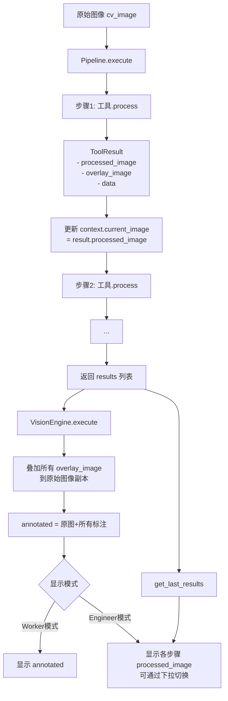

# 标注叠加与显示分离实施方案

## 概述

本方案针对 VisionTest 项目的5个需求，实现标注叠加（overlay_image）逻辑、Worker/Engineer 模式显示分离、步骤标签显示、ResultPanel 图像展示以及尺寸一致性处理。

---

## 需求3（核心基础）：实现 overlay_image 叠加逻辑

### 3.1 修改 `VisionEngine.execute()` — 叠加逻辑

**文件**: `vision/vision_engine.py:30-59`

**当前代码**（第39-42行）：
```python
annotated = current_image.copy()
for r in results:
    if r.processed_image is not None:
        annotated = r.processed_image.copy()
```
问题：只是用最后一个工具的 processed_image 覆盖，不是叠加。

**改为**：
```python
# 在原图上叠加所有工具的 overlay_image
annotated = cv_image.copy()  # 始终从原始图像开始
for r in results:
    if r.overlay_image is not None:
        overlay = r.overlay_image
        # 尺寸不一致时缩放
        if overlay.shape[:2] != annotated.shape[:2]:
            overlay = cv2.resize(overlay, (annotated.shape[1], annotated.shape[0]))
        # 通过 mask 只叠加非黑色部分（标注内容）
        gray_overlay = cv2.cvtColor(overlay, cv2.COLOR_BGR2GRAY)
        _, mask = cv2.threshold(gray_overlay, 1, 255, cv2.THRESH_BINARY)
        mask_inv = cv2.bitwise_not(mask)
        bg = cv2.bitwise_and(annotated, annotated, mask=mask_inv)
        fg = cv2.bitwise_and(overlay, overlay, mask=mask)
        annotated = cv2.add(bg, fg)
```

### 3.2 修改所有工具 — 填充 overlay_image

**原则**：
- `processed_image` 保持不变（各工具的处理结果）
- `overlay_image` = 在**原始图像尺寸的黑色背景**上绘制标注
- 不产生标注的工具（预处理类）：`overlay_image` 保持 `None`

**需要修改的工具列表**：

| 工具 | 标注内容 | 文件位置 |
|------|---------|---------|
| MultiROI | ROI矩形框+名称 | preprocess.py:256-274 |
| CircleDetection | 检测到的圆+圆心 | geometry.py:74-134 |
| HoughLineDetection | 检测到的直线 | geometry.py:242-307 |
| ContourRectDetection | 矩形框 | geometry.py:382-449 |
| SimpleBlobDetect | Blob标记 | geometry.py:508-570 |
| ContourAnalysis | 轮廓绘制+编号 | feature_extract.py:335-406 |
| BlobDetection | Blob标记 | feature_extract.py:492-546 |
| ContourFilter | 筛选后的轮廓 | feature_extract.py:610-671 |
| LineDetection | 检测到的直线 | feature_extract.py:800-862 |
| RectangleDetection | 矩形框 | feature_extract.py:946-1017 |
| AreaMeasure | 面积标注 | measure.py:22-74 |
| DistanceMeasure | 距离标注 | measure.py:119-174 |
| PointMeasure | 点标记 | measure.py:229-306 |
| LineMeasure | 线标注 | measure.py:363-440 |
| AngleMeasure | 角度标注 | measure.py:513-593 |
| ObjectCount | 目标计数标注 | measure.py:673-721 |
| ColorRecognition | 颜色区域标注 | recognize.py:68-147 |
| TemplateMatch | 匹配框+分数 | recognize.py:434-565 |
| EdgeMatch | 匹配轮廓 | recognize.py:708-777 |
| FastMatch | 匹配框 | recognize.py:845-942 |

**实现模式**（以 CircleDetection 为例）：
```python
# 已有：display = img.copy()  # processed_image
# 新增：
overlay = np.zeros_like(img)  # 黑色背景
for (x, y, r) in circles_list:
    cv2.circle(overlay, (x, y), r, (0, 255, 0), 2)
    cv2.circle(overlay, (x, y), 2, (0, 0, 255), 3)

return ToolResult(
    ...
    processed_image=display,  # 保持不变
    overlay_image=overlay,    # 新增
    ...
)
```

---

## 需求1：分离"原图+标注叠加"与"处理结果"的显示

### 1.1 修改 `_show_cv_image()` — 拆分为两个独立方法

**文件**: `ui/main_window.py:984-1003`

当前：`_show_cv_image()` 同时更新 worker_display 和 eng_test_display。

改为：
- `_show_worker_image(cv_img)` — 只更新 `worker_display`
- `_show_engineer_image(cv_img, step_index=-1)` — 只更新 `eng_test_display`，同时更新步骤标签

### 1.2 修改 `_do_detect()` — Worker模式

**文件**: `ui/main_window.py:1115-1196`

第1160-1161行改为：
```python
if annotated is not None:
    self._show_worker_image(annotated)
```

### 1.3 修改 `_run_preview()` — Engineer模式

**文件**: `ui/main_window.py:1041-1113`

第1084-1085行改为：
```python
# 默认显示最后一个步骤的处理结果
if results:
    last_result = results[-1]
    if last_result.processed_image is not None:
        self._show_engineer_image(last_result.processed_image, len(results) - 1)
```

### 1.4 Engineer模式添加步骤切换控件

**文件**: `ui/main_window.py:441-593`

在 Engineer 页面添加：
- `self.eng_step_combo` — QComboBox 下拉选择要查看的步骤
- `self.eng_step_label` — QLabel 显示当前步骤名称

---

## 需求2：界面上标注当前显示的是哪个步骤的结果

### 2.1 Engineer 页面添加步骤标签

**文件**: `ui/main_window.py:441-593`

在 `eng_test_display` 上方添加 QLabel：
```python
self.eng_step_label = QLabel("当前显示: 原始图像")
```

### 2.2 步骤切换时更新标签

当用户切换步骤 combo 或点击上一步/下一步时，更新 `eng_step_label` 的文本。

---

## 需求4：ResultPanel 增加图像显示区域

### 4.1 修改 `_setup_ui()`

**文件**: `ui/widgets/result_panel.py:12-35`

添加 QLabel 用于显示 annotated_image：
```python
self.result_image_label = QLabel()
self.result_image_label.setAlignment(Qt.AlignCenter)
self.result_image_label.setMinimumHeight(120)
self.result_image_label.setStyleSheet("...")
layout.addWidget(self.result_image_label, 1)
```

### 4.2 修改 `show_result()`

**文件**: `ui/widgets/result_panel.py:37-51`

当 `annotated_image` 不为 None 时，将 OpenCV 图像转为 QPixmap 并显示：
```python
if annotated_image is not None:
    h, w = annotated_image.shape[:2]
    if len(annotated_image.shape) == 2:
        q_img = QImage(annotated_image.data, w, h, w, QImage.Format_Grayscale8)
    else:
        rgb_img = cv2.cvtColor(annotated_image, cv2.COLOR_BGR2RGB)
        q_img = QImage(rgb_img.data, w, h, 3 * w, QImage.Format_RGB888)
    pix = QPixmap.fromImage(q_img)
    scaled = pix.scaled(self.result_image_label.size(), Qt.KeepAspectRatio, Qt.SmoothTransformation)
    self.result_image_label.setPixmap(scaled)
```

---

## 需求5：保持图像尺寸一致

### 5.1 在叠加时统一尺寸

**文件**: `vision/vision_engine.py:30-59`

在叠加 `overlay_image` 时，如果尺寸与原始图像不一致，自动缩放：
```python
if overlay.shape[:2] != annotated.shape[:2]:
    overlay = cv2.resize(overlay, (annotated.shape[1], annotated.shape[0]))
```

### 5.2 在显示时统一尺寸

**文件**: `ui/main_window.py:984-1003` 和 `ui/widgets/result_panel.py`

使用 `Qt.KeepAspectRatio` + `Qt.SmoothTransformation` 保持宽高比（当前已有此设置，无需修改）。

---

## 实施顺序

| 步骤 | 描述 | 涉及文件 |
|------|------|---------|
| 1 | 修改 VisionEngine.execute() 叠加逻辑 | vision/vision_engine.py |
| 2 | 修改所有工具填充 overlay_image | 所有工具文件（约20个） |
| 3 | 修改 ResultPanel 添加图像显示 | ui/widgets/result_panel.py |
| 4 | 拆分 _show_cv_image，分离 Worker/Engineer 显示 | ui/main_window.py |
| 5 | 添加步骤标签和切换控件 | ui/main_window.py |
| 6 | 尺寸一致性处理 | vision/vision_engine.py（已在步骤1中完成） |

---

## 数据流图


