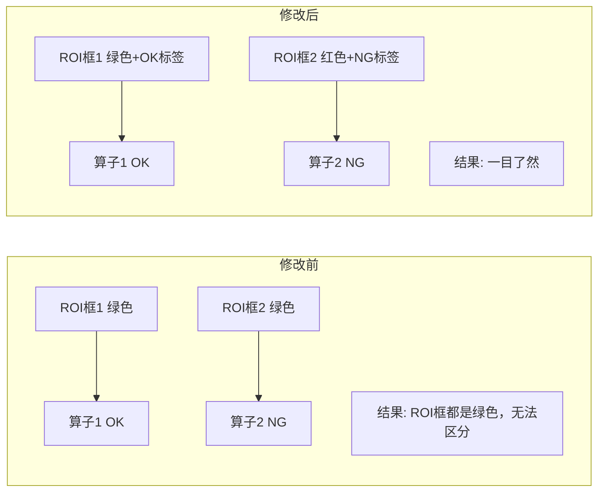

# ROI框显示检测结果方案

## 需求概述

在测试结束后，在图像的ROI框上显示每个ROI对应的检测结果：
- 如果该ROI框所使用的算子检测为 **NG** → ROI框标 **红色**
- 如果该ROI框所使用的算子检测为 **OK** → ROI框标 **绿色**

> **注意**：不修改 MultiROI 工具本身。MultiROI 仍然负责定义 ROI 区域，颜色标注在检测完成后由 VisionEngine 统一处理。

## 当前系统分析

### 数据流

```mermaid
flowchart TD
    A[MultiROI工具] -->|定义 regions dict: name->(x,y,w,h)| B[PipelineContext.regions]
    B -->|下游算子通过 _input_source=region:名称 引用| C[下游算子如 TemplateMatch]
    C -->|返回 ToolResult 含 passed| D[Pipeline.execute 收集 results]
    D -->|VisionEngine.execute 叠加 overlay| E[annotated 标注结果图]
    E -->|显示到 UI| F[worker_display / eng_test_display]
```

### 关键数据结构

1. **ROI定义**：在 [`MultiROI`](vision/tools/preprocess.py:217) 的 `params["regions"]` 中，每个区域格式为 `{name, x, y, width, height, enabled}`
2. **算子与ROI关联**：下游算子通过 `_input_source: "region:区域名"` 引用ROI（如 [`默认方案.json`](data/schemes/默认方案.json:74) 中的 `"region:脚垫1"`）
3. **检测结果**：每个步骤的 [`ToolResult`](vision/tools/base_tool.py:10) 包含 `passed`（是否通过）、`tool_type`、`tool_name` 等
4. **当前ROI框颜色**：MultiROI 绘制时固定为绿色，仅用于标识区域位置，不反映检测结果

### 核心问题

当前系统在检测完成后，ROI框始终是绿色，无法直观区分哪些ROI对应的算子检测通过、哪些不通过。

## 技术方案

### 方案概述

**只修改 [`vision/vision_engine.py`](vision/vision_engine.py) 的 `execute()` 方法**，在流水线执行完毕后新增逻辑：

1. 解析 Pipeline 中的所有步骤，建立 **ROI名称 → 使用该ROI的算子检测结果** 的映射
2. 根据映射结果，在最终标注图上重新绘制ROI框（OK=绿色，NG=红色）

### 详细设计

#### Step 1: 建立 ROI→算子结果 映射

在 [`VisionEngine.execute()`](vision/vision_engine.py:30) 中，执行完 `self._pipeline.execute(cv_image)` 后，遍历 `self._pipeline.steps`：

```python
# 收集ROI区域信息 {roi_name: (x, y, w, h)}
roi_regions = {}
# 收集ROI对应的算子检测结果 {roi_name: passed(bool)}
roi_results = {}

for step in self._pipeline.steps:
    tool_type = type(step.tool).__name__
    
    if tool_type == "MultiROI":
        # 从MultiROI的参数中获取ROI区域定义
        raw_regions = step.tool.params.get("regions", [])
        use_pct = step.tool.params.get("use_percentage", False)
        h_img, w_img = cv_image.shape[:2]
        
        for r in raw_regions:
            if isinstance(r, dict) and r.get("enabled", True):
                name = r.get("name", "未命名")
                if use_pct:
                    x = int(r.get("x", 0) / 100.0 * w_img)
                    y = int(r.get("y", 0) / 100.0 * h_img)
                    w = int(r.get("width", r.get("w", 100)) / 100.0 * w_img)
                    h = int(r.get("height", r.get("h", 100)) / 100.0 * h_img)
                else:
                    x = r.get("x", 0)
                    y = r.get("y", 0)
                    w = r.get("width", r.get("w", 100))
                    h = r.get("height", r.get("h", 100))
                roi_regions[name] = (x, y, w, h)
    
    # 检查该步骤是否引用了ROI
    input_source = step.tool.params.get("_input_source", "current")
    if input_source.startswith("region:"):
        region_name = input_source[7:]
        # 查找对应的 result（按步骤索引匹配）
        step_idx = self._pipeline.steps.index(step)
        if step_idx < len(results):
            roi_results[region_name] = results[step_idx].passed
```

#### Step 2: 在标注图上绘制带颜色的ROI框

在叠加完所有工具的 `overlay_image` 之后、`return` 之前，在 `annotated` 图像上绘制：

```python
# 在 annotated 上绘制ROI结果
for roi_name, (x, y, w, h) in roi_regions.items():
    if roi_name in roi_results:
        passed = roi_results[roi_name]
        color = (0, 255, 0) if passed else (0, 0, 255)  # 绿/红
        thickness = 3  # 加粗边框突出显示
        label = "OK" if passed else "NG"
    else:
        color = (0, 255, 0)  # 未被引用的ROI默认绿色
        thickness = 2
        label = ""
    
    cv2.rectangle(annotated, (x, y), (x + w, y + h), color, thickness)
    cv2.putText(annotated, roi_name, (x, y - 5),
                cv2.FONT_HERSHEY_SIMPLEX, 0.5, color, 1)
    if label:
        # 在ROI框右上角添加 OK/NG 标签
        (label_w, _), _ = cv2.getTextSize(label, cv2.FONT_HERSHEY_SIMPLEX, 0.5, 1)
        cv2.putText(annotated, label, (x + w - label_w - 5, y - 5),
                    cv2.FONT_HERSHEY_SIMPLEX, 0.5, color, 1)
```

### 修改文件清单

| 文件 | 修改内容 |
|------|---------|
| [`vision/vision_engine.py`](vision/vision_engine.py) | 在 `execute()` 方法中新增ROI结果标注逻辑（约30行代码） |

### 边界情况处理

1. **ROI未被任何算子引用**：保持绿色边框，不加 OK/NG 标签
2. **多个算子引用同一个ROI**：按步骤顺序，取最后一个算子的结果
3. **ROI区域坐标超出图像边界**：`cv2.rectangle` 会自动裁剪，无需额外处理
4. **百分比坐标模式**：根据图像尺寸将百分比坐标转换为像素坐标
5. **算子执行失败（success=False）**：视为NG，标红
6. **步骤被跳过（enabled=False）**：不参与结果映射

### 效果预览



### 测试验证

1. 创建一个包含 MultiROI + 多个引用不同ROI的算子的方案（如默认方案中的脚垫1~4）
2. 执行检测，验证：
   - 所有算子OK的ROI框显示绿色 + OK标签
   - 有算子NG的ROI框显示红色 + NG标签
   - 未被引用的ROI框保持绿色，无标签
3. 分别在工程师模式和生产模式下验证
