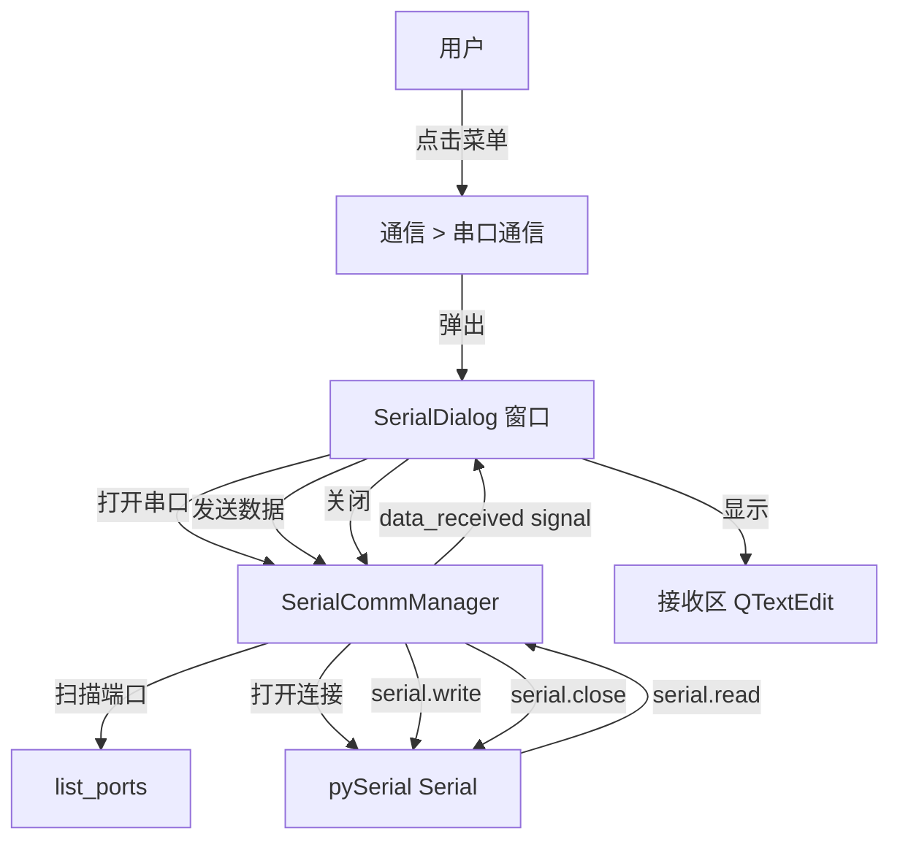

# 串口通信功能实现计划

## 概述
在菜单栏添加"通信"菜单，点击后弹出独立的串口通信窗口。串口通信的核心函数封装在独立的模块中。

---

## 1. 创建串口通信核心模块 `core/serial_comm.py`

### 职责
封装所有串口通信相关的底层操作，提供清晰的 API 供 UI 层调用。

### 封装的函数

| 函数 | 说明 |
|------|------|
| `list_ports() -> List[dict]` | 扫描系统可用串口，返回端口列表（含端口号、描述、硬件ID） |
| `SerialCommManager` 类 | 串口通信管理器，封装完整生命周期 |

### `SerialCommManager` 类设计

```
SerialCommManager
├── __init__(port, baudrate, bytesize, parity, stopbits, timeout)
├── open() -> bool          # 打开串口
├── close()                 # 关闭串口
├── is_open() -> bool       # 检查串口是否打开
├── send(data: bytes/str) -> int  # 发送数据，返回发送字节数
├── read(size=1) -> bytes   # 读取指定字节数
├── read_line() -> bytes    # 读取一行（直到换行符）
├── read_all() -> bytes     # 读取所有可用数据
├── read_until(expected: bytes) -> bytes  # 读取直到遇到指定字节
├── set_dtr(state: bool)    # 设置 DTR 信号
├── set_rts(state: bool)    # 设置 RTS 信号
├── get_settings() -> dict  # 获取当前串口参数
└── signals:
    ├── data_received(bytes)  # 数据接收信号（异步读取线程发出）
    ├── connection_changed(bool)  # 连接状态变化信号
    └── error_occurred(str)   # 错误信号
```

### 支持的串口参数
- **波特率**: 9600, 19200, 38400, 57600, 115200, 230400, 460800, 921600
- **数据位**: 5, 6, 7, 8
- **校验位**: None, Even, Odd, Mark, Space
- **停止位**: 1, 1.5, 2
- **流控制**: None, RTS/CTS, XON/XOFF

### 异步读取
- 使用 QThread 后台线程持续读取串口数据
- 通过 pyqtSignal 将接收到的数据发射到 UI 线程
- 支持暂停/恢复异步读取

---

## 2. 创建串口通信窗口 `ui/widgets/serial_dialog.py`

### 窗口布局

```
┌─────────────────────────────────────────────────┐
│  串口通信                              [X] 关闭  │
├─────────────────────────────────────────────────┤
│  ┌─ 连接设置 ────────────────────────────────┐  │
│  │  端口: [COM1  ▼]  [刷新]                   │  │
│  │  波特率: [115200 ▼]  数据位: [8 ▼]         │  │
│  │  校验位: [None ▼]    停止位: [1 ▼]         │  │
│  │  [打开串口]                                │  │
│  └────────────────────────────────────────────┘  │
│  ┌─ 发送区 ──────────────────────────────────┐  │
│  │  [HEX发送 ☐]  [添加换行 ☐]                 │  │
│  │  [输入数据............................]    │  │
│  │  [发送]  [清空]                           │  │
│  └────────────────────────────────────────────┘  │
│  ┌─ 接收区 ──────────────────────────────────┐  │
│  │  [HEX显示 ☐]  [自动滚动 ☐]  [清空]        │  │
│  │  ┌──────────────────────────────────────┐ │  │
│  │  │ 接收数据显示区域 (QTextEdit, 只读)    │ │  │
│  │  │                                      │ │  │
│  │  └──────────────────────────────────────┘ │  │
│  └────────────────────────────────────────────┘  │
│  状态栏: [已连接/已断开]  RX: 1024 bytes         │
└─────────────────────────────────────────────────┘
```

### 功能特性
1. **端口扫描** - 点击"刷新"按钮扫描可用串口列表
2. **连接管理** - 打开/关闭串口连接
3. **数据发送** - 支持文本和 HEX 两种发送模式，可选自动添加换行符
4. **数据接收** - 实时显示接收数据，支持 HEX 显示模式
5. **自动滚动** - 接收区自动滚动到底部
6. **统计信息** - 显示接收/发送字节数
7. **配置持久化** - 保存上次使用的串口参数到配置文件

---

## 3. 修改 `ui/main_window.py`

### 在 `_setup_menu_bar()` 方法中添加"通信"菜单

```
通信菜单 (menubar.addMenu("通信"))
├── 串口通信 (QAction) → 弹出 SerialDialog
└── (预留其他通信方式)
```

### 添加方法
```python
def _open_serial_dialog(self):
    """打开串口通信窗口"""
    from .widgets.serial_dialog import SerialDialog
    dialog = SerialDialog(self)
    dialog.exec_()
```

---

## 4. 更新 `requirements.txt`

添加一行：
```
pyserial>=3.5
```

---

## 文件修改清单

| 文件 | 操作 | 说明 |
|------|------|------|
| `core/serial_comm.py` | **新建** | 串口通信核心模块，封装所有串口操作函数 |
| `ui/widgets/serial_dialog.py` | **新建** | 串口通信独立窗口 UI |
| `ui/main_window.py` | **修改** | 在 `_setup_menu_bar()` 中添加"通信"菜单 |
| `requirements.txt` | **修改** | 添加 pyserial 依赖 |

---

## 数据流图



---

## 注意事项

1. **线程安全** - 异步读取使用 QThread，通过信号/槽机制安全地更新 UI
2. **资源管理** - 窗口关闭时自动关闭串口连接，防止端口占用
3. **错误处理** - 所有串口操作都有 try/except 保护，错误信息通过信号传递
4. **配置持久化** - 使用 ConfigManager 保存/恢复串口参数
5. **与现有风格一致** - UI 样式与现有深色主题保持一致
