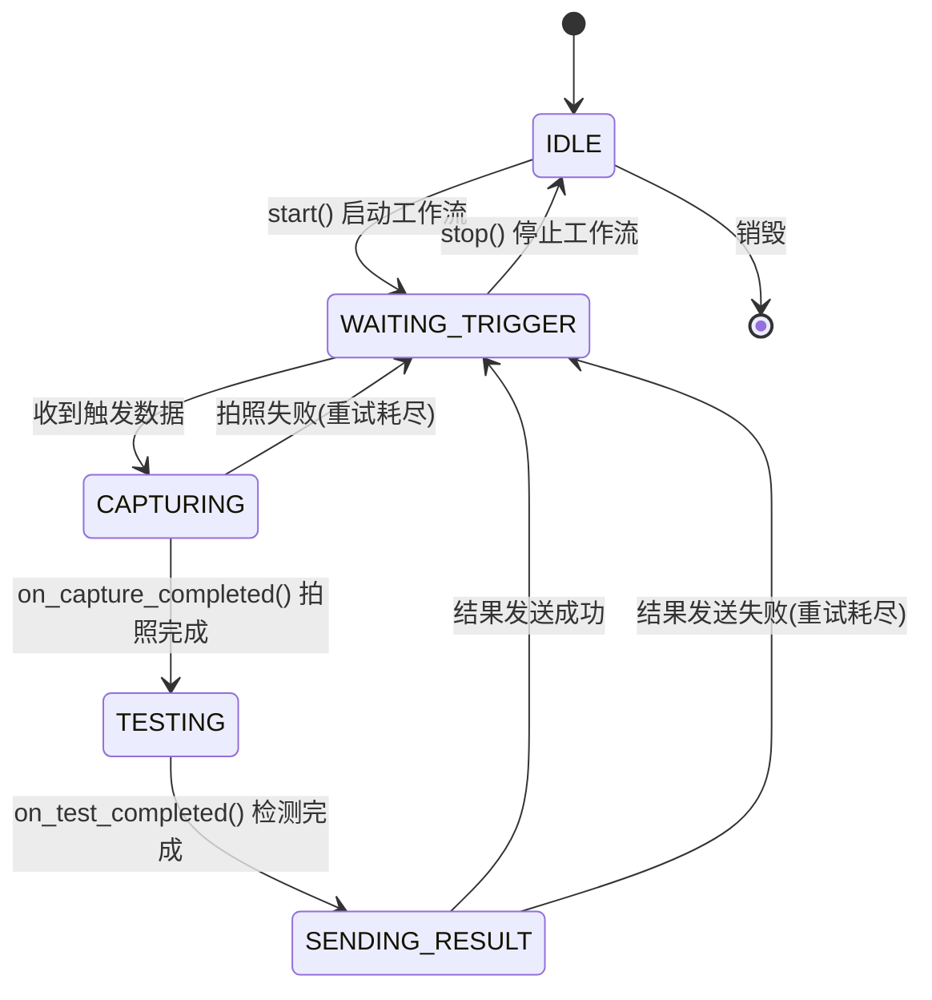
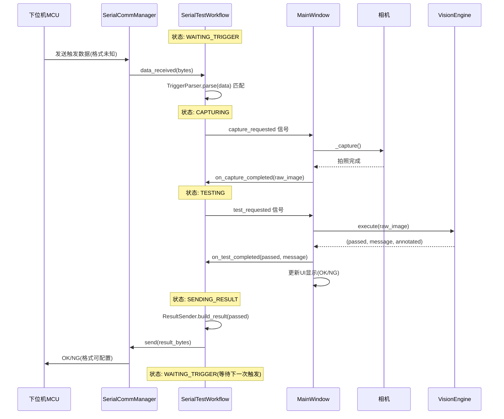

# 串口触发自动测试工作流实现计划

## 概述

实现一个由串口数据触发的自动化测试工作流：下位机（MCU）通过串口发送数据 → 上位机接收后开始拍照测试 → 测试结束后向下位机发送 OK/NG 结果 → 流程结束，等待下一次触发。

由于下位机发送的数据格式和上位机发送的结果格式目前未知，采用**策略模式**设计，预留接口以便后续扩展。

**UI 集成方式**：不新增独立对话框，工作流直接在现有生产模式界面上运行，通过菜单项启动/停止。

---

## 1. 核心工作流模块 `core/serial_test_workflow.py`（新建）

### 职责
封装串口触发测试的完整工作流逻辑，与 UI 层通过 Qt 信号/槽解耦。

### 类设计

```python
class SerialTestWorkflow(QObject):
    """
    串口触发测试工作流管理器。
    
    工作流状态机:
    IDLE -> WAITING_TRIGGER -> CAPTURING -> TESTING -> SENDING_RESULT -> WAITING_TRIGGER
    
    信号:
        state_changed(WorkflowState): 状态变化时发射
        trigger_received(data: bytes): 收到触发信号时发射
        test_started(): 测试开始时发射
        test_completed(passed: bool, message: str): 测试完成时发射
        result_sent(success: bool): 结果发送完成时发射
        error_occurred(str): 发生错误时发射
        capture_requested(): 请求拍照的信号（由 UI 层响应）
    """
    
    class State(Enum):
        IDLE = "空闲"
        WAITING_TRIGGER = "等待触发"
        CAPTURING = "拍照中"
        TESTING = "检测中"
        SENDING_RESULT = "发送结果"
```

### 关键设计点

#### 1.1 触发数据解析策略（可扩展）

```python
class TriggerParser(ABC):
    """触发数据解析器基类 - 策略模式"""
    @abstractmethod
    def parse(self, data: bytes) -> Optional[dict]:
        """解析串口数据，返回解析结果或 None（表示不匹配）"""
        pass

class AnyDataTriggerParser(TriggerParser):
    """任意数据触发 - 收到任何非空数据即触发"""
    def parse(self, data: bytes) -> Optional[dict]:
        if data and len(data) > 0:
            return {"trigger": True, "raw": data}
        return None

# 预留：后续可添加特定协议解析器
# class ModbusTriggerParser(TriggerParser): ...
# class CustomProtocolParser(TriggerParser): ...
```

#### 1.2 结果发送策略（可扩展）

```python
class ResultSender(ABC):
    """结果发送器基类 - 策略模式"""
    @abstractmethod
    def build_result(self, passed: bool) -> bytes:
        """根据检测结果构建要发送的字节数据"""
        pass

class SimpleTextResultSender(ResultSender):
    """简单文本结果 - 发送 'OK\\n' 或 'NG\\n'"""
    def build_result(self, passed: bool) -> bytes:
        return b"OK\n" if passed else b"NG\n"

class HexResultSender(ResultSender):
    """HEX 格式结果 - 发送 0x01(OK) 或 0x02(NG)"""
    def build_result(self, passed: bool) -> bytes:
        return b"\x01" if passed else b"\x02"

# 预留：后续可添加自定义格式发送器
```

#### 1.3 工作流状态机



#### 1.4 工作流与 UI 层的协作方式

工作流不直接操作相机和视觉引擎，而是通过信号请求 UI 层执行操作：

```
SerialTestWorkflow                  MainWindow
    │                                    │
    │── capture_requested() ──────────→  │ 触发拍照
    │                                    │── _capture()
    │                                    │
    │←── on_capture_completed(img) ────  │ 拍照完成回调
    │                                    │
    │── test_requested(img) ──────────→  │ 请求检测
    │                                    │── vision_engine.execute()
    │                                    │
    │←── on_test_completed(result) ────  │ 检测完成回调
    │                                    │
    │── send_result(passed) ──────────→  │ 发送结果到下位机
    │                                    │── serial_comm.send()
```

### 配置参数

```python
@dataclass
class WorkflowConfig:
    """工作流配置"""
    # 触发相关
    trigger_parser: TriggerParser = field(default_factory=AnyDataTriggerParser)
    
    # 结果发送相关
    result_sender: ResultSender = field(default_factory=SimpleTextResultSender)
    
    # 重试设置
    max_capture_retries: int = 3      # 拍照最大重试次数
    max_send_retries: int = 3         # 发送最大重试次数
```

---

## 2. 修改 `ui/main_window.py`

### 2.1 在 `MainWindow.__init__` 中添加工作流管理器

```python
from core.serial_test_workflow import SerialTestWorkflow, WorkflowConfig

class MainWindow(QMainWindow):
    def __init__(self):
        # ... 现有代码 ...
        self._serial_workflow: Optional[SerialTestWorkflow] = None
```

### 2.2 在 `_setup_menu_bar()` 中添加菜单项

在"通信"菜单中添加：
```
通信菜单
├── 串口通信 (已有)
├── ──────────
├── 启动自动测试 (新增) → 启动工作流
└── 停止自动测试 (新增) → 停止工作流
```

### 2.3 添加工作流控制方法

```python
def _start_auto_test(self):
    """启动串口自动测试"""
    # 1. 检查串口是否已打开（通过 SerialCommManager）
    # 2. 检查是否已导入方案
    # 3. 创建 SerialTestWorkflow 实例
    # 4. 连接信号
    # 5. 启动工作流
    # 6. 更新 UI 状态

def _stop_auto_test(self):
    """停止串口自动测试"""
    # 1. 停止工作流
    # 2. 更新 UI 状态
```

### 2.4 连接工作流信号到 UI

```python
# 状态变化 → 更新状态栏
self._serial_workflow.state_changed.connect(self._on_workflow_state_changed)

# 请求拍照 → 执行拍照
self._serial_workflow.capture_requested.connect(self._capture)

# 测试完成 → 更新结果显示
self._serial_workflow.test_completed.connect(self._on_workflow_test_completed)

# 错误 → 显示错误信息
self._serial_workflow.error_occurred.connect(self._on_workflow_error)
```

### 2.5 工作流与检测逻辑的集成

工作流中的"检测"步骤复用现有的 [`VisionEngine.execute()`](vision/vision_engine.py:30) 逻辑。拍照完成后，通过 [`_on_capture_completed`](ui/main_window.py:1045) 回调将图像传递给工作流。

关键改动点：
- 在 [`_on_capture_completed`](ui/main_window.py:1045) 中，判断当前是否处于工作流模式，如果是则调用工作流的 `on_capture_completed()` 而非 `_do_detect()`
- 工作流模式下，检测结果直接通过信号更新 UI，不需要用户点击按钮

### 2.6 生产模式 UI 状态联动

工作流运行时，生产模式界面的状态变化：
- 状态栏显示当前工作流状态（如"等待触发"、"检测中..."）
- 检测结果显示区（[`worker_judge`](ui/main_window.py:222)）正常显示 OK/NG
- 执行日志（[`worker_log`](ui/main_window.py:359)）记录每次触发的检测结果
- 统计信息：触发次数、OK次数、NG次数

---

## 3. 修改 `ui/widgets/serial_dialog.py`

**无需修改**。串口通信对话框仅负责串口连接的打开/关闭和参数配置，工作流在串口已打开的前提下由主窗口直接管理。

---

## 4. 工作流完整数据流



---

## 5. 文件修改清单

| 文件 | 操作 | 说明 |
|------|------|------|
| `core/serial_test_workflow.py` | **新建** | 串口自动测试工作流核心模块 |
| `ui/main_window.py` | **修改** | 集成工作流管理器，添加菜单项和控制方法 |
| `requirements.txt` | **无需修改** | pyserial 已添加 |

---

## 6. 注意事项

1. **线程安全** - 工作流状态变更和串口数据接收都在 Qt 信号/槽机制下进行，天然线程安全
2. **状态保护** - 工作流状态机防止重复触发（如在检测中时忽略新的触发数据）
3. **可扩展性** - 触发解析和结果发送使用策略模式，后续可轻松添加自定义协议
4. **与现有逻辑兼容** - 工作流复用现有的 `VisionEngine.execute()` 和相机拍照逻辑，不破坏现有功能
5. **无侵入式 UI** - 不新增对话框，直接在现有生产模式界面上运行，通过菜单项控制
6. **错误恢复** - 拍照或发送失败时可配置重试次数
