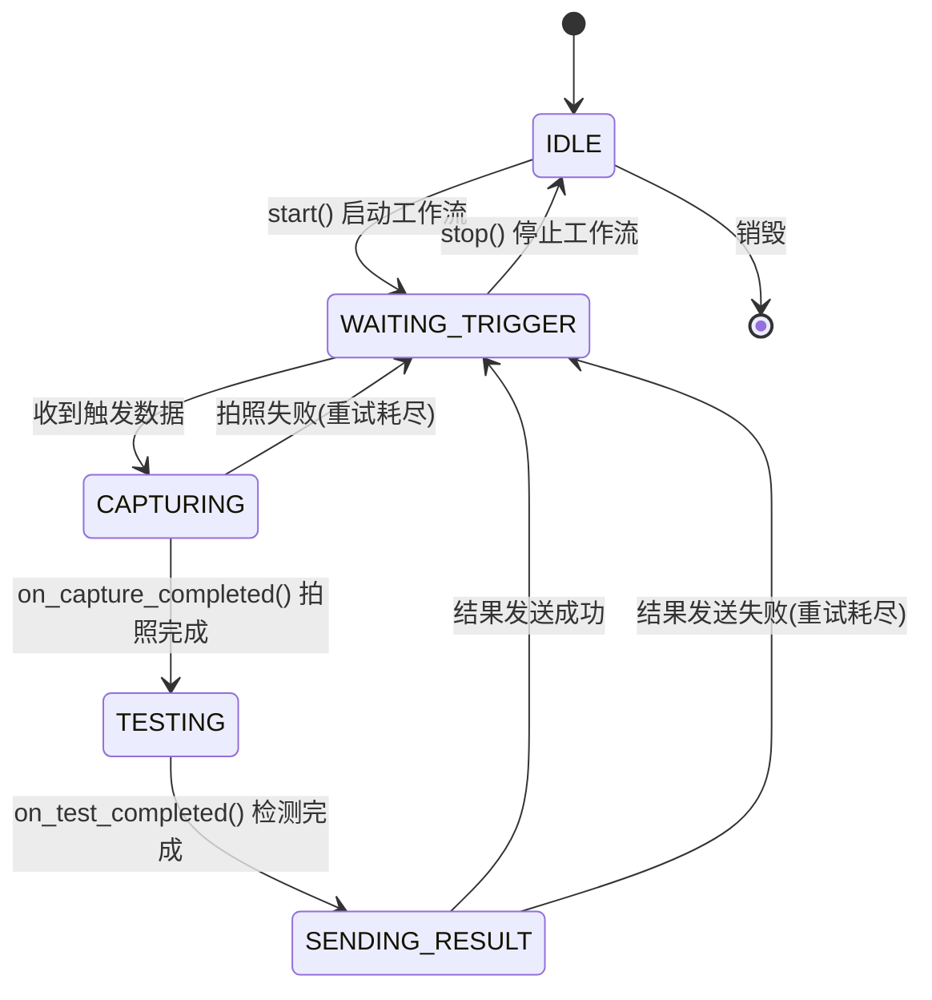
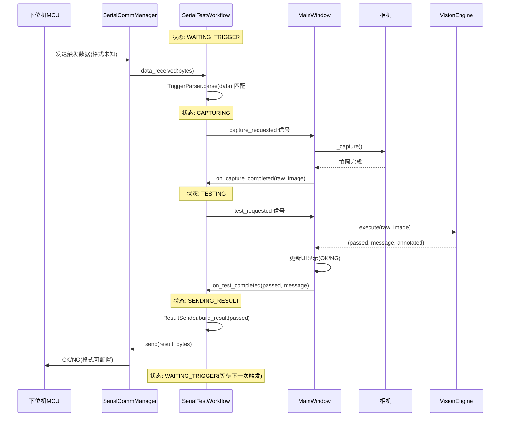

# 串口触发自动测试工作流实现计划

## 概述

实现一个由串口数据触发的自动化测试工作流：下位机（MCU）通过串口发送数据 → 上位机接收后开始拍照测试 → 测试结束后向下位机发送 OK/NG 结果 → 流程结束，等待下一次触发。

由于下位机发送的数据格式和上位机发送的结果格式目前未知，采用**策略模式**设计，预留接口以便后续扩展。

**UI 集成方式**：在生产模式右侧面板的按钮组中，添加一个"启动自动测试"按钮，与现有的"开始检测"按钮并列。

---

## 1. 核心工作流模块 `core/serial_test_workflow.py`（新建）

### 职责
封装串口触发测试的完整工作流逻辑，与 UI 层通过 Qt 信号/槽解耦。

### 类设计

```python
class SerialTestWorkflow(QObject):
    """
    串口触发测试工作流管理器。
    
    工作流状态机:
    IDLE -> WAITING_TRIGGER -> CAPTURING -> TESTING -> SENDING_RESULT -> WAITING_TRIGGER
    
    信号:
        state_changed(WorkflowState): 状态变化时发射
        capture_requested(): 请求拍照的信号（由 UI 层响应）
        test_requested(np.ndarray): 请求检测的信号（传递图像）
        result_sent(success: bool): 结果发送完成时发射
        error_occurred(str): 发生错误时发射
    """
    
    class State(Enum):
        IDLE = "空闲"
        WAITING_TRIGGER = "等待触发"
        CAPTURING = "拍照中"
        TESTING = "检测中"
        SENDING_RESULT = "发送结果"
```

### 关键设计点

#### 1.1 触发数据解析策略（可扩展）

```python
class TriggerParser(ABC):
    """触发数据解析器基类 - 策略模式"""
    @abstractmethod
    def parse(self, data: bytes) -> Optional[dict]:
        """解析串口数据，返回解析结果或 None（表示不匹配）"""
        pass

class AnyDataTriggerParser(TriggerParser):
    """任意数据触发 - 收到任何非空数据即触发"""
    def parse(self, data: bytes) -> Optional[dict]:
        if data and len(data) > 0:
            return {"trigger": True, "raw": data}
        return None

# 预留：后续可添加特定协议解析器
```

#### 1.2 结果发送策略（可扩展）

```python
class ResultSender(ABC):
    """结果发送器基类 - 策略模式"""
    @abstractmethod
    def build_result(self, passed: bool) -> bytes:
        """根据检测结果构建要发送的字节数据"""
        pass

class SimpleTextResultSender(ResultSender):
    """简单文本结果 - 发送 'OK\\n' 或 'NG\\n'"""
    def build_result(self, passed: bool) -> bytes:
        return b"OK\n" if passed else b"NG\n"

class HexResultSender(ResultSender):
    """HEX 格式结果 - 发送 0x01(OK) 或 0x02(NG)"""
    def build_result(self, passed: bool) -> bytes:
        return b"\x01" if passed else b"\x02"

# 预留：后续可添加自定义格式发送器
```

#### 1.3 工作流状态机



#### 1.4 工作流与 UI 层的协作方式

工作流不直接操作相机和视觉引擎，而是通过信号请求 UI 层执行操作：

```
SerialTestWorkflow                  MainWindow
    │                                    │
    │── capture_requested() ──────────→  │ 触发拍照
    │                                    │── _capture()
    │                                    │
    │←── on_capture_completed(img) ────  │ 拍照完成回调
    │                                    │
    │── test_requested(img) ──────────→  │ 请求检测
    │                                    │── vision_engine.execute()
    │                                    │
    │←── on_test_completed(result) ────  │ 检测完成回调
    │                                    │
    │── send_result(passed) ──────────→  │ 发送结果到下位机
    │                                    │── serial_comm.send()
```

### 配置参数

```python
@dataclass
class WorkflowConfig:
    """工作流配置"""
    trigger_parser: TriggerParser = field(default_factory=AnyDataTriggerParser)
    result_sender: ResultSender = field(default_factory=SimpleTextResultSender)
    max_capture_retries: int = 3      # 拍照最大重试次数
    max_send_retries: int = 3         # 发送最大重试次数
```

---

## 2. 修改 `ui/main_window.py`

### 2.1 生产模式右侧按钮组中添加自动测试按钮

在 [`_build_worker_page()`](ui/main_window.py:210) 方法中，在 [`btn_group`](ui/main_window.py:295) 的 [`worker_btn_detect`](ui/main_window.py:301) 下方添加新按钮：

```python
# 在 btn_layout.addWidget(self.worker_btn_detect) 之后添加

self.worker_btn_auto_test = QPushButton("🔌 启动自动测试")
self.worker_btn_auto_test.setMinimumHeight(48)
self.worker_btn_auto_test.setEnabled(False)
self.worker_btn_auto_test.setStyleSheet("""
    QPushButton {
        background-color: #E65100; color: #fff; font-size: 18px;
        font-weight: bold; padding: 6px 16px;
        border: 2px solid #FF6D00; border-radius: 8px;
    }
    QPushButton:hover { background-color: #BF360C; border-color: #FF9100; }
    QPushButton:disabled { background-color: #2d2d2d; color: #555; border-color: #3a3a3a; }
    QPushButton:checked { background-color: #C62828; border-color: #EF5350; }
""")
self.worker_btn_auto_test.setCheckable(True)  # 可切换：启动/停止

btn_layout.addWidget(self.worker_btn_auto_test)
```

按钮设计说明：
- **橙色主题**（`#E65100`），与"开始检测"的绿色主题区分
- **可切换按钮**（`setCheckable(True)`），选中=启动，未选中=停止
- 启动后按钮文字变为"⏹ 停止自动测试"
- 初始状态 `enabled=False`，需要串口已打开且方案已导入才可点击

### 2.2 连接按钮信号

```python
# 在 _build_worker_page 末尾添加
self.worker_btn_auto_test.clicked.connect(self._toggle_auto_test)
```

### 2.3 添加工作流控制方法

```python
def _toggle_auto_test(self, checked: bool):
    """切换自动测试状态"""
    if checked:
        self._start_auto_test()
    else:
        self._stop_auto_test()

def _start_auto_test(self):
    """启动串口自动测试"""
    # 1. 检查串口是否已打开
    if not self._serial_comm or not self._serial_comm.is_open:
        QMessageBox.warning(self, "提示", "请先通过「通信 > 串口通信」打开串口连接")
        self.worker_btn_auto_test.setChecked(False)
        return
    # 2. 检查是否已导入方案
    if self.vision_engine.pipeline is None:
        QMessageBox.warning(self, "提示", "请先导入检测方案")
        self.worker_btn_auto_test.setChecked(False)
        return
    # 3. 创建并启动工作流
    self._serial_workflow = SerialTestWorkflow(
        comm_mgr=self._serial_comm,
        config=WorkflowConfig()
    )
    self._serial_workflow.state_changed.connect(self._on_workflow_state_changed)
    self._serial_workflow.capture_requested.connect(self._capture)
    self._serial_workflow.test_requested.connect(self._execute_detect_for_workflow)
    self._serial_workflow.error_occurred.connect(self._on_workflow_error)
    self._serial_workflow.start()
    self.worker_btn_auto_test.setText("⏹ 停止自动测试")

def _stop_auto_test(self):
    """停止串口自动测试"""
    if self._serial_workflow:
        self._serial_workflow.stop()
        self._serial_workflow = None
    self.worker_btn_auto_test.setText("🔌 启动自动测试")
    self.worker_status_label.setText("自动测试已停止")
```

### 2.4 工作流信号处理

```python
def _on_workflow_state_changed(self, state):
    """工作流状态变化时更新 UI"""
    state_names = {
        SerialTestWorkflow.State.IDLE: "空闲",
        SerialTestWorkflow.State.WAITING_TRIGGER: "等待触发信号...",
        SerialTestWorkflow.State.CAPTURING: "拍照中...",
        SerialTestWorkflow.State.TESTING: "检测中...",
        SerialTestWorkflow.State.SENDING_RESULT: "发送结果...",
    }
    self.worker_status_label.setText(state_names.get(state, str(state)))

def _execute_detect_for_workflow(self, image):
    """工作流请求执行检测"""
    if self.vision_engine.pipeline is None:
        self._serial_workflow.on_test_completed(False, "未设置检测方案")
        return
    
    scheme_name = self._current_scheme_name or "未命名"
    passed, message, annotated = self.vision_engine.execute(
        image, scheme_name=scheme_name
    )
    if annotated is not None:
        self._show_worker_image(annotated)
    
    # 更新生产模式 UI 的 OK/NG 显示
    if passed:
        self.worker_judge.setText("✓ OK")
        self.worker_judge.setStyleSheet("...")  # 绿色样式
    else:
        self.worker_judge.setText("✗ NG")
        self.worker_judge.setStyleSheet("...")  # 红色样式
    
    # 记录日志
    results = self.vision_engine.get_last_results()
    for i, r in enumerate(results):
        ts = datetime.now().strftime("%H:%M:%S")
        status = "✓" if r.passed else "✗"
        self.worker_log.append_log(ts, i + 1, r.tool_type, status,
                                   r.message, r.elapsed_ms)
    
    self._serial_workflow.on_test_completed(passed, message)

def _on_workflow_error(self, error_msg):
    """工作流错误处理"""
    self.worker_status_label.setText(f"自动测试错误: {error_msg}")
    log_error(f"自动测试错误: {error_msg}")
```

### 2.5 修改 `_on_capture_completed` 支持工作流模式

在 [`_on_capture_completed`](ui/main_window.py:1045) 中，增加工作流模式的判断：

```python
def _on_capture_completed(self, width, height, pixel_type, img_bytes):
    # ... 现有图像处理代码 ...
    
    # 工作流模式：将图像传递给工作流
    if self._serial_workflow is not None and self._serial_workflow.is_running:
        self._serial_workflow.on_capture_completed(self._raw_image)
        return
    
    # 原有逻辑保持不变
    # ...
```

### 2.6 获取 SerialCommManager 实例

工作流需要访问 [`SerialCommManager`](core/serial_comm.py:141) 来发送结果。需要在主窗口中持有串口管理器的引用。

当前 [`SerialDialog`](ui/widgets/serial_dialog.py:40) 内部创建了自己的 `SerialCommManager` 实例。为了让主窗口也能访问串口，有两种方案：

**方案 A（推荐）**：在主窗口中也持有 `SerialCommManager` 引用，与 SerialDialog 共享。

```python
class MainWindow(QMainWindow):
    def __init__(self):
        # ...
        self._serial_comm: Optional[SerialCommManager] = None
    
    def _open_serial_dialog(self):
        """打开串口通信窗口 - 共享 SerialCommManager"""
        from .widgets.serial_dialog import SerialDialog
        if self._serial_comm is None:
            self._serial_comm = SerialCommManager()
        dialog = SerialDialog(self, comm_mgr=self._serial_comm)
        dialog.exec_()
```

同时修改 [`SerialDialog`](ui/widgets/serial_dialog.py) 的构造函数，接受可选的 `comm_mgr` 参数。

---

## 3. 工作流完整数据流



---

## 4. 文件修改清单

| 文件 | 操作 | 说明 |
|------|------|------|
| `core/serial_test_workflow.py` | **新建** | 串口自动测试工作流核心模块 |
| `ui/main_window.py` | **修改** | 生产模式添加自动测试按钮，集成工作流 |
| `ui/widgets/serial_dialog.py` | **修改** | 支持外部传入 SerialCommManager 实例 |
| `requirements.txt` | **无需修改** | pyserial 已添加 |

---

## 5. 生产模式 UI 布局变化

右侧按钮组区域变化：

```
┌─ 按钮组 ──────────────────────┐
│                                │
│  ┌──────────────────────────┐  │
│  │   📷 开始检测             │  │  ← 原有按钮（绿色）
│  └──────────────────────────┘  │
│                                │
│  ┌──────────────────────────┐  │
│  │   🔌 启动自动测试         │  │  ← 新增按钮（橙色，可切换）
│  └──────────────────────────┘  │
│                                │
└────────────────────────────────┘
```

---

## 6. 注意事项

1. **线程安全** - 工作流状态变更和串口数据接收都在 Qt 信号/槽机制下进行，天然线程安全
2. **状态保护** - 工作流状态机防止重复触发（如在检测中时忽略新的触发数据）
3. **可扩展性** - 触发解析和结果发送使用策略模式，后续可轻松添加自定义协议
4. **与现有逻辑兼容** - 工作流复用现有的 `VisionEngine.execute()` 和相机拍照逻辑，不破坏现有功能
5. **按钮状态联动** - 自动测试启动后，"开始检测"按钮应禁用，防止手动和自动冲突
6. **串口共享** - SerialCommManager 在主窗口和 SerialDialog 之间共享，避免重复打开串口
