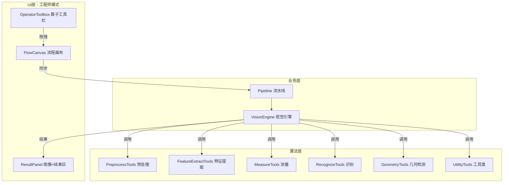
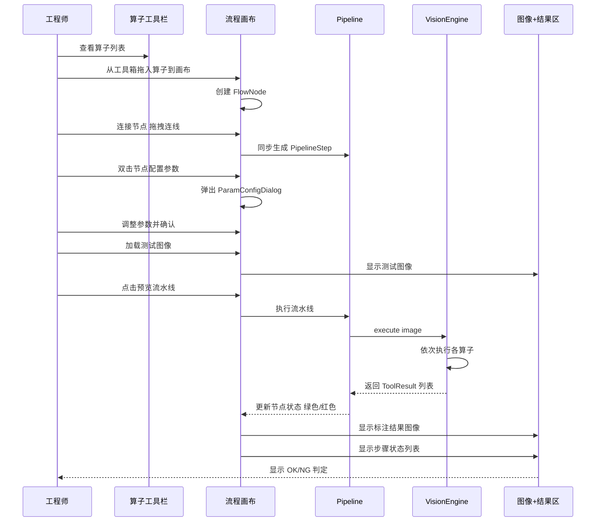

# 可视化机器视觉流程编辑器 - 架构设计方案

## 1. 概述

将现有系统升级为**可视化拖拽式机器视觉流程编辑器**，类似海康 VM、康耐视 In-Sight 的交互模式。工程师可通过拖拽算子、连接数据流来设计视觉方案，工人使用简洁的操作界面执行检测。

---

## 2. 工程师界面布局（最终确认）

```
┌──────────────────────────────────────────────────────────────┐
│  方案栏: [下拉框] [新建] [保存] [应用] [删除]                │
├──────────┬──────────────────────────┬───────────────────────┤
│ 算子工具栏 │  流程画布区              │  图像 + 结果显示区     │
│ (固定~200px)│  (可拖拽流程图)          │  (固定~400px)         │
│           │                          │                       │
│ ▼ 预处理   │  ┌───┐  ┌───┐  ┌───┐   │  ┌─────────────────┐ │
│  灰度图   │  │灰度│→│滤波│→│阈值│   │  │   图像显示       │ │
│  高斯滤波 │  └───┘  └───┘  └───┘   │  │   (测试图像)      │ │
│  中值滤波 │     │                   │  │   (标注结果)      │ │
│  直方图均衡│  ┌───┐                 │  │                  │ │
│  图像缩放 │  │匹配│                 │  │                  │ │
│  ...     │  └───┘                 │  │                  │ │
│ ▼ 边缘/轮廓│  │                   │  ├─────────────────┤ │
│  Canny   │  [加载测试图像]         │  │  结果输出         │ │
│  查找轮廓 │  [▶ 预览流水线]         │  │  [步骤1: ✓ 12ms] │ │
│  ...     │                          │  │  [步骤2: ✓ 8ms]  │ │
│ ▼ 定位/匹配│                          │  │  [步骤3: ✗ NG]  │ │
│ ▼ 几何检测│                          │  │  总耗时: 45ms    │ │
│ ▼ 测量   │                          │  │  判定: NG        │ │
│ ▼ 工具   │                          │  └─────────────────┘ │
└──────────┴──────────────────────────┴───────────────────────┘
```

### 三大功能区块

| 区块 | 位置 | 宽度 | 功能 |
|------|------|------|------|
| **算子工具栏** | 左侧 | ~200px | 分类树形列表，算子可拖拽到画布 |
| **流程画布区** | 左中 | 自适应 | 拖放算子节点、连线、加载测试图像按钮、预览按钮 |
| **图像+结果显示区** | 右侧 | ~400px | 上半部分显示测试图像/标注结果，下半部分显示步骤状态和OK/NG |

### 交互方式
- **添加算子**：从左侧工具栏拖拽算子到画布
- **连接节点**：在画布上从一个节点拖出连线到另一个节点
- **配置参数**：双击画布上的节点，弹出参数配置对话框
- **预览**：点击画布上的「预览流水线」按钮
- **加载测试图像**：点击画布上的「加载测试图像」按钮，图像显示在右侧

---

## 3. 新增算子清单

### 3.1 预处理类（现有 5 个 → 扩充至 10 个）

| 算子名称 | 说明 | 状态 |
|---------|------|------|
| 转灰度图 | 彩色→灰度 | 已有 `Grayscale` |
| 高斯滤波 | 高斯模糊降噪 | 已有 `GaussianBlur` |
| 中值滤波 | 中值模糊，去椒盐噪声 | **新增** `MedianBlur` |
| 直方图均衡化 | CLAHE 增强对比度 | 已有 `HistEqualize` |
| 图像缩放 | 等比例/固定尺寸缩放 | **新增** `Resize` |
| 固定阈值 | 二值化/反二值化/OTSU | 已有 `Threshold`（从特征提取移入） |
| 自适应阈值 | 局部自适应二值化 | **新增** `AdaptiveThreshold` |
| 形态学-腐蚀 | 腐蚀操作 | 已有 `Morphology` |
| 形态学-膨胀 | 膨胀操作 | 已有 `Morphology` |
| 形态学-开运算 | 先腐蚀后膨胀 | 已有 `Morphology` |
| 形态学-闭运算 | 先膨胀后腐蚀 | 已有 `Morphology` |

### 3.2 边缘/轮廓类（现有 4 个 → 扩充至 6 个）

| 算子名称 | 说明 | 状态 |
|---------|------|------|
| Canny 边缘检测 | Canny 算法 | 已有 `CannyEdge` |
| 查找轮廓 | findContours | 已有 `ContourAnalysis` |
| 轮廓过滤 | 按面积/周长/宽高比过滤 | **新增** `ContourFilter` |
| 直线检测 | HoughLinesP | **新增** `LineDetection` |
| 圆检测 | HoughCircles | 已有 `CircleDetection`（从测量移入） |
| 矩形检测 | 轮廓逼近+矩形判定 | **新增** `RectangleDetection` |

### 3.3 定位/匹配类（现有 2 个 → 扩充至 5 个）

| 算子名称 | 说明 | 状态 |
|---------|------|------|
| 灰度匹配（标准模板匹配） | cv2.matchTemplate | 已有 `TemplateMatch` |
| 边缘匹配 | Canny + 轮廓匹配 | **新增** `EdgeMatch` |
| 快速匹配 | 图像金字塔 + 模板匹配 | **新增** `FastMatch` |
| 高精度匹配 | SIFT/ORB 特征匹配 | 已有 `TemplateMatch`（feature_match） |
| 颜色识别 | HSV 颜色范围识别 | 已有 `ColorRecognition` |

### 3.4 几何检测类（新增类别，3 个算子）

| 算子名称 | 说明 | 状态 |
|---------|------|------|
| 圆检测 | 霍夫圆变换 | 从测量移入 |
| 直线检测 | 霍夫直线变换 | **新增** |
| 矩形检测 | 轮廓逼近 | **新增** |
| 点检测 | 角点检测/Blob | 已有 `BlobDetection`（从特征提取移入） |

### 3.5 测量类（现有 4 个 → 扩充至 6 个）

| 算子名称 | 说明 | 状态 |
|---------|------|------|
| 点测量 | 点坐标/点间距 | **新增** `PointMeasure` |
| 线测量 | 线段长度/角度 | **新增** `LineMeasure` |
| 距离测量 | 轮廓间距离 | 已有 `DistanceMeasure` |
| 角度测量 | 两条线夹角 | **新增** `AngleMeasure` |
| 面积测量 | 轮廓面积 | 已有 `AreaMeasure` |
| 目标计数 | 轮廓计数 | 已有 `ObjectCount` |

### 3.6 工具类（新增类别，4 个算子）

| 算子名称 | 说明 | 状态 |
|---------|------|------|
| 坐标转换 | 像素坐标↔物理坐标 | **新增** `CoordinateTransform` |
| 数值计算 | 加减乘除/公式计算 | **新增** `Calculator` |
| 逻辑判断 | OK/NG 判定规则 | **新增** `LogicJudge` |
| 多区域ROI | 多命名区域选取 | 已有 `MultiROI` |

---

## 4. 拖拽式流程编辑器 UI 组件

### 4.1 算子工具栏 `OperatorToolbox`

- **位置**: 左侧面板，固定宽度 ~200px
- **功能**: 
  - 按类别分组的算子列表（可折叠/展开的 QTreeWidget）
  - 每个算子是一个可拖拽的项
  - 顶部搜索框支持过滤
  - 鼠标悬停显示算子简要说明（ToolTip）
- **实现**: `QTreeWidget` + 自定义 `QMimeData` 拖拽

### 4.2 流程画布 `FlowCanvas`

- **位置**: 左中区域，占据主要空间
- **功能**:
  - 拖放式放置算子节点（从工具箱拖入）
  - 节点间连线表示数据流（从一个节点输出端拖到另一个节点输入端）
  - 节点可拖动重新排列
  - 双击节点打开参数配置对话框
  - 右键菜单：删除、禁用、复制
  - 鼠标滚轮缩放
  - 包含「加载测试图像」和「预览流水线」按钮
- **实现**: 基于 `QGraphicsView` + `QGraphicsScene`
  - `FlowNode`（QGraphicsItem）：算子节点，显示名称、状态图标
  - `FlowConnection`（QGraphicsItem）：节点间连线
  - `FlowCanvas`（QGraphicsView）：画布视图，处理拖放事件

### 4.3 图像+结果显示区

- **位置**: 右侧面板，固定宽度 ~400px
- **上半部分**: 图像显示
  - 显示测试图像
  - 预览时显示标注结果图像
  - 使用 QLabel + QPixmap，保持宽高比缩放
- **下半部分**: 结果输出
  - 步骤状态列表（QTableWidget）
  - 每行：步骤序号、工具名称、状态（✓/✗）、耗时(ms)、消息
  - 底部：总耗时、OK/NG 判定（大字体醒目显示）

---

## 5. 文件变更清单

### 5.1 新增文件

| 文件路径 | 说明 |
|---------|------|
| `ui/widgets/operator_toolbox.py` | 算子工具箱（拖拽源） |
| `ui/widgets/flow_canvas.py` | 流程画布（QGraphicsView 实现） |
| `ui/widgets/flow_nodes.py` | 画布节点和连线组件 |
| `vision/tools/geometry.py` | 几何检测类工具集 |
| `vision/tools/utility.py` | 工具类工具集 |

### 5.2 修改文件

| 文件路径 | 修改内容 |
|---------|---------|
| `vision/tools/preprocess.py` | 新增 `MedianBlur`、`Resize`、`AdaptiveThreshold` |
| `vision/tools/feature_extract.py` | 新增 `ContourFilter`、`LineDetection`、`RectangleDetection`；移出 `BlobDetection`、`Threshold` |
| `vision/tools/measure.py` | 新增 `PointMeasure`、`LineMeasure`、`AngleMeasure`；移出 `CircleDetection` |
| `vision/tools/recognize.py` | 新增 `EdgeMatch`、`FastMatch` |
| `ui/main_window.py` | 重构工程师模式页面，集成新组件（三栏布局） |
| `vision/pipeline.py` | 新增工具注册表导入（geometry、utility） |

### 5.3 保留文件（不修改）

| 文件路径 | 说明 |
|---------|------|
| `ui/widgets/pipeline_editor.py` | 保留作为兼容层，新画布通过接口同步 |
| `ui/widgets/param_config_dialog.py` | 参数配置对话框继续使用 |
| `ui/widgets/result_panel.py` | 结果面板继续使用 |
| `ui/widgets/scheme_panel.py` | 方案面板继续使用 |
| `main.py` | 入口不变 |
| `vision/vision_engine.py` | 引擎不变 |
| `vision/pipeline.py` | 核心逻辑不变，仅新增注册表导入 |

---

## 6. 实现步骤

### 第一阶段：新增算子

1. **预处理类新增**：`MedianBlur`、`Resize`、`AdaptiveThreshold`
   - 每个算子继承 `VisionTool`，实现 `process()` 和 `get_param_widgets()`
   - 注册到 `PREPROCESS_TOOLS`

2. **边缘/轮廓类新增**：`ContourFilter`、`LineDetection`、`RectangleDetection`
   - `ContourFilter`：按面积、周长、宽高比、矩形度过滤轮廓
   - `LineDetection`：HoughLinesP 直线检测
   - `RectangleDetection`：轮廓逼近 + 矩形判定

3. **定位/匹配类新增**：`EdgeMatch`、`FastMatch`
   - `EdgeMatch`：Canny 边缘 + 轮廓匹配
   - `FastMatch`：图像金字塔降采样 + 模板匹配

4. **几何检测类**：新建 `vision/tools/geometry.py`
   - 从 `measure.py` 迁移 `CircleDetection`
   - 从 `feature_extract.py` 迁移 `BlobDetection`
   - 新增 `LineDetection`、`RectangleDetection`

5. **测量类新增**：`PointMeasure`、`LineMeasure`、`AngleMeasure`

6. **工具类**：新建 `vision/tools/utility.py`
   - `CoordinateTransform`：像素↔物理坐标
   - `Calculator`：数值计算
   - `LogicJudge`：OK/NG 判定

### 第二阶段：拖拽式流程编辑器 UI

1. **算子工具箱** `OperatorToolbox`
   - 分类树形列表
   - 拖拽支持（QMimeData）

2. **流程画布** `FlowCanvas` + `FlowNode` + `FlowConnection`
   - QGraphicsView 场景
   - 节点拖放放置
   - 连线绘制
   - 缩放
   - 右键菜单

3. **图像+结果显示区**
   - 复用现有 `ResultPanel` 和图像显示组件
   - 调整布局适配三栏结构

### 第三阶段：集成到主窗口

1. **重构 `main_window.py` 工程师模式**
   - 替换为三栏布局
   - 集成算子工具栏、流程画布、图像+结果区

2. **数据流同步**
   - 画布节点 ↔ Pipeline 步骤同步
   - 方案保存/加载兼容

3. **测试验证**
   - 各算子独立测试
   - 流水线执行测试
   - 方案导入/导出测试

---

## 7. 架构图

### 7.1 组件关系



### 7.2 数据流



---

## 8. 关键设计决策

### 8.1 为什么用 QGraphicsView 而非 QWidget 布局？
- QGraphicsView 原生支持：拖拽、缩放、碰撞检测
- 节点和连线作为独立 QGraphicsItem，便于交互
- 性能更好（大量节点时只渲染可见区域）

### 8.2 新旧兼容策略
- 旧 `PipelineEditor` 保留，通过 `set_pipeline()` / `get_pipeline()` 与新画布双向同步
- 方案 JSON 格式不变，确保旧方案可加载
- 新增算子的 `to_dict()` / `from_dict()` 遵循现有格式

### 8.3 算子分类调整
- `CircleDetection` 从「测量」移至「几何检测」
- `Threshold` 从「特征提取」移至「预处理」
- `BlobDetection` 从「特征提取」移至「几何检测」
- 保留原注册表兼容旧方案，新增类别通过新注册表文件实现

---

## 9. 风险与缓解

| 风险 | 影响 | 缓解措施 |
|------|------|---------|
| QGraphicsView 拖拽交互复杂 | 开发周期长 | 先实现基础拖放，后续迭代优化 |
| 大量算子同时开发质量难保证 | 功能缺陷 | 分阶段实现，每阶段测试 |
| 旧方案兼容性问题 | 用户数据丢失 | 保留旧 PipelineEditor 作为 fallback |
| 性能问题（大图像+多节点） | 卡顿 | 异步执行 + 进度指示 |
